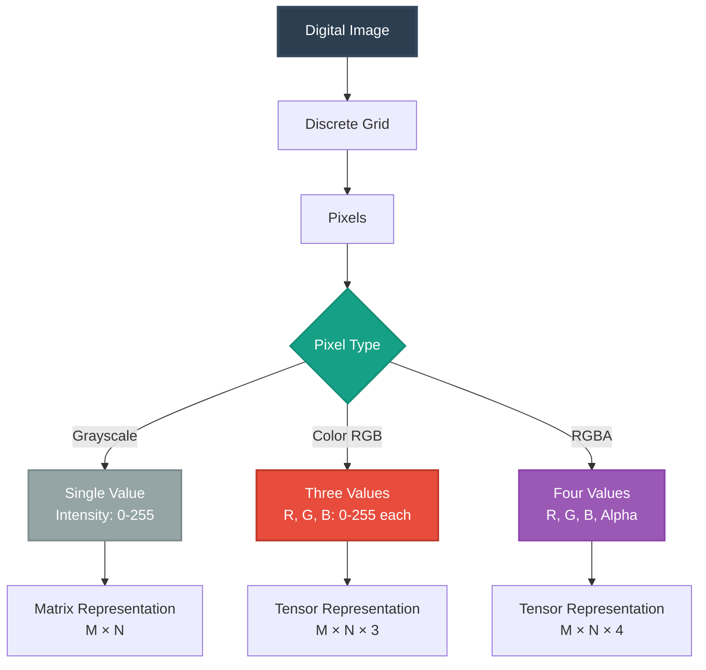
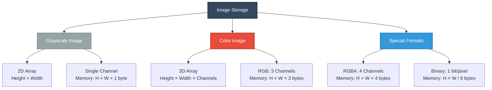
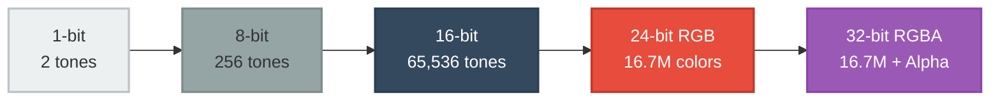
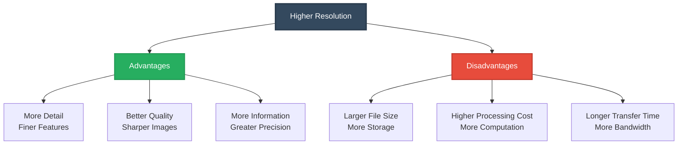
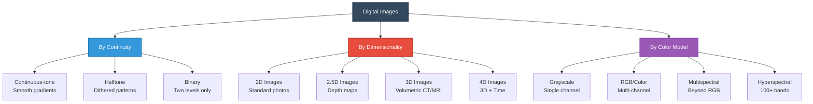
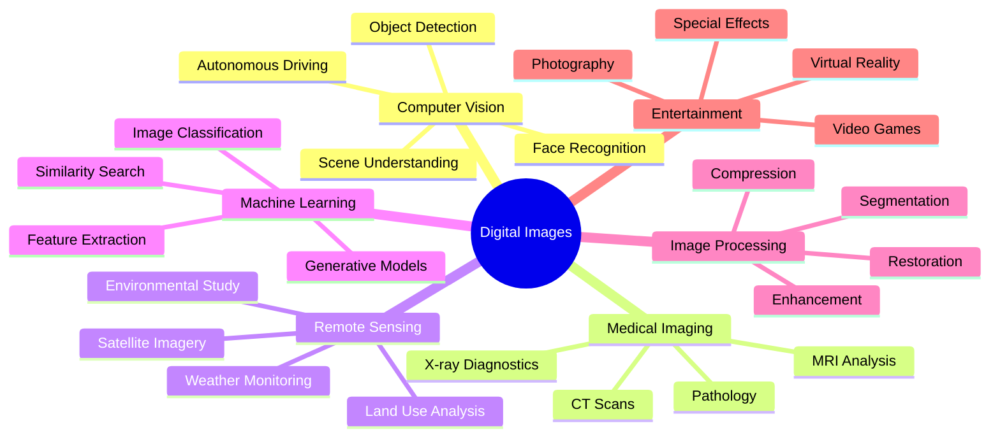
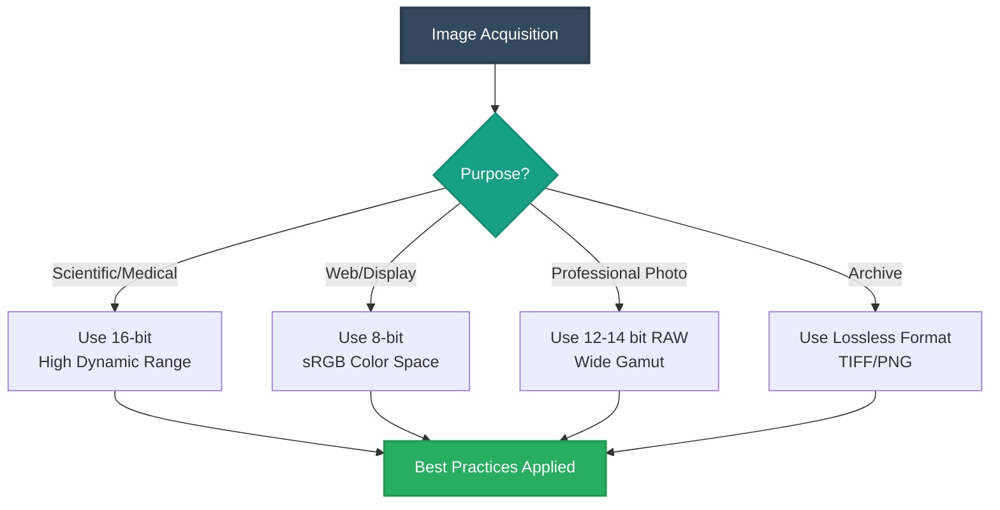
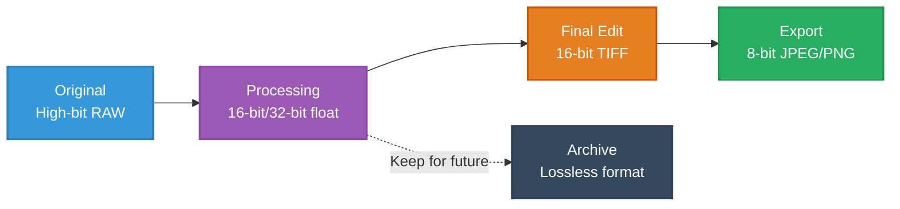

# Introduction to Digital Images

**A Comprehensive Guide to Digital Image Fundamentals**  
*Computer Vision | Image Processing | Machine Learning*

---

## Table of Contents

1. [Introduction](#1-introduction)
2. [What Is a Digital Image?](#2-what-is-a-digital-image)
3. [How Digital Images Are Stored](#3-how-digital-images-are-stored)
4. [Bit Depth and Color Representation](#4-bit-depth-and-color-representation)
5. [Spatial Resolution](#5-spatial-resolution)
6. [Physical vs. Digital Images](#6-physical-vs-digital-images)
7. [Digital Image Categories](#7-digital-image-categories)
8. [Applications and Importance](#8-applications-and-importance)
9. [Key Terminology](#9-key-terminology)
10. [Practical Examples](#10-practical-examples)
11. [Best Practices](#11-best-practices)
12. [References](#12-references)

---

## 1. Introduction

Digital images are ubiquitous in modern technology—from smartphones and medical scanners to satellites, security cameras, and autonomous vehicles. Understanding how digital images work forms the foundation of computer vision, machine learning, computer graphics, and image processing.

This document introduces the fundamental concepts of digital images in a clear, systematic, and beginner-friendly manner, providing both theoretical foundations and practical insights.

### Learning Outcomes

By the end of this guide, you will understand:
- The mathematical representation of digital images
- Image storage formats and data structures
- Bit depth, resolution, and their implications
- The relationship between physical and digital imagery
- Practical applications across various domains

---

## 2. What Is a Digital Image?

A **digital image** is a two-dimensional representation of visual information stored as a discrete grid of numerical values. Each element in this grid is called a **pixel** (picture element).

### Key Concepts

- An image is composed of **pixels** arranged in a grid
- Each pixel has an **intensity value** (grayscale) or **multiple values** (color channels)
- Images are stored using **matrices** (2D) or **tensors** (3D arrays)

### Mathematical Representation

A digital image can be represented as a function:

$$f(x, y) = \text{intensity at spatial position } (x, y)$$

Where:
- $(x, y)$ are discrete spatial coordinates
- $f(x, y)$ is typically an integer in the range $[0, 255]$ for 8-bit images
- $x \in [0, W-1]$ and $y \in [0, H-1]$ where $W$ is width and $H$ is height

For **grayscale images**:

$$f: \mathbb{Z}^2 \to [0, 255]$$

For **color (RGB) images**:

$$f(x, y) = \begin{bmatrix} R(x,y) \\ G(x,y) \\ B(x,y) \end{bmatrix}$$

Where $R, G, B \in [0, 255]$ represent Red, Green, and Blue channels respectively.

---

## 3. How Digital Images Are Stored

Digital images are stored as multi-dimensional arrays in computer memory, with structure depending on the image type.

### Storage Architecture

### Image Types and Representations

| Type | Dimensions | Range | Description |
|------|------------|-------|-------------|
| **Binary** | $H \times W \times 1$ | $\{0, 1\}$ | Black and white only, used in document scanning |
| **Grayscale** | $H \times W \times 1$ | $[0, 255]$ | Single intensity channel, 256 gray levels |
| **RGB** | $H \times W \times 3$ | $[0, 255]^3$ | Three color channels: Red, Green, Blue |
| **RGBA** | $H \times W \times 4$ | $[0, 255]^4$ | RGB + Alpha (transparency) channel |
| **Indexed** | $H \times W \times 1$ + palette | Palette-dependent | Uses color lookup table (colormap) |

### Mathematical Notation

**Grayscale image matrix:**

$$I = \begin{bmatrix}
I(0,0) & I(0,1) & \cdots & I(0,W-1) \\
I(1,0) & I(1,1) & \cdots & I(1,W-1) \\
\vdots & \vdots & \ddots & \vdots \\
I(H-1,0) & I(H-1,1) & \cdots & I(H-1,W-1)
\end{bmatrix}$$

**RGB image tensor:**

$$I \in \mathbb{R}^{H \times W \times 3}$$

Where the third dimension indexes the color channel:
- $I(:,:,0)$ = Red channel
- $I(:,:,1)$ = Green channel  
- $I(:,:,2)$ = Blue channel

---

## 4. Bit Depth and Color Representation

**Bit depth** (also called color depth) determines the number of distinct tones or colors an image can represent per channel.

### Bit Depth Hierarchy

### Common Bit Depths

| Bit Depth | Value Range | Total Tones/Colors | Use Case |
|-----------|-------------|-------------------|----------|
| **1-bit** | $\{0, 1\}$ | 2 | Binary images, text documents |
| **8-bit** | $[0, 255]$ | 256 | Standard grayscale, web images |
| **16-bit** | $[0, 65535]$ | 65,536 | Medical imaging, RAW photography |
| **24-bit RGB** | $[0, 255]$ per channel | $\approx 16.7$ million | Standard color images |
| **32-bit RGB** | $[0, 255]$ + 8-bit alpha | $\approx 16.7$ million + transparency | Graphics with transparency |
| **48-bit RGB** | $[0, 65535]$ per channel | $\approx 281$ trillion | Professional photography, HDR |

### Mathematical Formula

The total number of representable values for a given bit depth $b$ is:

$$\text{Total Values} = 2^b$$

For RGB images with $b$ bits per channel:

$$\text{Total Colors} = 2^{3b} = (2^b)^3$$

**Example:** An 8-bit RGB image can represent:

$$2^{8 \times 3} = 2^{24} = 16,777,216 \text{ colors}$$

### Dynamic Range

The **dynamic range** of an image is the ratio between the maximum and minimum representable values:

$$\text{Dynamic Range} = \frac{I_{\max}}{I_{\min}} = \frac{2^b - 1}{1} = 2^b - 1$$

In decibels (dB):

$$\text{Dynamic Range (dB)} = 20 \log_{10}(2^b - 1) \approx 6.02 \times b$$

---

## 5. Spatial Resolution

**Spatial resolution** refers to the number of pixels that constitute an image, typically expressed as Width × Height.

### Resolution Formula

$$\text{Total Pixels} = W \times H$$

Where $W$ is width (columns) and $H$ is height (rows).

### Common Resolutions

| Name | Resolution | Aspect Ratio | Megapixels | Use Case |
|------|-----------|--------------|------------|----------|
| **VGA** | 640 × 480 | 4:3 | 0.3 MP | Legacy systems |
| **HD (720p)** | 1280 × 720 | 16:9 | 0.9 MP | HD video |
| **Full HD (1080p)** | 1920 × 1080 | 16:9 | 2.1 MP | Standard HD |
| **2K** | 2048 × 1080 | 1.9:1 | 2.2 MP | Cinema |
| **4K UHD** | 3840 × 2160 | 16:9 | 8.3 MP | High-end displays |
| **8K UHD** | 7680 × 4320 | 16:9 | 33.2 MP | Professional video |
| **Full-frame DSLR** | 6000 × 4000 | 3:2 | 24 MP | Photography |

### Resolution Impact

### Pixel Density

For printed images or displays, we consider **pixels per inch (PPI)** or **dots per inch (DPI)**:

$$\text{PPI} = \frac{\sqrt{W^2 + H^2}}{\text{Diagonal (inches)}}$$

**Example:** A 5-inch diagonal phone with 1920×1080 resolution:

$$\text{PPI} = \frac{\sqrt{1920^2 + 1080^2}}{5} = \frac{2203}{5} \approx 441 \text{ PPI}$$

---

## 6. Physical vs. Digital Images

Understanding the distinction between physical and digital representations is crucial for image acquisition and processing.

### Comparison Framework

### Physical Images

**Characteristics:**
- Continuous in both **space** and **amplitude**
- Infinite resolution (limited only by physical laws)
- Analog representation of light intensity
- Subject to optical phenomena (diffraction, aberration)

**Mathematical representation:**

$$f(x, y): \mathbb{R}^2 \to \mathbb{R}^+$$

Where $(x, y) \in \mathbb{R}^2$ are continuous coordinates.

### Digital Images

**Characteristics:**
- Discrete in both **space** (pixels) and **amplitude** (quantized values)
- Finite resolution (determined by sensor/sampling)
- Numerical representation suitable for computation
- Subject to digitization artifacts (aliasing, quantization error)

**Mathematical representation:**

$$f[m, n]: \mathbb{Z}^2 \to \{0, 1, 2, \ldots, 2^b-1\}$$

Where $(m, n) \in \mathbb{Z}^2$ are discrete pixel coordinates.

### Digitization Process

The conversion involves two key steps:

**1. Sampling** (spatial discretization):

$$f[m, n] = f(m \Delta x, n \Delta y)$$

Where $\Delta x$ and $\Delta y$ are sampling intervals.

**2. Quantization** (amplitude discretization):

$$\hat{f}[m, n] = \text{round}\left(\frac{f[m, n] - f_{\min}}{f_{\max} - f_{\min}} \times (2^b - 1)\right)$$

---

## 7. Digital Image Categories

Digital images can be classified based on their mathematical properties and processing characteristics.

### Classification Taxonomy

### Category Descriptions

#### 1. Continuous-tone Images
Images with smooth transitions between intensity levels.

$$\nabla f \text{ is continuous}$$

**Examples:** Natural photographs, medical X-rays

#### 2. Discrete (Quantized) Images
Images with limited, distinct intensity levels.

$$f[m,n] \in \{v_1, v_2, \ldots, v_k\} \quad \text{where } k \ll 2^b$$

**Examples:** Posterized images, indexed color images

#### 3. Binary Images
Images with only two intensity levels.

$$f[m,n] \in \{0, 1\}$$

**Examples:** Text documents, thresholded images, masks

#### 4. Multispectral/Hyperspectral Images
Images with many spectral bands beyond RGB.

$$f[m, n, \lambda]: \mathbb{Z}^2 \times \Lambda \to [0, 2^b-1]$$

Where $\lambda$ indexes spectral bands.

**Examples:** Satellite imagery, agricultural monitoring

---

## 8. Applications and Importance

Digital images are fundamental to numerous technological domains.

### Application Domains

### Key Application Areas

#### Computer Vision

**Tasks:**
- Object detection and recognition
- Face detection and identification
- Pose estimation
- Semantic segmentation
- Instance segmentation

**Mathematical foundation:**

$$\text{Classification: } f: \mathcal{I} \to \mathcal{C}$$

Where $\mathcal{I}$ is the image space and $\mathcal{C}$ is the class space.

#### Image Processing

**Operations:**
- **Enhancement:** Improving visual quality

$$g(x,y) = T[f(x,y)]$$

- **Restoration:** Removing degradation

$$\hat{f} = \arg\min_f \|g - h * f\|^2 + \lambda R(f)$$

- **Compression:** Reducing storage requirements

$$\text{Compression Ratio} = \frac{\text{Original Size}}{\text{Compressed Size}}$$

- **Segmentation:** Partitioning into regions

$$I = \bigcup_{i=1}^n R_i, \quad R_i \cap R_j = \emptyset \text{ for } i \neq j$$

#### Deep Learning

**Applications:**
- Convolutional Neural Networks (CNNs)
- Image-to-image translation (e.g., style transfer)
- Generative Adversarial Networks (GANs)
- Vision transformers

**Convolution operation:**

$$S(i,j) = \sum_m \sum_n I(m,n) \cdot K(i-m, j-n)$$

Where $K$ is the kernel and $S$ is the feature map.

---

## 9. Key Terminology

### Essential Definitions

| Term | Definition | Mathematical Notation |
|------|------------|----------------------|
| **Pixel** | Picture element; smallest unit of an image | $(x, y)$ or $[m, n]$ |
| **Resolution** | Number of pixels in width and height | $W \times H$ |
| **Bit Depth** | Number of bits per pixel/channel | $b$ bits |
| **Channel** | Independent image component (e.g., R, G, B) | $C \in \{R, G, B\}$ |
| **Intensity** | Brightness value of a pixel | $I(x,y) \in [0, 2^b-1]$ |
| **Grayscale** | Single-channel intensity image | $I: \mathbb{Z}^2 \to [0, 255]$ |
| **RGB** | Three-channel color model | $[R, G, B]$ |
| **Histogram** | Distribution of intensity values | $h(k) = \sum_{x,y} \mathbb{1}[I(x,y)=k]$ |
| **Dynamic Range** | Ratio of brightest to darkest value | $\log_2(I_{\max}/I_{\min})$ |
| **Aspect Ratio** | Ratio of width to height | $\alpha = W/H$ |

### Coordinate Systems

**Image coordinates:**
- Origin at top-left: $(0, 0)$
- $x$-axis: horizontal (columns)
- $y$-axis: vertical (rows)

**Matrix notation:**

$$I[r, c] \text{ where } r \in [0, H-1], c \in [0, W-1]$$

---

## 10. Practical Examples

### Example 1: Pixel Intensity Interpretation

**Grayscale values (8-bit):**

| Value | Interpretation | Brightness |
|-------|---------------|------------|
| 0 | Pure black | 0% |
| 64 | Dark gray | 25% |
| 128 | Mid gray | 50% |
| 192 | Light gray | 75% |
| 255 | Pure white | 100% |

### Example 2: Matrix Representation

**Grayscale image (3×3 pixels):**

$$I = \begin{bmatrix}
34 & 56 & 78 \\
90 & 120 & 255 \\
10 & 15 & 18
\end{bmatrix}$$

**Interpretation:**
- Brightest pixel: $(1, 2)$ with value 255 (white)
- Darkest pixel: $(2, 0)$ with value 10 (near black)
- Average intensity: $\mu = \frac{1}{9}\sum I = 75.1$

### Example 3: RGB Color Representation

**2×2 RGB image:**

$$I_R = \begin{bmatrix} 120 & 90 \\ 255 & 10 \end{bmatrix}, \quad
I_G = \begin{bmatrix} 40 & 30 \\ 200 & 5 \end{bmatrix}, \quad
I_B = \begin{bmatrix} 60 & 20 \\ 50 & 2 \end{bmatrix}$$

**Pixel colors:**
- $(0,0)$: RGB(120, 40, 60) → Muted purple-brown
- $(0,1)$: RGB(90, 30, 20) → Dark brown
- $(1,0)$: RGB(255, 200, 50) → Bright yellow-orange
- $(1,1)$: RGB(10, 5, 2) → Near black

### Example 4: File Size Calculation

**Calculate storage size for a 4K RGB image:**

$$\text{Size} = W \times H \times C \times \frac{b}{8}$$

$$\text{Size} = 3840 \times 2160 \times 3 \times \frac{8}{8} = 24,883,200 \text{ bytes} \approx 23.7 \text{ MB}$$

**With compression (JPEG, 10:1 ratio):**

$$\text{Compressed Size} \approx \frac{23.7}{10} \approx 2.4 \text{ MB}$$

---

## 11. Best Practices

### Image Acquisition

### Guidelines by Use Case

#### 1. Bit Depth Selection

| Application | Recommended Bit Depth | Rationale |
|-------------|---------------------|-----------|
| Web images | 8-bit | Sufficient for displays, smaller files |
| Professional photography | 12-14 bit RAW | Preserves editing latitude |
| Scientific imaging | 16-bit | Maximum dynamic range preservation |
| Medical imaging | 12-16 bit | Required for diagnostic accuracy |
| Document scanning | 1-bit or 8-bit | Text clarity or grayscale documents |

#### 2. Format Selection

| Format | Compression | Use Case | Advantages |
|--------|------------|----------|-----------|
| **PNG** | Lossless | Web graphics, screenshots | Transparency support, no artifacts |
| **JPEG** | Lossy | Photos, web images | Small size, universal support |
| **TIFF** | None/Lossless | Archival, professional | Metadata support, no quality loss |
| **RAW** | None | Professional photography | Maximum editing flexibility |
| **WebP** | Both | Modern web | Better compression than JPEG |

#### 3. Quality Preservation

**Do's:**
- ✅ Use lossless formats (PNG, TIFF) for master copies
- ✅ Keep original RAW files when possible
- ✅ Use appropriate bit depth for your application
- ✅ Maintain proper color space (sRGB for web, Adobe RGB for print)
- ✅ Embed metadata (EXIF, IPTC) for traceability

**Don'ts:**
- ❌ Avoid repeated JPEG saving (quality degrades)
- ❌ Don't upscale low-resolution images (adds no information)
- ❌ Avoid unnecessary format conversions
- ❌ Don't use lossy compression for intermediate processing steps
- ❌ Avoid discarding original high-bit-depth data

#### 4. Processing Recommendations

**Workflow best practices:**

#### 5. Storage Considerations

**Estimating storage requirements:**

$$\text{Storage per image} = \frac{W \times H \times C \times b}{8 \times \text{Compression Ratio}}$$

**Example storage requirements:**

| Scenario | Resolution | Bit Depth | Format | Size/Image | 1000 Images |
|----------|-----------|-----------|--------|------------|-------------|
| Smartphone | 4000×3000 | 8-bit RGB | JPEG (10:1) | ~1.5 MB | 1.5 GB |
| DSLR | 6000×4000 | 14-bit RAW | Uncompressed | ~72 MB | 72 GB |
| Medical | 2048×2048 | 16-bit | TIFF | ~8 MB | 8 GB |
| Document scan | 2550×3300 | 1-bit | TIFF (G4) | ~100 KB | 100 MB |

---

## 12. References

### Foundational Texts

1. **Gonzalez, R. C., & Woods, R. E.** (2018). *Digital Image Processing* (4th ed.). Pearson Education.
   - Comprehensive coverage of image fundamentals and processing techniques
   - ISBN: 978-0133356724

2. **Szeliski, R.** (2022). *Computer Vision: Algorithms and Applications* (2nd ed.). Springer.
   - Modern computer vision perspective on image representation
   - Free online: http://szeliski.org/Book/

3. **Jain, A. K.** (1989). *Fundamentals of Digital Image Processing*. Prentice Hall.
   - Classic treatment of image fundamentals
   - ISBN: 978-0133361650

### Technical Resources

4. **OpenCV Documentation**  
   https://docs.opencv.org/
   - Open-source computer vision library
   - Practical implementation examples

5. **NumPy Documentation**  
   https://numpy.org/doc/
   - Python numerical computing for image arrays
   - Matrix operations and array manipulation

6. **scikit-image Documentation**  
   https://scikit-image.org/
   - Python image processing library
   - Educational examples and tutorials

### Standards and Specifications

7. **ITU-R BT.601** - Standard for digital video
8. **ITU-R BT.709** - HDTV standard (sRGB color space)
9. **DICOM Standard** - Medical imaging format specification

---

## Appendix: Quick Reference

### Conversion Formulas

**RGB to Grayscale (ITU-R BT.601):**

$$L = 0.299R + 0.587G + 0.114B$$

**RGB to HSV:**

$V = \max(R, G, B)$
$S = \begin{cases} 0 & \text{if } V = 0 \\ \frac{V - \min(R,G,B)}{V} & \text{otherwise} \end{cases}$

$H = \begin{cases}
\text{undefined} & \text{if } S = 0 \\
60° \times \frac{G-B}{V-\min(R,G,B)} & \text{if } V = R \\
60° \times \left(2 + \frac{B-R}{V-\min(R,G,B)}\right) & \text{if } V = G \\
60° \times \left(4 + \frac{R-G}{V-\min(R,G,B)}\right) & \text{if } V = B
\end{cases}$

**Normalize to [0, 1]:**

$I_{\text{norm}} = \frac{I - I_{\min}}{I_{\max} - I_{\min}}$

**Pixel distance (Euclidean):**

$d(p_1, p_2) = \sqrt{(R_1-R_2)^2 + (G_1-G_2)^2 + (B_1-B_2)^2}$

### Common Image Operations

| Operation | Formula | Purpose |
|-----------|---------|---------|
| **Negative** | $I' = 255 - I$ | Invert intensities |
| **Thresholding** | $I' = \begin{cases} 255 & \text{if } I > T \\ 0 & \text{otherwise} \end{cases}$ | Binary conversion |
| **Brightness** | $I' = I + c$ | Adjust overall brightness |
| **Contrast** | $I' = \alpha \cdot I$ | Adjust contrast ($\alpha > 1$ increases) |
| **Gamma correction** | $I' = 255 \left(\frac{I}{255}\right)^\gamma$ | Nonlinear intensity mapping |
| **Clipping** | $I' = \min(\max(I, 0), 255)$ | Ensure valid range |

### Memory Requirements

**Uncompressed image size:**

$\text{Size (bytes)} = W \times H \times C \times \frac{b}{8}$

Where:
- $W$ = width in pixels
- $H$ = height in pixels
- $C$ = number of channels
- $b$ = bits per channel

**Examples:**

| Configuration | Calculation | Size |
|--------------|-------------|------|
| 1920×1080, 8-bit RGB | $1920 \times 1080 \times 3 \times 1$ | 6.2 MB |
| 4096×4096, 16-bit grayscale | $4096 \times 4096 \times 1 \times 2$ | 33.6 MB |
| 1024×768, 8-bit RGBA | $1024 \times 768 \times 4 \times 1$ | 3.1 MB |

---

## Glossary

**Aliasing** - Artifacts caused by insufficient sampling rate, violating the Nyquist theorem

**Aspect Ratio** - Proportional relationship between image width and height

**Bit Depth** - Number of bits used to represent each pixel or channel value

**Channel** - Independent component of an image (e.g., Red, Green, Blue)

**Color Space** - Mathematical model describing how colors are represented

**Compression Ratio** - Ratio of original to compressed file size

**Convolution** - Mathematical operation combining image with a kernel for filtering

**Dynamic Range** - Ratio between maximum and minimum representable intensities

**Histogram** - Graphical representation of pixel intensity distribution

**Interpolation** - Method for estimating pixel values at non-integer coordinates

**Pixel** - Smallest addressable element in a digital image

**Quantization** - Process of mapping continuous values to discrete levels

**Resolution** - Number of pixels comprising an image (width × height)

**Sampling** - Process of converting continuous signal to discrete values

**Saturation** - Purity or vividness of a color

---

## Practice Problems

### Problem 1: File Size Calculation

**Question:** Calculate the uncompressed file size of a 3264×2448 pixel image with 10-bit RGB color depth.

**Solution:**

$\text{Size} = 3264 \times 2448 \times 3 \times \frac{10}{8} = 30,009,600 \text{ bytes} = 28.6 \text{ MB}$

### Problem 2: Bit Depth Comparison

**Question:** How many times more colors can a 12-bit RGB image represent compared to an 8-bit RGB image?

**Solution:**

$\text{12-bit RGB: } 2^{12 \times 3} = 2^{36} = 68,719,476,736 \text{ colors}$

$\text{8-bit RGB: } 2^{8 \times 3} = 2^{24} = 16,777,216 \text{ colors}$

$\text{Ratio: } \frac{2^{36}}{2^{24}} = 2^{12} = 4096\text{×}$

### Problem 3: Resolution Scaling

**Question:** If a 4K image (3840×2160) is downsampled to HD (1920×1080), what percentage of pixels are retained?

**Solution:**

$\text{Original pixels: } 3840 \times 2160 = 8,294,400$

$\text{Downsampled pixels: } 1920 \times 1080 = 2,073,600$

$\text{Percentage: } \frac{2,073,600}{8,294,400} \times 100\% = 25\%$

---

## Summary Checklist

By completing this guide, you should now understand:

- ✅ Digital images are discrete 2D/3D arrays of numerical values
- ✅ Pixels are the fundamental building blocks of digital images
- ✅ Bit depth determines the number of representable intensity levels or colors
- ✅ Resolution defines image size and detail capacity
- ✅ Different image types (grayscale, RGB, binary) serve different purposes
- ✅ The relationship between physical scenes and digital representation
- ✅ Storage requirements depend on resolution, bit depth, and compression
- ✅ Proper format selection is crucial for quality preservation
- ✅ Digital images enable countless applications across science and technology

---

**Document Version:** 1.0  
**Last Updated:** November 2025  
**License:** Educational use permitted with attribution

---

*This comprehensive guide provides the foundational knowledge necessary for further study in computer vision, image processing, machine learning, and related fields.*