# 02-image-formation.md

## **1. Introduction**
Image formation is the process by which real-world scenes are converted into digital images.  
It involves **light**, **objects**, **optics**, and **sensors**.

Understanding image formation is essential for:
- Camera calibration  
- 3D reconstruction  
- Photogrammetry  
- Image correction  
- Computer vision algorithms  

---

## **2. The Image Formation Pipeline**
The real world → becomes → a digital image through these stages:# Image Formation: From Physical Scene to Digital Image

**A Comprehensive Guide to the Physics and Mathematics of Image Capture**  
*Computer Vision | Photogrammetry | Computational Photography*

---

## Table of Contents

1. [Introduction](#1-introduction)
2. [The Image Formation Pipeline](#2-the-image-formation-pipeline)
3. [Physics of Light](#3-physics-of-light)
4. [Light-Object Interaction](#4-light-object-interaction)
5. [Imaging Geometry](#5-imaging-geometry)
6. [Lens-Based Imaging Systems](#6-lens-based-imaging-systems)
7. [Radiometry and Photometry](#7-radiometry-and-photometry)
8. [The Exposure Triangle](#8-the-exposure-triangle)
9. [Image Sensors](#9-image-sensors)
10. [Sampling and Quantization](#10-sampling-and-quantization)
11. [Noise in Image Formation](#11-noise-in-image-formation)
12. [Complete Image Formation Example](#12-complete-image-formation-example)
13. [Best Practices](#13-best-practices)
14. [References](#14-references)

---

## 1. Introduction

**Image formation** is the fundamental process by which three-dimensional real-world scenes are converted into two-dimensional digital representations. This transformation involves the complex interplay of light, physical objects, optical systems, and electronic sensors.

### Why Image Formation Matters

Understanding image formation is essential for:

- **Camera calibration** - Correcting geometric and photometric distortions
- **3D reconstruction** - Recovering depth from 2D projections
- **Photogrammetry** - Precise measurement from photographs
- **Image correction** - Compensating for optical aberrations
- **Computer vision algorithms** - Modeling the image acquisition process
- **Computational photography** - Advanced image enhancement techniques

### Learning Objectives

By the end of this guide, you will understand:
- The complete pipeline from light source to digital pixel
- Mathematical models of projection and imaging
- Physical principles governing light-matter interaction
- Sensor characteristics and limitations
- Sources of image degradation and noise

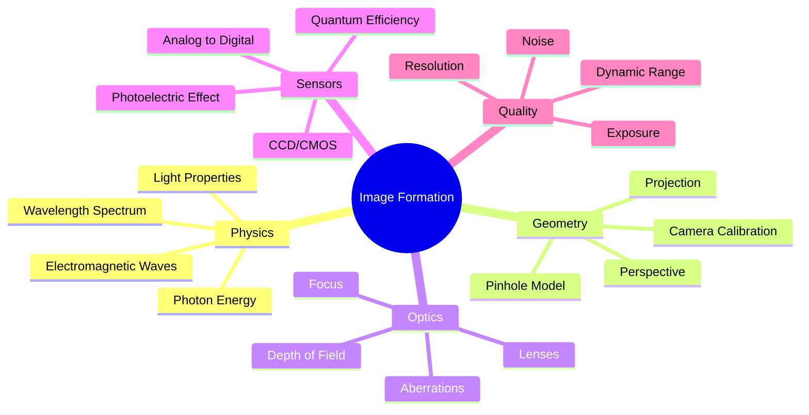

---

## 2. The Image Formation Pipeline

The transformation from physical scene to digital image proceeds through a sequence of distinct stages, each introducing its own characteristics and limitations.

### Pipeline Overview

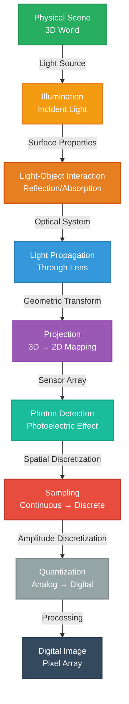

### Stage Descriptions

#### 1. Illumination
Light from natural (sun) or artificial sources illuminates the scene.

$$\Phi_{\text{incident}} = \int_{\lambda} \int_{\Omega} L(\lambda, \omega) \, d\omega \, d\lambda$$

Where:
- $\Phi$ = luminous flux
- $L(\lambda, \omega)$ = spectral radiance
- $\Omega$ = solid angle

#### 2. Light-Object Interaction
Objects absorb, reflect, refract, or transmit incident light based on material properties.

$$L_{\text{reflected}} = \int_{\Omega_i} f_r(\omega_i, \omega_r) \cdot L_{\text{incident}}(\omega_i) \cdot \cos\theta_i \, d\omega_i$$

#### 3. Optical Propagation
Light travels through the imaging system (lenses, aperture).

#### 4. Projection
3D world coordinates are mapped to 2D image plane coordinates.

$$\begin{bmatrix} x \\ y \\ 1 \end{bmatrix} = \mathbf{K} \begin{bmatrix} \mathbf{R} & \mathbf{t} \end{bmatrix} \begin{bmatrix} X \\ Y \\ Z \\ 1 \end{bmatrix}$$

#### 5. Photon Detection
Sensor converts photons to electrical charge via photoelectric effect.

#### 6. Sampling
Continuous spatial distribution is sampled at discrete sensor locations.

#### 7. Quantization
Continuous intensity values are mapped to discrete digital levels.

$$I_{\text{digital}} = \text{round}\left(\frac{I_{\text{analog}} - I_{\min}}{I_{\max} - I_{\min}} \times (2^b - 1)\right)$$

---

## 3. Physics of Light

Light exhibits both wave and particle properties (wave-particle duality), fundamental to understanding image formation.

### Electromagnetic Wave Properties

Light is an electromagnetic wave characterized by:

**Wavelength ($\lambda$):** Distance between wave peaks

$$c = \lambda \cdot \nu$$

Where:
- $c = 3 \times 10^8$ m/s (speed of light)
- $\lambda$ = wavelength (meters)
- $\nu$ = frequency (Hz)

**Frequency ($\nu$):** Number of oscillations per second

### Visible Spectrum

```mermaid
graph LR
    A[UV<br/>< 380 nm] --> B[Violet<br/>380-450 nm]
    B --> C[Blue<br/>450-495 nm]
    C --> D[Green<br/>495-570 nm]
    D --> E[Yellow<br/>570-590 nm]
    E --> F[Orange<br/>590-620 nm]
    F --> G[Red<br/>620-750 nm]
    G --> H[IR<br/>> 750 nm]
    
    style A fill:#8b00ff,stroke:#6a00cc,stroke-width:2px,color:#fff
    style B fill:#8b00ff,stroke:#6a00cc,stroke-width:2px,color:#fff
    style C fill:#0000ff,stroke:#0000cc,stroke-width:2px,color:#fff
    style D fill:#00ff00,stroke:#00cc00,stroke-width:2px,color:#fff
    style E fill:#ffff00,stroke:#cccc00,stroke-width:2px
    style F fill:#ff8800,stroke:#cc6600,stroke-width:2px
    style G fill:#ff0000,stroke:#cc0000,stroke-width:2px,color:#fff
    style H fill:#8b0000,stroke:#660000,stroke-width:2px,color:#fff
```

| Color | Wavelength Range | Typical Value |
|-------|-----------------|---------------|
| Violet | 380–450 nm | ~400 nm |
| Blue | 450–495 nm | ~470 nm |
| Green | 495–570 nm | ~550 nm |
| Yellow | 570–590 nm | ~580 nm |
| Orange | 590–620 nm | ~600 nm |
| Red | 620–750 nm | ~650 nm |

### Photon Energy

Light also behaves as discrete particles (photons) with energy:

$$E = h\nu = \frac{hc}{\lambda}$$

Where:
- $h = 6.626 \times 10^{-34}$ J·s (Planck's constant)
- $\nu$ = frequency (Hz)
- $c$ = speed of light (m/s)
- $\lambda$ = wavelength (m)

**Example:** Energy of green light ($\lambda = 550$ nm):

$$E = \frac{(6.626 \times 10^{-34})(3 \times 10^8)}{550 \times 10^{-9}} = 3.61 \times 10^{-19} \text{ J} = 2.25 \text{ eV}$$

### Implications for Imaging

- **Shorter wavelengths** (blue) carry more energy than longer wavelengths (red)
- **Color perception** depends on wavelength sensitivity of sensor/eye
- **Chromatic aberration** occurs because different wavelengths refract differently

---

## 4. Light-Object Interaction

When light encounters a surface, four fundamental interactions can occur, determining what the camera ultimately captures.

### Interaction Types

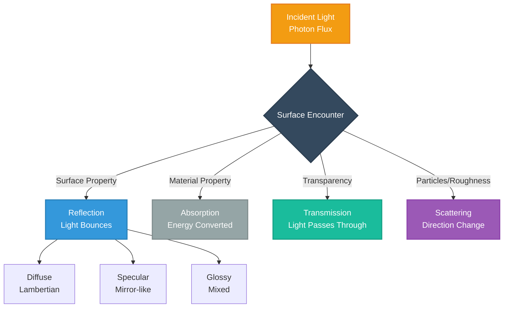

### Energy Conservation

The incident light must be conserved:

$$E_{\text{incident}} = E_{\text{reflected}} + E_{\text{absorbed}} + E_{\text{transmitted}} + E_{\text{scattered}}$$

Or in terms of coefficients:

$$1 = \rho + \alpha + \tau + \sigma$$

Where:
- $\rho$ = reflectance coefficient
- $\alpha$ = absorption coefficient
- $\tau$ = transmission coefficient
- $\sigma$ = scattering coefficient

### Reflection Types

#### 1. Diffuse (Lambertian) Reflection

Light scatters equally in all directions. The reflected intensity depends only on the angle of incidence.

**Lambert's Cosine Law:**

$$L_r = \frac{\rho}{\pi} L_i \cos\theta_i$$

Where:
- $L_r$ = reflected radiance
- $L_i$ = incident radiance
- $\theta_i$ = angle of incidence
- $\rho$ = albedo (reflectance)

**Characteristics:**
- Surface appears equally bright from all viewing angles
- Typical of matte surfaces (paper, unpolished wood, clay)
- Intensity proportional to $\cos\theta_i$

#### 2. Specular Reflection

Mirror-like reflection where incident angle equals reflected angle.

**Law of Reflection:**

$$\theta_i = \theta_r$$

**Reflected direction:**

$$\omega_r = \omega_i - 2(\omega_i \cdot \mathbf{n})\mathbf{n}$$

Where:
- $\omega_i$ = incident direction
- $\omega_r$ = reflected direction
- $\mathbf{n}$ = surface normal

**Characteristics:**
- Creates highlights and glare
- Typical of polished metals, mirrors, water surfaces
- Viewing angle dependent

#### 3. Glossy Reflection

Combination of diffuse and specular components.

**Phong Reflection Model:**

$$I = k_a I_a + k_d I_d (\mathbf{L} \cdot \mathbf{N}) + k_s I_s (\mathbf{R} \cdot \mathbf{V})^n$$

Where:
- $k_a, k_d, k_s$ = ambient, diffuse, specular coefficients
- $\mathbf{L}$ = light direction
- $\mathbf{N}$ = surface normal
- $\mathbf{R}$ = reflection direction
- $\mathbf{V}$ = view direction
- $n$ = shininess exponent

### BRDF: Bidirectional Reflectance Distribution Function

The **BRDF** is a fundamental function describing how light reflects from an opaque surface:

$$f_r(\omega_i, \omega_r) = \frac{dL_r(\omega_r)}{dE_i(\omega_i)} = \frac{dL_r(\omega_r)}{L_i(\omega_i) \cos\theta_i \, d\omega_i}$$

Where:
- $\omega_i = (\theta_i, \phi_i)$ = incident direction
- $\omega_r = (\theta_r, \phi_r)$ = reflected direction
- $L_r$ = reflected radiance
- $E_i$ = incident irradiance

**Properties:**
- Units: sr$^{-1}$ (per steradian)
- Must satisfy reciprocity: $f_r(\omega_i, \omega_r) = f_r(\omega_r, \omega_i)$
- Must conserve energy: $\int_{\Omega} f_r(\omega_i, \omega_r) \cos\theta_r \, d\omega_r \leq 1$

**Applications:**
- Photorealistic rendering
- Material classification and recognition
- Photometric stereo for shape recovery
- Appearance modeling

**Common BRDF Models:**

| Model | Equation | Use Case |
|-------|----------|----------|
| **Lambertian** | $f_r = \frac{\rho}{\pi}$ | Matte surfaces |
| **Phong** | $f_r = k_d + k_s(\mathbf{R} \cdot \mathbf{V})^n$ | Computer graphics |
| **Cook-Torrance** | Microfacet-based | Realistic metals |
| **Ward** | Anisotropic model | Brushed metals, cloth |

---

## 5. Imaging Geometry

The geometric relationship between 3D world points and their 2D image projections is fundamental to computer vision and photogrammetry.

### Pinhole Camera Model

The **pinhole camera** is the simplest and most fundamental imaging model, forming the basis for all camera calibration and 3D reconstruction algorithms.

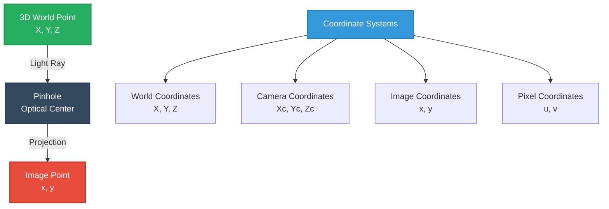

### Perspective Projection

**Basic projection equations:**

$$x = f \frac{X}{Z}, \qquad y = f \frac{Y}{Z}$$

Where:
- $(X, Y, Z)$ = 3D point in camera coordinates
- $(x, y)$ = 2D point on image plane
- $f$ = focal length
- $Z$ = depth (distance from camera)

**In homogeneous coordinates:**

$$\begin{bmatrix} x \\ y \\ 1 \end{bmatrix} \sim \begin{bmatrix} f & 0 & 0 & 0 \\ 0 & f & 0 & 0 \\ 0 & 0 & 1 & 0 \end{bmatrix} \begin{bmatrix} X \\ Y \\ Z \\ 1 \end{bmatrix}$$

### Complete Camera Model

The full transformation from world to pixel coordinates:

$$\mathbf{x} = \mathbf{K}[\mathbf{R}|\mathbf{t}]\mathbf{X}$$

Where:

**Intrinsic matrix** $\mathbf{K}$:

$$\mathbf{K} = \begin{bmatrix} f_x & s & c_x \\ 0 & f_y & c_y \\ 0 & 0 & 1 \end{bmatrix}$$

- $f_x, f_y$ = focal lengths in pixels
- $c_x, c_y$ = principal point (image center)
- $s$ = skew parameter (usually 0)

**Extrinsic parameters** $[\mathbf{R}|\mathbf{t}]$:

$$[\mathbf{R}|\mathbf{t}] = \begin{bmatrix} r_{11} & r_{12} & r_{13} & t_x \\ r_{21} & r_{22} & r_{23} & t_y \\ r_{31} & r_{32} & r_{33} & t_z \end{bmatrix}$$

- $\mathbf{R}$ = 3×3 rotation matrix
- $\mathbf{t}$ = 3×1 translation vector

### Projection Properties

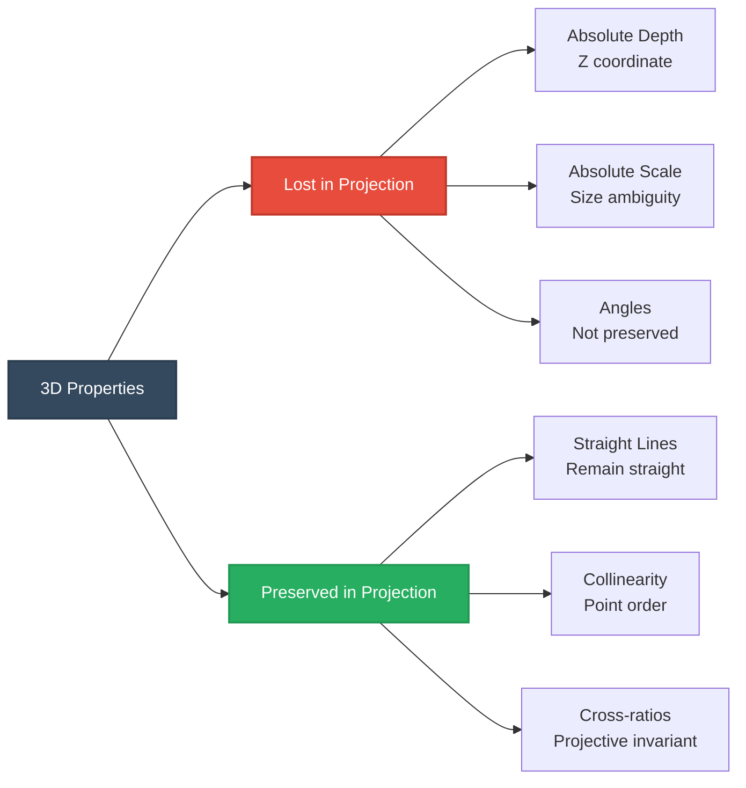

### Field of View (FOV)

The angular extent of the scene captured by the camera:

$$\text{FOV}_{\text{horizontal}} = 2 \arctan\left(\frac{w}{2f}\right)$$

$$\text{FOV}_{\text{vertical}} = 2 \arctan\left(\frac{h}{2f}\right)$$

Where:
- $w$ = sensor width
- $h$ = sensor height
- $f$ = focal length

---

## 6. Lens-Based Imaging Systems

Real cameras use lenses rather than pinholes to gather sufficient light for practical imaging.

### Thin Lens Model

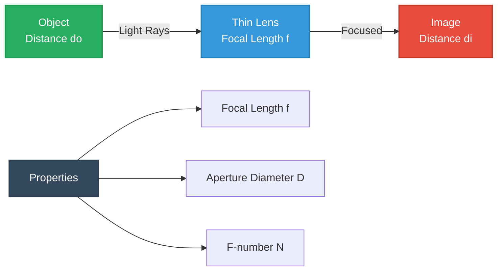

### Thin Lens Equation

The relationship between object distance, image distance, and focal length:

$$\frac{1}{f} = \frac{1}{d_o} + \frac{1}{d_i}$$

Where:
- $f$ = focal length of the lens
- $d_o$ = distance from lens to object
- $d_i$ = distance from lens to image plane (sensor)

**Sign convention:**
- Positive for real images/objects
- Negative for virtual images/objects

**Example:** Object at 2m from a 50mm lens:

$$\frac{1}{50} = \frac{1}{2000} + \frac{1}{d_i} \implies d_i = \frac{2000}{39} \approx 51.3 \text{ mm}$$

### Magnification

The ratio of image size to object size:

$$m = -\frac{d_i}{d_o} = \frac{h_i}{h_o}$$

Where:
- $m$ = magnification
- $h_i$ = image height
- $h_o$ = object height
- Negative sign indicates inverted image

### Focal Length Effects

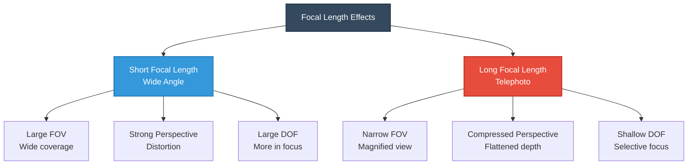

| Focal Length | Type | FOV (35mm) | Use Case |
|--------------|------|-----------|----------|
| < 21mm | Ultra-wide | > 90° | Architecture, landscapes |
| 21-35mm | Wide angle | 64-84° | Environmental portraits |
| 35-70mm | Normal | 34-54° | General photography |
| 70-135mm | Short telephoto | 18-34° | Portraits |
| 135-300mm | Telephoto | 8-18° | Sports, wildlife |
| > 300mm | Super telephoto | < 8° | Distant subjects |

### Depth of Field (DOF)

The range of distances that appear acceptably sharp:

$$\text{DOF} = \frac{2 NC d_o^2}{f^2}$$

Where:
- $N$ = f-number
- $C$ = circle of confusion diameter
- $d_o$ = focus distance
- $f$ = focal length

**Near and far limits:**

$$d_{\text{near}} = \frac{d_o f^2}{f^2 + NC(d_o - f)}$$

$$d_{\text{far}} = \frac{d_o f^2}{f^2 - NC(d_o - f)}$$

### Lens Aberrations

Real lenses suffer from imperfections that degrade image quality:

| Aberration | Effect | Correction |
|------------|--------|------------|
| **Spherical** | Blur at edges | Aspherical elements |
| **Chromatic** | Color fringing | Achromatic doublets |
| **Coma** | Comet-like tails | Symmetricdesign |
| **Astigmatism** | Different focus planes | Complex lens design |
| **Field curvature** | Curved focus plane | Field flattener |
| **Distortion** | Barrel/pincushion | Software correction |

**Radial distortion model:**

$$r_d = r_u(1 + k_1 r_u^2 + k_2 r_u^4 + k_3 r_u^6)$$

Where:
- $r_u$ = undistorted radius
- $r_d$ = distorted radius
- $k_1, k_2, k_3$ = distortion coefficients

---

## 7. Radiometry and Photometry

**Radiometry** measures electromagnetic radiation energy, while **photometry** measures light as perceived by the human eye.

### Fundamental Quantities

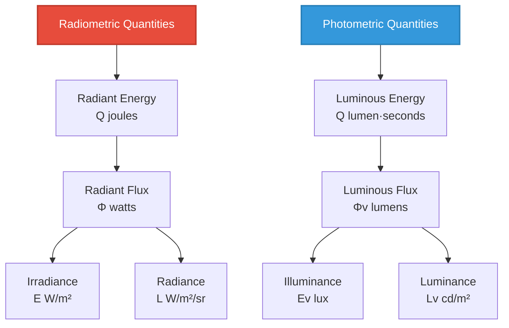

### Irradiance

Light power incident on a surface per unit area:

$$E = \frac{d\Phi}{dA}$$

Units: W/m² (radiometric) or lux (photometric)

**For a point source:**

$$E = \frac{\Phi}{4\pi r^2} \cos\theta$$

Where:
- $r$ = distance from source
- $\theta$ = angle from surface normal

### Radiance

Light power per unit area per unit solid angle:

$$L = \frac{d^2\Phi}{dA \, d\omega \, \cos\theta}$$

Units: W/(m²·sr) or cd/m² (nits)

**Key properties:**
- Invariant along rays in lossless media
- What cameras actually measure
- Determines brightness in images

### Relationship to Image Formation

The sensor irradiance is related to scene radiance:

$$E_{\text{sensor}} = \frac{\pi}{4} \frac{D^2}{(1 + m)^2 f^2} L_{\text{scene}} T$$

Where:
- $D$ = aperture diameter
- $m$ = magnification
- $f$ = focal length
- $T$ = transmission coefficient
- $L_{\text{scene}}$ = scene radiance

### Applications

- **HDR imaging** - Capturing high dynamic range scenes
- **Exposure control** - Determining proper camera settings
- **Tone mapping** - Displaying HDR on standard displays
- **Photometric stereo** - Recovering shape from shading
- **Relighting** - Changing illumination in post-processing

---

## 8. The Exposure Triangle

Proper exposure requires balancing three interdependent parameters that control the amount of light reaching the sensor.

### Exposure Triangle Visualization

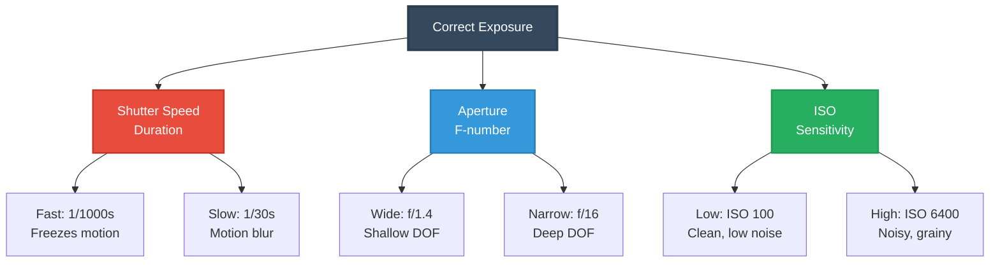

### 1. Shutter Speed

Duration the sensor is exposed to light:

$$t_{\text{exposure}} = \frac{1}{\text{shutter speed}}$$

**Common values:**
- 1/8000s - Very fast, freezes rapid motion
- 1/1000s - Sports, action
- 1/250s - General handheld
- 1/60s - Minimum for handheld (rule: 1/focal length)
- 1/15s - Static scenes, tripod recommended
- 1s - Long exposure, intentional blur
- 30s+ - Night photography, star trails

**Effect on exposure:**

$$E \propto t$$

Doubling shutter speed doubles exposure (one "stop").

### 2. Aperture (F-number)

The diameter of the lens opening:

$$N = \frac{f}{D}$$

Where:
- $N$ = f-number (f/stop)
- $f$ = focal length
- $D$ = aperture diameter

**Common f-stops (full stops):**

f/1.4, f/2, f/2.8, f/4, f/5.6, f/8, f/11, f/16, f/22

**Effect on exposure:**

$$E \propto \frac{1}{N^2}$$

Each stop change (e.g., f/4 → f/5.6) halves the light.

**Area of aperture:**

$$A = \pi \left(\frac{D}{2}\right)^2 = \pi \left(\frac{f}{2N}\right)^2$$

**Side effects:**
- **Depth of field:** Larger aperture (smaller f-number) = shallower DOF
- **Diffraction:** Smaller aperture (larger f-number) = more diffraction blur
- **Aberrations:** Wide open lenses show more aberrations

### 3. ISO Sensitivity

Amplification of the sensor signal:

$\text{Signal}_{\text{output}} = \text{ISO} \times \text{Signal}_{\text{sensor}}$

**Standard ISO values:**

ISO 100, 200, 400, 800, 1600, 3200, 6400, 12800

**Effect on exposure:**

$E \propto \text{ISO}$

Doubling ISO doubles effective exposure (one stop).

**Trade-offs:**
- **Low ISO (100-400):** Clean images, low noise, requires more light
- **Medium ISO (400-1600):** Balanced noise/light, general purpose
- **High ISO (1600+):** Enables low-light shooting, increased noise

### Exposure Value (EV)

A single number representing exposure level:

$\text{EV} = \log_2\left(\frac{N^2}{t}\right)$

Where:
- $N$ = f-number
- $t$ = shutter speed in seconds

**Equivalent exposures:**

All combinations with the same EV produce identical exposure:

| Aperture | Shutter | ISO | EV (ISO 100) |
|----------|---------|-----|--------------|
| f/2.8 | 1/1000s | 100 | 13 |
| f/4 | 1/500s | 100 | 13 |
| f/5.6 | 1/250s | 100 | 13 |
| f/8 | 1/125s | 100 | 13 |

### Exposure Equation

Total sensor irradiance:

$H = \frac{\pi}{4} \cdot \frac{L \cdot t}{N^2} \cdot T \cdot \text{ISO gain}$

Where:
- $H$ = exposure (lux·seconds)
- $L$ = scene luminance
- $t$ = shutter speed
- $N$ = f-number
- $T$ = lens transmission

---

## 9. Image Sensors

Image sensors convert photons into electrical signals that can be digitized and processed.

### Sensor Types Comparison

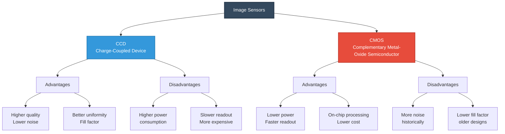

### Photoelectric Effect

The fundamental principle of sensor operation:

$E_{\text{photon}} \geq W_{\text{work function}}$

When a photon with sufficient energy strikes the sensor:

1. Photon absorbed by semiconductor (silicon)
2. Electron-hole pair generated
3. Electrons collected in potential well
4. Charge accumulated proportional to light intensity
5. Charge converted to voltage
6. Voltage digitized by ADC

### Quantum Efficiency (QE)

The probability that an incident photon generates an electron:

$\text{QE}(\lambda) = \frac{\text{Number of electrons generated}}{\text{Number of incident photons}}$

**Typical QE curves:**

| Sensor Type | Peak QE | Peak Wavelength |
|-------------|---------|-----------------|
| CCD | 60-90% | 550-650 nm |
| CMOS | 40-70% | 500-600 nm |
| Back-illuminated | 90-95% | 450-650 nm |

### Signal Generation

The photocurrent generated:

$I_{\text{signal}} = \text{QE}(\lambda) \cdot q \cdot \Phi_{\text{photon}}$

Where:
- $q = 1.602 \times 10^{-19}$ C (electron charge)
- $\Phi_{\text{photon}}$ = photon flux (photons/s)

**Total collected charge:**

$Q = \int_0^{t_{\text{exp}}} I(t) \, dt = \text{QE} \cdot q \cdot N_{\text{photons}}$

### Sensor Response

The digital output value:

$\text{DN} = \text{Gain} \times \frac{Q}{Q_{\text{full-well}}} \times (2^b - 1)$

Where:
- DN = Digital Number
- $Q_{\text{full-well}}$ = maximum charge capacity
- $b$ = bit depth

### Color Filter Array (CFA)

Most sensors use a Bayer pattern to capture color:

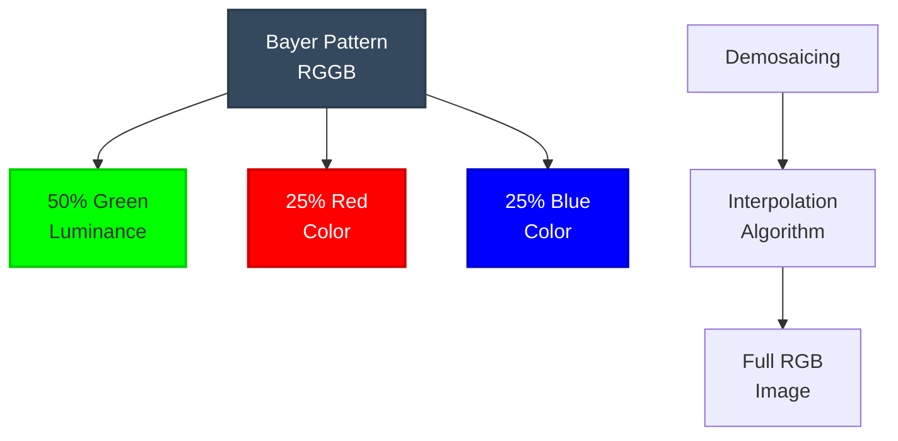

**Bayer pattern:**

```
G R G R G R
B G B G B G
G R G R G R
B G B G B G
```

**Why 50% green?**
- Human vision most sensitive to green
- Green provides most luminance information
- Better resolution for detail

### Sensor Size Effects

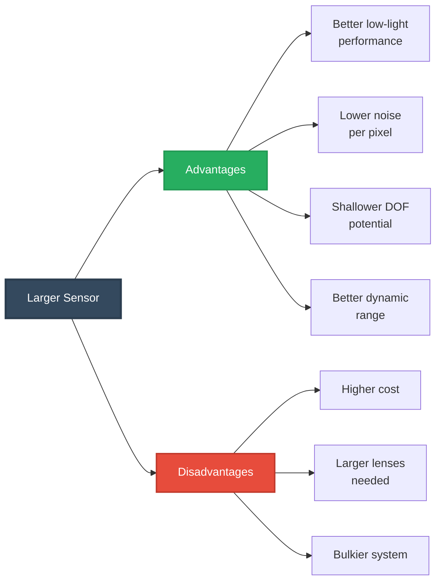

**Common sensor sizes:**

| Format | Dimensions | Crop Factor | Use Case |
|--------|-----------|-------------|----------|
| 1/2.3" | 6.2 × 4.6 mm | 5.6× | Smartphones |
| Micro 4/3 | 17.3 × 13 mm | 2.0× | Mirrorless |
| APS-C | 23.6 × 15.6 mm | 1.5× | Consumer DSLR |
| Full Frame | 36 × 24 mm | 1.0× | Professional |
| Medium Format | 44 × 33 mm | 0.8× | High-end studio |

---

## 10. Sampling and Quantization

The conversion from continuous analog signals to discrete digital values involves two fundamental processes.

### Sampling and Quantization Pipeline

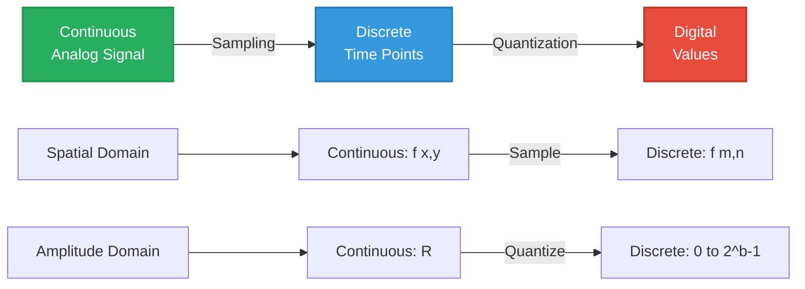

### Spatial Sampling

Converting continuous spatial coordinates to discrete pixel locations:

$f[m, n] = f(m\Delta x, n\Delta y)$

Where:
- $m, n$ = discrete pixel indices
- $\Delta x, \Delta y$ = sampling intervals (pixel pitch)
- $f(x, y)$ = continuous image function

### Nyquist-Shannon Sampling Theorem

To avoid aliasing, the sampling rate must be at least twice the highest spatial frequency:

$f_s \geq 2f_{\max}$

Or in terms of pixel spacing:

$\Delta x \leq \frac{1}{2f_{\max}}$

**Consequences of undersampling:**
- **Aliasing** - High frequencies appear as false low frequencies
- **Moiré patterns** - Interference patterns in regular textures
- **Jagged edges** - Stairstepping in diagonal lines

### Quantization

Converting continuous amplitude values to discrete levels:

$Q[m,n] = \text{round}\left(\frac{f[m,n] - f_{\min}}{f_{\max} - f_{\min}} \times (L-1)\right)$

Where:
- $L = 2^b$ = number of quantization levels
- $b$ = bit depth

### Quantization Error

The difference between original and quantized value:

$e_q = f[m,n] - Q[m,n]$

**Uniform quantization:**

$e_q \in \left[-\frac{\Delta}{2}, \frac{\Delta}{2}\right]$

Where $\Delta = \frac{f_{\max} - f_{\min}}{L}$ is the quantization step size.

**Signal-to-Quantization-Noise Ratio (SQNR):**

$\text{SQNR} = 6.02b + 1.76 \text{ dB}$

**Example:** 8-bit quantization provides:

$\text{SQNR} = 6.02(8) + 1.76 = 49.92 \text{ dB}$

### Analog-to-Digital Conversion

The ADC process:

1. **Sample and hold** - Capture instantaneous voltage
2. **Comparison** - Compare to reference voltages
3. **Encoding** - Convert to binary representation
4. **Output** - Digital pixel value

**ADC characteristics:**
- **Resolution:** Number of bits (typically 12-16 for cameras)
- **Conversion time:** Speed of digitization
- **Linearity:** Uniform step sizes
- **Noise:** Electronic noise floor

---

## 11. Noise in Image Formation

Image noise degrades quality and limits the minimum detectable signal. Understanding noise sources is crucial for image quality optimization.

### Noise Source Taxonomy

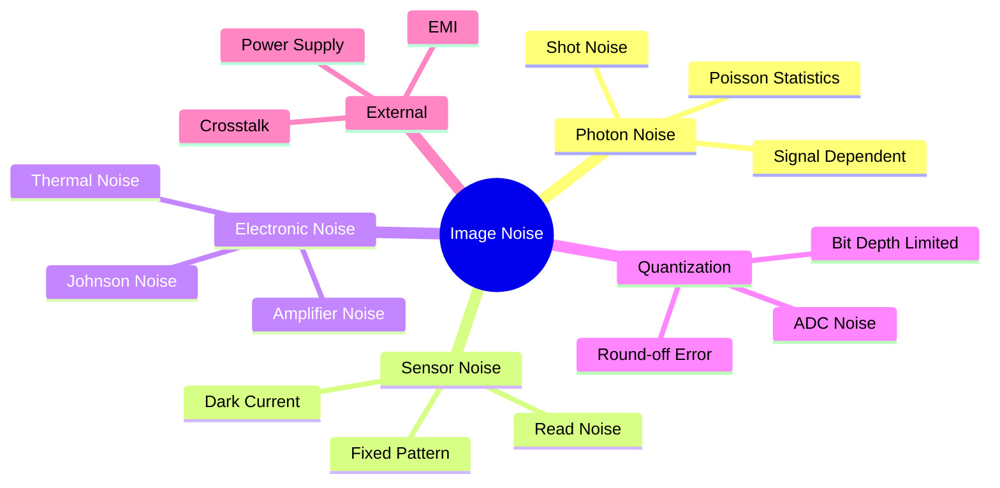

### 1. Photon Shot Noise

Inherent statistical variation in photon arrival (quantum noise):

$\sigma_{\text{shot}} = \sqrt{N_{\text{photons}}}$

**Signal-to-Noise Ratio (SNR):**

$\text{SNR}_{\text{shot}} = \frac{N}{\sqrt{N}} = \sqrt{N}$

**Key properties:**
- Follows Poisson statistics
- Fundamental limit (cannot be eliminated)
- Proportional to $\sqrt{\text{signal}}$
- Dominant in bright regions

**Example:** Detecting 10,000 photons:

$\sigma = \sqrt{10000} = 100 \text{ photons}$
$\text{SNR} = \frac{10000}{100} = 100 = 40 \text{ dB}$

### 2. Dark Current Noise

Thermally generated electrons in the sensor:

$N_{\text{dark}} = D \cdot t_{\text{exp}} \cdot A$

Where:
- $D$ = dark current rate (electrons/pixel/second)
- $t_{\text{exp}}$ = exposure time
- $A$ = pixel area

**Temperature dependence:**

$D(T) = D_0 \cdot 2^{(T-T_0)/8°C}$

Dark current approximately doubles every 8°C increase.

**Mitigation:**
- Sensor cooling
- Dark frame subtraction
- Shorter exposures

### 3. Read Noise

Electronic noise from signal readout circuitry:

$\sigma_{\text{read}} = \text{constant (electrons rms)}$

**Typical values:**
- High-end CCD: 2-5 electrons rms
- CMOS: 5-15 electrons rms
- Older sensors: 20-50 electrons rms

**Characteristics:**
- Independent of signal level
- Dominant in low-light conditions
- Reduced by cooling and better electronics

### 4. Fixed Pattern Noise (FPN)

Pixel-to-pixel variations in response:

$\text{FPN} = \sigma_{\text{pixel}} / \mu_{\text{signal}}$

**Types:**
- **Photo-response non-uniformity (PRNU):** Gain variations
- **Dark signal non-uniformity (DSNU):** Dark current variations

**Correction:**
- Flat-field calibration
- Per-pixel gain/offset correction

### Total Noise Model

Combining all noise sources:

$\sigma_{\text{total}}^2 = \sigma_{\text{shot}}^2 + \sigma_{\text{dark}}^2 + \sigma_{\text{read}}^2 + \sigma_{\text{quant}}^2$

$= N_{\text{signal}} + N_{\text{dark}} + R^2 + \frac{\Delta^2}{12}$

Where:
- $N_{\text{signal}}$ = signal photoelectrons
- $N_{\text{dark}}$ = dark current electrons
- $R$ = read noise (electrons rms)
- $\Delta$ = quantization step size

### Signal-to-Noise Ratio

Overall image quality metric:

$\text{SNR} = \frac{\mu_{\text{signal}}}{\sigma_{\text{total}}} = \frac{N_{\text{signal}}}{\sqrt{N_{\text{signal}} + N_{\text{dark}} + R^2}}$

**In decibels:**

$\text{SNR (dB)} = 20 \log_{10}(\text{SNR})$

### Noise Reduction Strategies

| Strategy | Method | Trade-off |
|----------|--------|-----------|
| **Longer exposure** | Increase signal | Motion blur, saturation |
| **Larger aperture** | More light | Reduced DOF |
| **Lower ISO** | Less amplification | Need more light |
| **Sensor cooling** | Reduce dark current | Complexity, cost |
| **Frame averaging** | Average N frames | Requires static scene |
| **Spatial filtering** | Denoise algorithms | Loss of detail |

**Frame averaging improvement:**

$\text{SNR}_{\text{avg}} = \sqrt{N} \times \text{SNR}_{\text{single}}$

Averaging 16 frames improves SNR by 4× (12 dB).

---

## 12. Complete Image Formation Example

Let's trace the complete path from scene to digital image with a concrete example.

### Scenario Setup

**Scene:** A tree reflecting sunlight  
**Camera:** DSLR with 50mm f/1.8 lens  
**Settings:** 1/500s, f/4, ISO 400  
**Sensor:** APS-C CMOS, 24MP (6000×4000)

### Step-by-Step Process

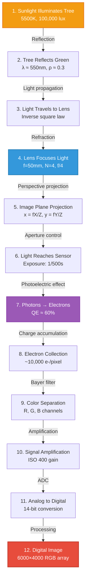

### Detailed Calculations

#### 1. Scene Illumination

Solar irradiance at Earth's surface:
$E_{\text{sun}} \approx 100,000 \text{ lux} = 100,000 \text{ lm/m}^2$

#### 2. Surface Reflection

Tree reflects primarily green wavelengths:
$L_{\text{tree}} = \frac{\rho \cdot E}{\pi} = \frac{0.3 \times 100,000}{\pi} \approx 9,549 \text{ cd/m}^2$

#### 3. Lens Transmission

Light collected by lens (T ≈ 0.9):
$\Phi_{\text{lens}} = L \cdot A_{\text{lens}} \cdot \Omega$

#### 4. Sensor Irradiance

$E_{\text{sensor}} = \frac{\pi}{4} \cdot \frac{L \cdot t}{N^2} \cdot T$

$= \frac{\pi}{4} \cdot \frac{9549 \times (1/500)}{16} \times 0.9 \approx 8.5 \text{ lux·s}$

#### 5. Photon Count

Number of photons per pixel (green, λ=550nm):

Photon energy: $E_{\text{photon}} = \frac{hc}{\lambda} = 3.61 \times 10^{-19}$ J

Pixel area: $(24\text{mm} / 6000)^2 = 16 \mu\text{m}^2$

Photons collected:
$N_{\text{photons}} \approx \frac{E_{\text{sensor}} \cdot A_{\text{pixel}}}{E_{\text{photon}}} \approx 30,000$

#### 6. Electron Generation

With QE = 60%:
$N_{\text{electrons}} = 0.60 \times 30,000 = 18,000 \text{ e}^-$

#### 7. ISO Amplification

ISO 400 provides approximately 4× gain:
$N_{\text{effective}} = 4 \times 18,000 = 72,000 \text{ e}^-$

#### 8. Noise Calculation

$\sigma_{\text{total}} = \sqrt{18000 + 100 + 10^2} \approx 135 \text{ e}^-$

$\text{SNR} = \frac{18000}{135} \approx 133 = 42.5 \text{ dB}$

#### 9. Digital Conversion

14-bit ADC with full-well capacity of 100,000 e⁻:

$\text{DN} = \frac{72,000}{100,000} \times 16383 \approx 11,796$

#### 10. Final Image

After demosaicing and processing:
- Resolution: 6000×4000 pixels
- Bit depth: 14-bit RAW (or 8-bit JPEG)
- Color: Full RGB after interpolation
- File size: ~50 MB (RAW), ~8 MB (JPEG)

---

## 13. Best Practices

### Camera Setup and Calibration

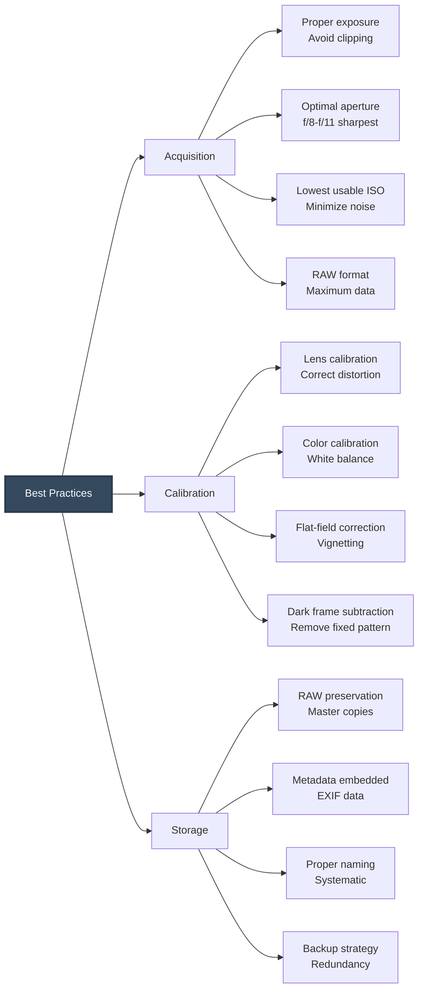

### Exposure Optimization

**1. Avoid overexposure (clipping)**
- Loss of information is permanent
- Check histogram for highlights
- Use highlight warning ("blinkies")
- Consider exposure bracketing for HDR

**2. Expose to the right (ETTR)**
- Maximize signal without clipping
- Better SNR in shadows after adjustment
- Particularly important for low bit-depth

**3. Control noise**
- Use lowest ISO that allows proper exposure
- Longer exposures better than high ISO (if motion allows)
- Consider sensor cooling for scientific applications

### Calibration Procedures

**1. Intrinsic calibration**

Determine camera matrix $\mathbf{K}$:
- Use checkerboard pattern
- Multiple views at different orientations
- Solve for $f_x, f_y, c_x, c_y$, distortion coefficients

**2. Extrinsic calibration**

Determine camera pose $[\mathbf{R}|\mathbf{t}]$:
- Known reference points in 3D
- Perspective-n-Point (PnP) algorithms
- Bundle adjustment for multiple views

**3. Radiometric calibration**

Establish response curve:
$I_{\text{scene}} = f^{-1}(I_{\text{measured}})$

- Capture same scene at different exposures
- Construct camera response function
- Enable HDR and photometric applications

**4. Color calibration**

Use standard color targets (e.g., ColorChecker):
- Measure known colors
- Compute color transformation matrix
- Correct for illuminant and camera bias

### Format Selection

| Application | Recommended Format | Rationale |
|-------------|-------------------|-----------|
| **Photogrammetry** | RAW (DNG, CR2, NEF) | Maximum quality, no compression artifacts |
| **Computer vision** | RAW or TIFF | Preserve geometric fidelity |
| **Scientific imaging** | FITS, TIFF 16-bit | High dynamic range, metadata |
| **Web deployment** | JPEG, WebP | Efficient compression, wide support |
| **Archival** | TIFF uncompressed | Long-term preservation |
| **Machine learning** | PNG, JPEG | Balance of size and quality |

### Quality Assurance Checklist

- ✅ Proper exposure (check histogram)
- ✅ Sharp focus (critical areas in focus)
- ✅ Minimal ISO (noise control)
- ✅ Appropriate aperture (DOF vs. diffraction)
- ✅ Correct white balance
- ✅ No lens flare or artifacts
- ✅ RAW format enabled
- ✅ Metadata embedded (GPS, settings)
- ✅ Systematic file naming
- ✅ Immediate backup

---

## 14. References

### Foundational Textbooks

1. **Szeliski, R.** (2022). *Computer Vision: Algorithms and Applications* (2nd ed.). Springer.
   - Comprehensive coverage of image formation and camera models
   - Free online: http://szeliski.org/Book/

2. **Forsyth, D. A., & Ponce, J.** (2012). *Computer Vision: A Modern Approach* (2nd ed.). Pearson.
   - Detailed treatment of imaging geometry and photometry
   - ISBN: 978-0136085928

3. **Hartley, R., & Zisserman, A.** (2004). *Multiple View Geometry in Computer Vision* (2nd ed.). Cambridge University Press.
   - Mathematical foundations of projection and calibration
   - ISBN: 978-0521540513

4. **Gonzalez, R. C., & Woods, R. E.** (2018). *Digital Image Processing* (4th ed.). Pearson.
   - Image formation fundamentals and sensor characteristics
   - ISBN: 978-0133356724

### Specialized Topics

5. **Glassner, A. S.** (1995). *Principles of Digital Image Synthesis*. Morgan Kaufmann.
   - Deep dive into radiometry and light transport

6. **Holst, G. C., & Lomheim, T. S.** (2011). *CMOS/CCD Sensors and Camera Systems* (2nd ed.). SPIE Press.
   - Comprehensive sensor physics and engineering

7. **Nakamura, J.** (2017). *Image Sensors and Signal Processing for Digital Still Cameras*. CRC Press.
   - Practical camera system design and processing

### Standards and Technical Documents

8. **ISO 12232:2019** - Photography — Digital still cameras — Determination of exposure index, ISO speed ratings

9. **EMVA Standard 1288** - Standard for Measurement and Presentation of Specifications for Image Sensors and Cameras

10. **Camera Calibration Toolbox for MATLAB** - J.-Y. Bouguet  
    http://www.vision.caltech.edu/bouguetj/calib_doc/

### Online Resources

11. **OpenCV Documentation - Camera Calibration**  
    https://docs.opencv.org/master/dc/dbb/tutorial_py_calibration.html

12. **CVPR Computer Vision Tutorials**  
    Various tutorials on image formation and camera geometry

13. **Stanford CS231A: Computer Vision Lecture Notes**  
    http://web.stanford.edu/class/cs231a/

---

## Appendix: Quick Reference

### Key Equations

**Pinhole projection:**
$x = f\frac{X}{Z}, \quad y = f\frac{Y}{Z}$

**Thin lens equation:**
$\frac{1}{f} = \frac{1}{d_o} + \frac{1}{d_i}$

**Exposure value:**
$\text{EV} = \log_2\left(\frac{N^2}{t}\right)$

**Photon energy:**
$E = \frac{hc}{\lambda}$

**Signal-to-noise ratio:**
$\text{SNR} = \frac{N_{\text{signal}}}{\sqrt{N_{\text{signal}} + N_{\text{dark}} + R^2}}$

**Depth of field:**
$\text{DOF} = \frac{2NCd_o^2}{f^2}$

### Conversion Factors

| Quantity | Conversion |
|----------|------------|
| **EV to f-stop** | Each EV = 1 stop |
| **f-stop to area** | Area ∝ 1/N² |
| **ISO doubling** | +1 EV equivalent |
| **Shutter doubling** | +1 EV equivalent |
| **°C to dark current** | 2× per 8°C increase |

### Typical Parameter Ranges

| Parameter | Consumer | Professional | Scientific |
|-----------|----------|--------------|------------|
| **Sensor QE** | 40-60% | 60-80% | 80-95% |
| **Read noise** | 10-20 e⁻ | 3-8 e⁻ | 1-3 e⁻ |
| **Full-well** | 20,000 e⁻ | 50,000 e⁻ | 100,000+ e⁻ |
| **Dynamic range** | 10-12 stops | 12-14 stops | 14-16 stops |
| **Bit depth** | 12-14 bit | 14-16 bit | 16-24 bit |

---

**Document Version:** 1.0  
**Last Updated:** November 2025  
**License:** Educational use permitted with attribution

---

*This comprehensive guide provides the essential knowledge for understanding how physical scenes become digital images, supporting applications in computer vision, photogrammetry, computational photography, and image processing.*

1. **Illumination** – light strikes objects  
2. **Interaction** – reflection, absorption, scattering  
3. **Optics** – lens focuses light  
4. **Projection** – onto a sensor  
5. **Sampling** – converting continuous light to discrete pixels  
6. **Quantization** – mapping brightness to numbers  

---

## **3. Physics of Light**
Light behaves as both:
- **Electromagnetic wave**
- **Photon particle**

### **Wavelength (λ)**
Determines color:
- Red ≈ 700 nm  
- Green ≈ 550 nm  
- Blue ≈ 450 nm  

### **Energy of Light**
\[
E = h
u = \frac{hc}{\lambda}
\]

Where:  
- \( h \) = Planck’s constant  
- \( 
u \) = frequency  
- \( \lambda \) = wavelength  

---

## **4. Interaction of Light With Objects**
Light may be:
- **Reflected**  
- **Refracted**  
- **Absorbed**  
- **Scattered**  

### **Types of Reflection**
1. **Diffuse Reflection** – scattered equally  
2. **Specular Reflection** – mirror-like  
3. **Retroreflection** – returns to source  

### **BRDF (Bidirectional Reflectance Distribution Function)**
Defines how light reflects:
\[
f_r(	heta_i, \phi_i, 	heta_r, \phi_r)
\]

Used in:
- Rendering  
- Material classification  
- Photometric stereo  

---

## **5. Imaging Geometry**
### **Pinhole Camera Model**
A fundamental model used in computer vision.

```
      Object
        ^
        |
        |      /|
        |     / |
        |    /  |
        |   /   |
        |  /    | Focal Length (f)
        | /     |
   -----O-------|----------- Sensor Plane
```

### **Projection Equation**
\[
x = f \frac{X}{Z}, \qquad y = f \frac{Y}{Z}
\]

Where:
- \( (X, Y, Z) \) = 3D world point  
- \( (x, y) \) = 2D image point  

This describes how a 3D world is projected onto a 2D image plane.

---

## **6. Lens-Based Imaging**
Real cameras use lenses to focus light.

### **Thin Lens Equation**
\[
\frac{1}{f} = \frac{1}{d_o} + \frac{1}{d_i}
\]

Where:
- \( f \) = focal length  
- \( d_o \) = object distance  
- \( d_i \) = image distance  

### **Effects of Focal Length**
- **Short focal length (wide angle)** → large field of view  
- **Long focal length (telephoto)** → magnified, narrow view  

---

## **7. Radiometry and Photometry**
### **Irradiance (E)**  
Light falling on the sensor.

\[
E = \frac{d\Phi}{dA}
\]

### **Radiance (L)**  
Light leaving a surface.

\[
L = \frac{d^2\Phi}{dA \, d\omega}
\]

Used for:
- HDR imaging  
- Exposure control  
- Tone mapping  

---

## **8. Exposure Triangle**
Correct exposure depends on:

1. **Shutter speed** – how long light enters  
2. **Aperture (f-number)** – how wide the lens opens  
3. **ISO** – sensor sensitivity  

### **Aperture Equation**
\[
f	ext{-number} = \frac{f}{D}
\]

Smaller f-number → more light.

---

## **9. Image Sensors**
Two major sensor types:
- **CCD (Charge-Coupled Device)**
- **CMOS (Complementary Metal-Oxide Semiconductor)**

Sensors convert photons → electrons → voltage → digital values.

### **Sensor Equation**
\[
I = QE \cdot P
\]

Where:
- \( QE \) = quantum efficiency  
- \( P \) = photon count  

---

## **10. Sampling and Quantization**
### **Sampling**
Converts continuous image → discrete grid.

### **Quantization**
Maps intensity to integer levels.

\[
Q(x,y) = \text{round}(f(x,y))
\]

---

## **11. Noise During Image Formation**
Common noise sources:
- Photon shot noise  
- Sensor readout noise  
- Thermal noise  
- Analog-to-digital conversion noise  

These are covered in detail in **09-image-noise-types.md**.

---

## **12. Real-World Example (Conceptual)**
1. Sunlight hits a tree  
2. Tree reflects green wavelengths  
3. Lens focuses light onto sensor  
4. Photons convert to electrons  
5. ADC converts values to numbers  
6. Computer displays a digital image  

---

## **13. Best Practices**
- Use proper exposure for noise-free capture  
- Avoid overexposure (clipping)  
- Calibrate camera for scientific imaging  
- Use RAW image formats for full sensor data  

---

## **14. References**
- Szeliski – Computer Vision  
- Forsyth & Ponce – Computer Vision: A Modern Approach  
- Hartley & Zisserman – Multiple View Geometry

