# Image Sensors and Cameras: Architecture and Technology

**A Comprehensive Guide to Digital Imaging Systems**  
*Computer Vision | Computational Photography | Machine Vision*

---

## Table of Contents

1. [Introduction](#1-introduction)
2. [What Is an Image Sensor?](#2-what-is-an-image-sensor)
3. [CCD vs CMOS Technology](#3-ccd-vs-cmos-technology)
4. [Pixel Architecture and Design](#4-pixel-architecture-and-design)
5. [Color Filter Arrays](#5-color-filter-arrays)
6. [Shutter Mechanisms](#6-shutter-mechanisms)
7. [Camera Lenses and Optics](#7-camera-lenses-and-optics)
8. [Camera Types and Applications](#8-camera-types-and-applications)
9. [Critical Camera Parameters](#9-critical-camera-parameters)
10. [Camera Calibration](#10-camera-calibration)
11. [Image Signal Processing Pipeline](#11-image-signal-processing-pipeline)
12. [Best Practices and Guidelines](#12-best-practices-and-guidelines)
13. [References](#13-references)

---

## 1. Introduction

**Image sensors** are the fundamental components that convert optical signals (photons) into electrical signals (electrons) and ultimately into digital data. Combined with lenses, electronics, and processing systems, they form complete **camera systems** that capture the visual world for applications ranging from consumer photography to scientific research and industrial automation.

### Why This Matters

Understanding image sensors and cameras is essential for:

- **Image processing** - Compensating for sensor artifacts and limitations
- **Computer vision** - Modeling image acquisition for robust algorithms
- **Photography** - Making informed decisions about equipment and settings
- **Machine vision** - Selecting appropriate sensors for industrial applications
- **Computational photography** - Exploiting sensor characteristics for enhancement
- **Scientific imaging** - Achieving precise, calibrated measurements

### Learning Objectives

By the end of this guide, you will understand:
- The fundamental differences between CCD and CMOS sensors
- Pixel-level architecture and photoelectric conversion
- Color imaging through filter arrays and demosaicing
- Shutter mechanisms and their implications
- Camera types optimized for different applications
- Critical parameters that define image quality
- Calibration procedures for geometric accuracy

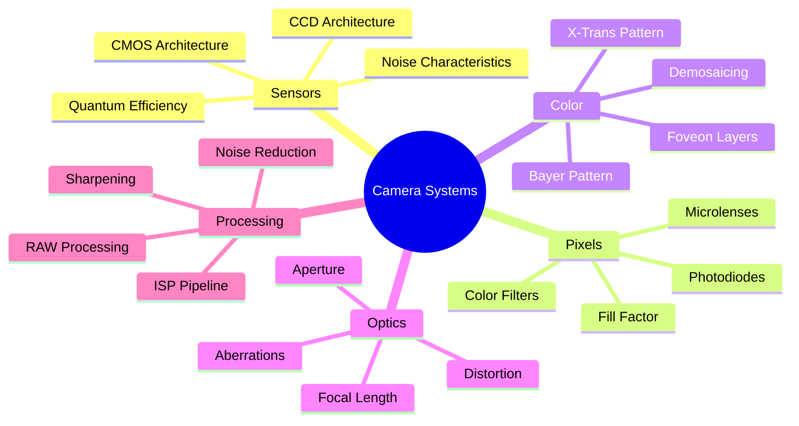

---

## 2. What Is an Image Sensor?

An **image sensor** is a semiconductor device that converts incident photons into electrical charge, which is then read out, amplified, and digitized to form a digital image.

### Operating Principle


### Fundamental Process

**1. Photon Absorption (Photoelectric Effect)**

When a photon with sufficient energy strikes the silicon substrate:

$$E_{\text{photon}} = h\nu = \frac{hc}{\lambda} \geq E_{\text{gap}}$$

Where:
- $E_{\text{gap}} \approx 1.12$ eV for silicon
- $h = 6.626 \times 10^{-34}$ J·s (Planck's constant)
- $c = 3 \times 10^8$ m/s (speed of light)

**2. Charge Generation**

Each absorbed photon creates an electron-hole pair:

$$\text{Photon} \rightarrow e^- + h^+$$

**3. Charge Collection**

Electrons accumulate in potential wells during exposure time $t_{\text{exp}}$:

$$Q = \int_0^{t_{\text{exp}}} I_{\text{photo}}(t) \, dt$$

**4. Charge Transfer and Readout**

Accumulated charge is transferred to readout circuitry and converted to voltage:

$$V_{\text{out}} = \frac{Q}{C_{\text{sense}}}$$

Where $C_{\text{sense}}$ is the sensing capacitance.

**5. Analog-to-Digital Conversion**

Voltage is digitized to produce pixel values:

$$\text{DN} = \text{Gain} \times \frac{V_{\text{out}}}{V_{\text{ref}}} \times (2^b - 1)$$

### Sensor Types Evolution

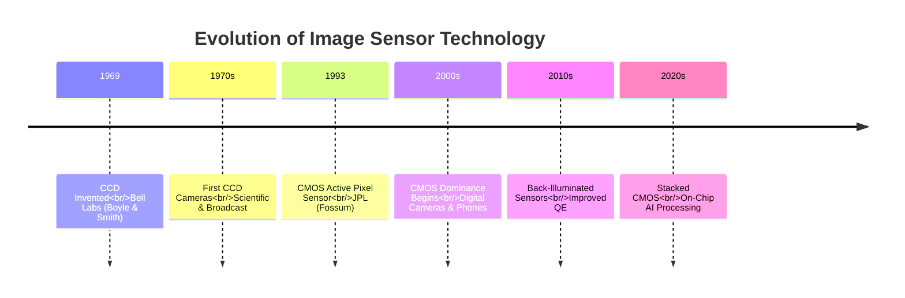

### Two Major Sensor Families

Modern image sensors fall into two primary categories:

1. **CCD (Charge-Coupled Device)**
   - Sequential charge transfer
   - Central readout architecture
   - Established in high-end applications

2. **CMOS (Complementary Metal-Oxide Semiconductor)**
   - Parallel readout architecture
   - Per-pixel amplification
   - Dominant in modern systems

---

## 3. CCD vs CMOS Technology

While both CCD and CMOS sensors convert light to electrical signals, their architectures differ fundamentally in how charge is read out and processed.

### Architecture Comparison

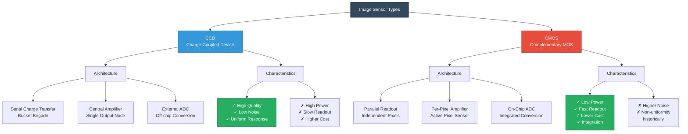

### CCD Architecture

**Charge Transfer Mechanism:**

In a CCD, charges are transferred sequentially from pixel to pixel until reaching the readout amplifier:

$$Q_{\text{out}}(t) = Q_{\text{pixel}}(i,j) \times \text{CTE}^n$$

Where:
- CTE = Charge Transfer Efficiency (typically 0.99999)
- $n$ = number of transfers to readout node

**Advantages:**
- **High fill factor** - More light-sensitive area per pixel (approaching 100%)
- **Low noise** - Single amplifier, well-controlled readout
- **Excellent uniformity** - All pixels processed identically
- **High image quality** - Superior for low-light and scientific applications

**Disadvantages:**
- **Sequential readout** - Slower frame rates
- **High power consumption** - Requires multiple voltage levels
- **Blooming** - Charge overflow affects adjacent pixels
- **Higher cost** - More complex manufacturing

**Applications:**
- Astronomy and astrophotography
- Scientific imaging (microscopy, spectroscopy)
- High-end digital cameras (medium format)
- Medical imaging

### CMOS Architecture

**Active Pixel Sensor (APS):**

Each pixel contains its own amplifier and readout circuitry:

$$V_{\text{pixel}}(i,j) = G_{\text{pixel}} \times \frac{Q(i,j)}{C_{\text{sense}}}$$

**Advantages:**
- **Low power** - Only active pixels consume power
- **Fast readout** - Parallel access to pixels, random access possible
- **Lower cost** - Standard CMOS fabrication process
- **On-chip integration** - ADC, timing, signal processing on same chip
- **Windowing** - Can read out regions of interest

**Disadvantages:**
- **Lower fill factor** - Transistors occupy pixel area (60-80% typical)
- **Higher noise** - Multiple amplifiers introduce variation
- **Fixed pattern noise** - Pixel-to-pixel variations
- **Lower dynamic range** - Historically (now largely addressed)

**Applications:**
- Consumer cameras (smartphones, DSLRs, mirrorless)
- Machine vision and industrial inspection
- Automotive cameras
- Security and surveillance
- Drones and robotics

### Detailed Comparison Table

| Feature | CCD | CMOS | Modern BSI-CMOS |
|---------|-----|------|-----------------|
| **Readout Method** | Serial transfer | Parallel, per-pixel | Parallel, per-pixel |
| **Amplifiers** | 1 (central) | One per pixel/column | One per pixel/column |
| **Fill Factor** | 90-100% | 60-80% | 80-100% |
| **Read Noise** | 2-5 e⁻ | 5-15 e⁻ | 1-3 e⁻ |
| **Power Consumption** | High (100-1000 mW) | Low (10-100 mW) | Low (10-100 mW) |
| **Speed (fps)** | 10-60 | 60-1000+ | 60-1000+ |
| **Quantum Efficiency** | 40-60% | 40-60% | 80-95% |
| **Dynamic Range** | 60-70 dB | 55-65 dB | 65-75+ dB |
| **Cost** | High | Low | Medium |
| **Manufacturing** | Specialized | Standard CMOS | Advanced CMOS |
| **On-chip Processing** | Limited | Extensive | Extensive + AI |
| **Global Shutter** | Native | Difficult (rolling) | Increasingly common |

### Back-Illuminated (BSI) Technology

Modern CMOS sensors use **back-illuminated** architecture to overcome fill factor limitations:

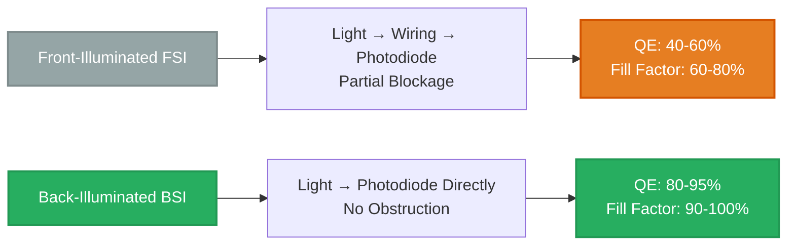

**BSI Advantages:**
- Light enters directly to photodiode without obstruction
- Quantum efficiency approaches 90-95%
- Better low-light performance
- Improved color accuracy

---

## 4. Pixel Architecture and Design

Each pixel in an image sensor is a sophisticated structure optimized for light collection, conversion, and readout.

### Pixel Cross-Section

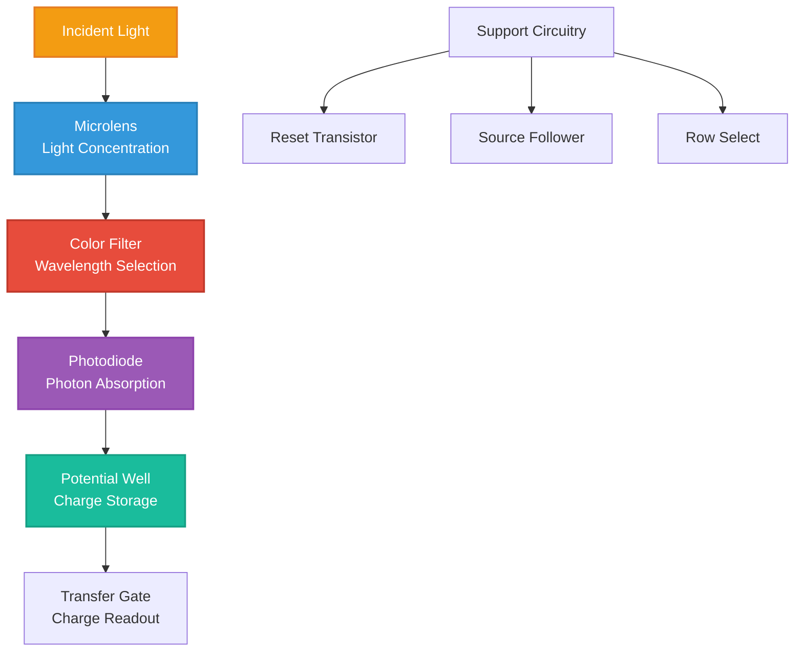

### Key Pixel Components

#### 1. Microlens

**Function:** Concentrates light onto the photodiode, compensating for non-photosensitive areas.

**Focal length:**

$$f_{\text{lens}} = \frac{d_{\text{pixel}}}{2 \tan(\theta_{\text{chief}})}$$

Where:
- $d_{\text{pixel}}$ = pixel pitch
- $\theta_{\text{chief}}$ = chief ray angle

**Light concentration factor:**

$$\text{Concentration} = \frac{A_{\text{lens}}}{A_{\text{photodiode}}}$$

Microlenses can increase effective fill factor from 60% to 90%+.

#### 2. Color Filter

**Function:** Transmits specific wavelengths while blocking others.

**Spectral transmission:**

$$T(\lambda) = \begin{cases}
\tau_{\max} & \text{if } \lambda \in [\lambda_{\min}, \lambda_{\max}] \\
0 & \text{otherwise}
\end{cases}$$

Typical transmission efficiency: $\tau_{\max} \approx 80\%$ for primary color.

#### 3. Photodiode

**Function:** Converts photons to electron-hole pairs via photoelectric effect.

**Quantum Efficiency (QE):**

$$\text{QE}(\lambda) = \frac{N_{\text{electrons}}}{N_{\text{photons}}}$$

Silicon QE peaks at 550-650 nm (green-red), with typical values:
- Blue (450 nm): 30-50%
- Green (550 nm): 60-80%
- Red (650 nm): 50-70%

**Generated charge:**

$$Q = q \cdot \text{QE}(\lambda) \cdot N_{\text{photons}}$$

Where $q = 1.602 \times 10^{-19}$ C (electron charge).

#### 4. Potential Well

**Function:** Stores accumulated charge during exposure.

**Full-well capacity (FWC):**

$$\text{FWC} = C_{\text{well}} \cdot V_{\text{max}}$$

Where:
- $C_{\text{well}}$ = well capacitance
- $V_{\text{max}}$ = maximum voltage swing

**Typical values:**
- Small pixels (1-2 μm): 1,000-5,000 e⁻
- Medium pixels (3-5 μm): 10,000-30,000 e⁻
- Large pixels (8-10 μm): 50,000-100,000+ e⁻

### Pixel Characteristics

#### Fill Factor

The ratio of photosensitive area to total pixel area:

$$\text{FF} = \frac{A_{\text{photodiode}}}{A_{\text{pixel}}} \times 100\%$$

**Impact of pixel size:**

$$\text{FF} \approx \frac{(p - w_{\text{wire}})^2}{p^2}$$

Where:
- $p$ = pixel pitch
- $w_{\text{wire}}$ = width of non-photosensitive area

Smaller pixels have lower fill factor due to fixed-size transistors.

#### Pixel Size Trade-offs

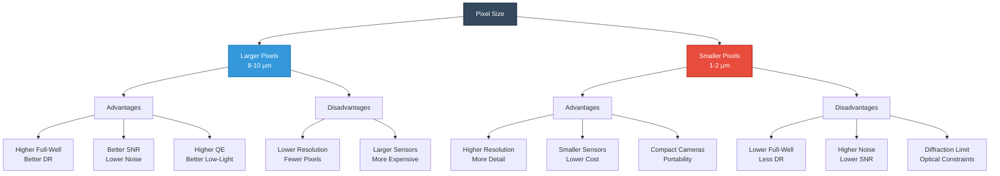

| Pixel Size | Resolution (24MP) | Sensor Size | Full-Well | SNR | Use Case |
|------------|------------------|-------------|-----------|-----|----------|
| 1.0 μm | 6000×4000 | 6×4 mm | ~1,500 e⁻ | Low | Smartphones |
| 2.0 μm | 6000×4000 | 12×8 mm | ~6,000 e⁻ | Medium | Action cameras |
| 3.9 μm | 6000×4000 | 23.4×15.6 mm (APS-C) | ~25,000 e⁻ | High | Consumer DSLR |
| 6.0 μm | 6000×4000 | 36×24 mm (Full-frame) | ~50,000 e⁻ | Very High | Pro photography |
| 9.0 μm | 6000×4000 | 54×36 mm (Medium format) | ~100,000 e⁻ | Excellent | Studio/scientific |

---

## 5. Color Filter Arrays

Most image sensors capture intensity only, requiring color filters to produce color images.

### Color Imaging Approaches

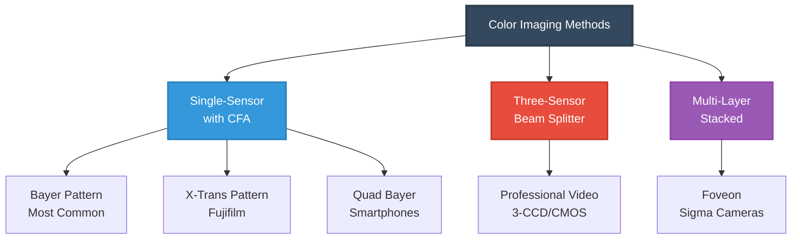

### Bayer Pattern (RGGB)

The **Bayer filter** is the most widely used CFA, invented by Bryce Bayer at Kodak (1976).

**Pattern structure:**

```
Row 1:  G  R  G  R  G  R  G  R
Row 2:  B  G  B  G  B  G  B  G
Row 3:  G  R  G  R  G  R  G  R
Row 4:  B  G  B  G  B  G  B  G
```

**Color distribution:**
- **50% Green** - Human vision most sensitive to green wavelengths
- **25% Red** - Provides color information
- **25% Blue** - Provides color information

**Why more green?**

Human luminance perception:

$$L = 0.299R + 0.587G + 0.114B$$

Green contributes most to perceived brightness.

### CFA Variations

| Pattern | Structure | Advantages | Disadvantages | Use Case |
|---------|-----------|------------|---------------|----------|
| **Bayer RGGB** | 2×2 repeating | Standard, well-understood | Moiré artifacts | Most cameras |
| **Bayer RGBW** | Adds white pixels | Better low-light | Lower color fidelity | Surveillance |
| **X-Trans** | 6×6 repeating | Reduced moiré | Complex demosaicing | Fujifilm cameras |
| **Quad Bayer** | 2×2 same color groups | Binning for low-light | Processing complexity | Smartphones |
| **Foveon** | Stacked RGB layers | True color per pixel | Lower sensitivity | Sigma DSLRs |

### Demosaicing

**Demosaicing** reconstructs full RGB values from sparse CFA data through interpolation.

#### Problem Statement

Given sparse samples:
- $R(i,j)$ known at red positions
- $G(i,j)$ known at green positions  
- $B(i,j)$ known at blue positions

Estimate:
- $R(i,j)$ at all positions
- $G(i,j)$ at all positions
- $B(i,j)$ at all positions

#### Simple Bilinear Interpolation

For a missing red value at a green position:

$$R(i,j) = \frac{R(i,j-1) + R(i,j+1) + R(i-1,j) + R(i+1,j)}{4}$$

For a missing red value at a blue position (diagonal neighbors):

$$R(i,j) = \frac{R(i-1,j-1) + R(i-1,j+1) + R(i+1,j-1) + R(i+1,j+1)}{4}$$

#### Advanced Algorithms

Modern demosaicing uses sophisticated methods:

1. **Adaptive Color Plane Interpolation (ACPI)**
   - Analyzes local gradients
   - Interpolates along edges to preserve sharpness

2. **Frequency-Domain Methods**
   - Exploit spectral properties
   - Minimize aliasing artifacts

3. **Deep Learning Approaches**
   - Neural networks trained on ground truth
   - State-of-the-art quality

**Quality metrics:**

$$\text{PSNR} = 20 \log_{10}\left(\frac{\text{MAX}_I}{\text{RMSE}}\right)$$

$$\text{S-CIELAB} = \text{CIELAB distance in spatial frequency domain}$$

### Moiré and Aliasing

**Moiré patterns** occur when scene frequencies exceed Nyquist limit of CFA sampling.

**Mitigation strategies:**
- **Optical low-pass filter (OLPF)** - Blurs image slightly before sensor
- **Non-regular patterns** (X-Trans) - Disrupts periodic aliasing
- **Computational methods** - Post-processing removal

---

## 6. Shutter Mechanisms

The shutter mechanism determines how pixels are exposed to light, critically affecting motion capture and image quality.

### Shutter Types Comparison

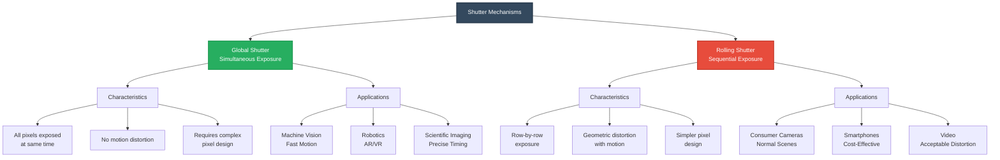

### Rolling Shutter

**Mechanism:** Rows are exposed sequentially, scanning from top to bottom.

**Exposure timing:**

$$t_{\text{row}}(i) = t_{\text{start}} + i \cdot t_{\text{line}}$$

Where:
- $i$ = row index
- $t_{\text{line}}$ = time per line readout

**Total readout time:**

$$T_{\text{readout}} = N_{\text{rows}} \cdot t_{\text{line}}$$

**Example:** 50mm lens focused on object 2m away:

$\frac{1}{50} = \frac{1}{2000} + \frac{1}{d_i} \implies d_i = 51.3 \text{ mm}$

$m = -\frac{51.3}{2000} = -0.0256 \text{ (2.56% of actual size)}$

### Focal Length and Field of View

**Horizontal FOV:**

$\text{FOV}_h = 2 \arctan\left(\frac{w_{\text{sensor}}}{2f}\right)$

**Vertical FOV:**

$\text{FOV}_v = 2 \arctan\left(\frac{h_{\text{sensor}}}{2f}\right)$

**Diagonal FOV:**

$\text{FOV}_d = 2 \arctan\left(\frac{d_{\text{sensor}}}{2f}\right)$

Where $d_{\text{sensor}} = \sqrt{w^2 + h^2}$

**Example:** 24mm lens on full-frame sensor (36×24mm):

$\text{FOV}_h = 2 \arctan\left(\frac{36}{2 \times 24}\right) = 2 \arctan(0.75) = 73.7°$

### Aperture and F-Number

The aperture controls light gathering and depth of field:

$N = \frac{f}{D}$

Where:
- $N$ = f-number (f-stop)
- $f$ = focal length
- $D$ = aperture diameter

**Light transmission:**

$T \propto \frac{1}{N^2}$

**Common f-stops:** f/1.4, f/2, f/2.8, f/4, f/5.6, f/8, f/11, f/16, f/22

Each full stop represents a doubling or halving of light.

### Depth of Field

The range of distances appearing acceptably sharp:

$\text{DOF} = \frac{2NC(d_o - f)d_o}{f^2 - NC(d_o - f)}$

Simplified for $d_o \gg f$:

$\text{DOF} \approx \frac{2NCd_o^2}{f^2}$

Where:
- $N$ = f-number
- $C$ = circle of confusion (typically sensor diagonal / 1500)
- $d_o$ = focus distance

**Near limit:**

$d_{\text{near}} = \frac{d_o(f^2)}{f^2 + NC(d_o - f)}$

**Far limit:**

$d_{\text{far}} = \frac{d_o(f^2)}{f^2 - NC(d_o - f)}$

### Lens Aberrations

Real lenses suffer from optical imperfections:

| Aberration | Effect | Mathematical Model | Correction |
|------------|--------|-------------------|------------|
| **Spherical** | Blur, soft edges | Higher-order radial terms | Aspherical elements |
| **Chromatic** | Color fringing | $\Delta f = f(\lambda)$ | Achromatic doublets, APO |
| **Coma** | Comet-like tails | Off-axis asymmetry | Symmetric design |
| **Astigmatism** | Different focal planes | Tangential vs. sagittal | Complex lens groups |
| **Field curvature** | Curved focus plane | Petzval curvature | Field flattener |
| **Distortion** | Geometric warping | Radial displacement | Software correction |

### Radial Distortion Model

The most common geometric aberration:

$\begin{bmatrix} x_d \\ y_d \end{bmatrix} = (1 + k_1r^2 + k_2r^4 + k_3r^6) \begin{bmatrix} x_u \\ y_u \end{bmatrix} + \begin{bmatrix} p_1(2x_uy_u) + p_2(r^2 + 2x_u^2) \\ p_1(r^2 + 2y_u^2) + p_2(2x_uy_u) \end{bmatrix}$

Where:
- $(x_u, y_u)$ = undistorted coordinates
- $(x_d, y_d)$ = distorted coordinates
- $k_1, k_2, k_3$ = radial distortion coefficients
- $p_1, p_2$ = tangential distortion coefficients
- $r = \sqrt{x_u^2 + y_u^2}$

**Types:**
- **Barrel distortion** ($k_1 < 0$): Wide-angle lenses, edges bow outward
- **Pincushion distortion** ($k_1 > 0$): Telephoto lenses, edges bow inward

---


$$t_{\text{line}} = \frac{1/60}{4000} \approx 4.17 \text{ μs per row}$$

$$T_{\text{readout}} = 4000 \times 4.17\text{ μs} = 16.7 \text{ ms}$$

### Rolling Shutter Artifacts

#### 1. Skew (Lean)

Vertical objects appear tilted when camera or subject moves horizontally.

**Apparent angle:**

$$\tan(\theta) = \frac{v \cdot T_{\text{readout}}}{H_{\text{sensor}}}$$

Where:
- $v$ = horizontal velocity
- $H_{\text{sensor}}$ = sensor height

#### 2. Wobble

Vibration creates wavy patterns in the image.

#### 3. Partial Exposure

Fast-moving objects partially exposed in each row, causing temporal blur.

### Global Shutter

**Mechanism:** All pixels exposed simultaneously for the same duration.

**Implementation approaches:**

1. **CCD native** - Charge transferred to storage area, then read sequentially
2. **CMOS with storage** - Each pixel has storage node
3. **Mechanical shutter** - Physical shutter blocks light

**Advantages:**
- No motion distortion
- Precise timing for multi-camera sync
- Freeze fast motion accurately
- Critical for 3D reconstruction

**Disadvantages:**
- Lower fill factor (storage takes space)
- Higher cost
- More complex pixel design
- Historically lower performance (improving)

### Comparison Table

| Feature | Global Shutter | Rolling Shutter |
|---------|----------------|-----------------|
| **Exposure** | Simultaneous | Sequential |
| **Motion artifacts** | None | Skew, wobble, partial exposure |
| **Pixel complexity** | High | Low |
| **Fill factor** | Lower (70-85%) | Higher (85-100%) |
| **Cost** | Higher | Lower |
| **Frame rate** | Limited by readout | Can be very high |
| **Applications** | Machine vision, scientific | Consumer, smartphones |
| **Sync accuracy** | Excellent | Poor |

---

## 7. Camera Lenses and Optics

Camera lenses focus light onto the sensor, critically affecting image formation, quality, and characteristics.

### Lens Fundamentals

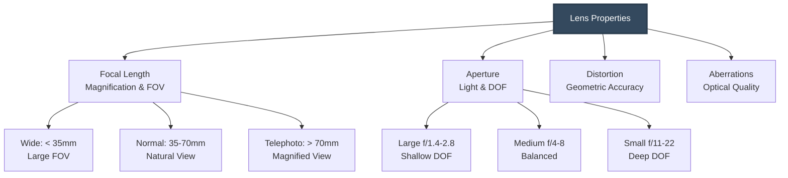

### Thin Lens Equation

Relationship between object distance, image distance, and focal length:

$$\frac{1}{f} = \frac{1}{d_o} + \frac{1}{d_i}$$

Where:
- $f$ = focal length
- $d_o$ = object distance (from lens to subject)
- $d_i$ = image distance (from lens to sensor)

**Magnification:**

$$m = -\frac{d_i}{d_o} = \frac{h_i}{h_o}$$


## 8. Camera Types and Applications

Different applications require specialized camera designs optimized for specific requirements.

### Camera Categories

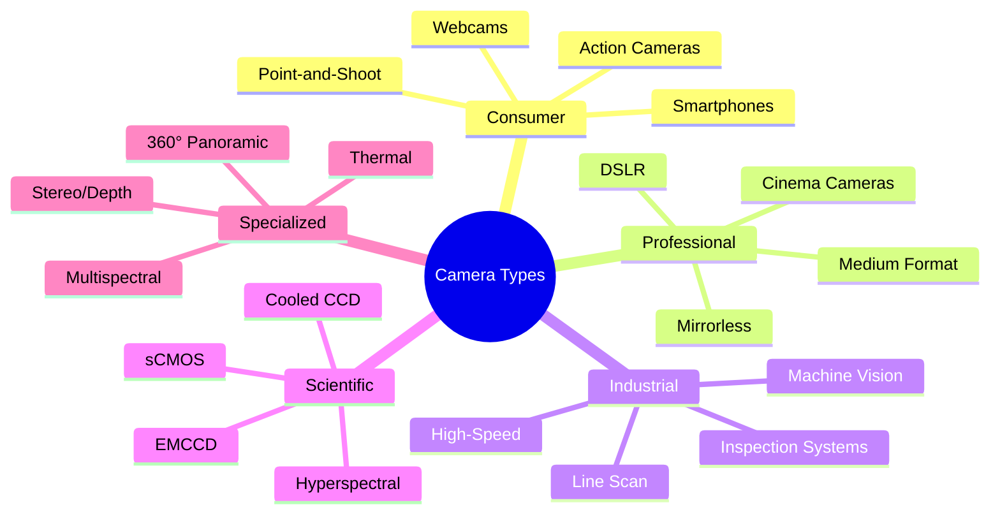

### 1. Smartphone Cameras

**Characteristics:**
- Very small sensors (1/2.3" to 1/1.3")
- Small pixels (0.8-2.0 μm)
- Fixed lens, limited aperture control
- Heavy computational photography

**Sensor sizes:**
- Entry: 1/3.6" (~4.0 × 3.0 mm)
- Mid-range: 1/2.3" (~6.2 × 4.6 mm)
- Flagship: 1/1.3" (~9.8 × 7.3 mm)

**Technologies:**
- Multi-camera arrays (wide, ultra-wide, telephoto, depth)
- Quad Bayer for pixel binning
- HDR+ multi-frame fusion
- Computational bokeh
- Night mode (frame stacking)

**Image equation:**

$I_{\text{final}} = \text{ISP}\left(\sum_{i=1}^{N} w_i \cdot I_i\right)$

Multi-frame averaging improves SNR by $\sqrt{N}$.

### 2. DSLR / Mirrorless Cameras

**Characteristics:**
- Large sensors (APS-C to full-frame)
- Interchangeable lenses
- Manual controls
- High image quality

**Sensor formats:**

| Format | Dimensions | Crop Factor | Megapixels (typical) |
|--------|------------|-------------|---------------------|
| Micro 4/3 | 17.3 × 13 mm | 2.0× | 16-24 MP |
| APS-C (Canon) | 22.2 × 14.8 mm | 1.6× | 18-32 MP |
| APS-C (Nikon/Sony) | 23.6 × 15.6 mm | 1.5× | 20-26 MP |
| Full-frame | 36 × 24 mm | 1.0× | 12-61 MP |
| Medium format | 44 × 33 mm | 0.79× | 50-102 MP |

**Performance parameters:**
- ISO range: 100-51,200 (expandable to 204,800+)
- Dynamic range: 12-15 stops
- Burst rate: 10-30 fps
- Video: 4K-8K

### 3. Industrial/Machine Vision Cameras

**Requirements:**
- Precise timing and synchronization
- Global shutter (typically)
- High frame rates
- Deterministic behavior
- Robust interfaces (GigE, USB3, CoaXPress)

**Types:**

#### Area Scan Cameras
Standard rectangular sensor for 2D imaging.

**Resolution:** 0.3-150 MP  
**Frame rate:** Up to 1000+ fps  
**Applications:** Inspection, tracking, recognition

#### Line Scan Cameras
Single row of pixels scans moving objects.

**Resolution:** 512-16,384 pixels (width)  
**Line rate:** Up to 400 kHz  
**Applications:** Web inspection, PCB inspection, sorting

**Spatial resolution:**

$\Delta x = \frac{v}{f_{\text{line}}}$

Where:
- $v$ = object velocity
- $f_{\text{line}}$ = line acquisition rate

### 4. Scientific Cameras

**Specialized features:**
- Thermoelectric cooling (-40°C to -100°C)
- Ultra-low noise (< 1 e⁻ read noise)
- High quantum efficiency (> 90%)
- Large dynamic range (16-20 bits)
- Precise calibration

**Types:**

#### Back-Illuminated CCD
- QE: 90-95%
- Read noise: 2-4 e⁻
- Applications: Astronomy, microscopy

#### Electron-Multiplying CCD (EMCCD)
- On-chip gain: 100-1000×
- Single-photon sensitivity
- Applications: Single-molecule imaging, adaptive optics

**Multiplication gain:**

$G = g^{n}$

Where:
- $g$ = gain per stage (~1.01-1.02)
- $n$ = number of gain stages (500-600)

#### sCMOS (Scientific CMOS)
- QE: 80-95%
- Read noise: 1-3 e⁻
- Speed: 100-400 fps full frame
- Applications: Live-cell imaging, super-resolution

### 5. Depth and 3D Cameras

**Technologies:**

#### Stereo Vision
Two cameras separated by baseline $b$ measure disparity $d$:

$Z = \frac{fb}{d}$

Where:
- $f$ = focal length
- $b$ = baseline
- $d$ = disparity (pixels)

#### Structured Light
Projects known pattern, triangulates from deformation.

**Depth from phase:**

$Z = \frac{f \cdot p}{2\pi \cdot \phi} \cdot \lambda$

#### Time-of-Flight (ToF)
Measures round-trip time of modulated light:

$Z = \frac{c \cdot \Delta t}{2}$

Where:
- $c$ = speed of light
- $\Delta t$ = time delay

**Phase-based ToF:**

$Z = \frac{c \cdot \phi}{4\pi f_{\text{mod}}}$

#### LiDAR
Laser scanning with precise time-of-flight:

$Z = \frac{c \cdot (t_{\text{receive}} - t_{\text{transmit}})}{2}$

**Comparison:**

| Technology | Range | Accuracy | Resolution | Frame Rate | Cost |
|------------|-------|----------|------------|------------|------|
| **Stereo** | 0.5-50m | 0.1-2% | High | 30-60 fps | Low |
| **Structured Light** | 0.3-3m | 0.1-1mm | Very High | 30-60 fps | Medium |
| **ToF** | 0.1-10m | 1-5cm | Low-Medium | 60-120 fps | Medium |
| **LiDAR** | 1-200m | 1-5cm | Medium | 10-30 fps | High |

---

## 9. Critical Camera Parameters

Understanding quantitative parameters is essential for selecting and optimizing cameras for specific applications.

### Dynamic Range

The ratio between the maximum and minimum detectable signal:

$\text{DR} = 20 \log_{10}\left(\frac{Q_{\text{full-well}}}{\sigma_{\text{read}}}\right) \text{ dB}$

Or in stops:

$\text{DR (stops)} = \log_2\left(\frac{Q_{\text{full-well}}}{\sigma_{\text{read}}}\right)$

**Example:** Sensor with 50,000 e⁻ full-well and 5 e⁻ read noise:

$\text{DR} = 20 \log_{10}\left(\frac{50000}{5}\right) = 80 \text{ dB} = 13.3 \text{ stops}$

**Typical ranges:**

| Camera Type | Dynamic Range | Stops |
|-------------|---------------|-------|
| Smartphone | 50-60 dB | 8-10 |
| Consumer DSLR | 65-75 dB | 11-12.5 |
| Professional | 75-85 dB | 12.5-14 |
| Scientific CCD | 85-95 dB | 14-16 |
| HDR techniques | 100+ dB | 17+ |

### Signal-to-Noise Ratio (SNR)

The ratio of signal to total noise:

$\text{SNR} = \frac{\mu_{\text{signal}}}{\sigma_{\text{total}}}$

**Total noise model:**

$\sigma_{\text{total}} = \sqrt{\sigma_{\text{shot}}^2 + \sigma_{\text{dark}}^2 + \sigma_{\text{read}}^2 + \sigma_{\text{quant}}^2}$

For photon-limited imaging:

$\text{SNR} = \sqrt{N_{\text{signal}}}$

**In decibels:**

$\text{SNR (dB)} = 20 \log_{10}(\text{SNR})$

**Peak SNR:** Maximum achievable at full-well:

$\text{SNR}_{\text{peak}} = \frac{Q_{\text{full-well}}}{\sqrt{Q_{\text{full-well}} + \sigma_{\text{read}}^2}}$

### Quantum Efficiency (QE)

Probability that an incident photon generates a photoelectron:

$\text{QE}(\lambda) = \frac{N_{\text{electrons}}}{N_{\text{photons}}} \times 100\%$

**Wavelength dependence:**

Silicon QE is wavelength-dependent due to:
- **Absorption depth:** $\alpha(\lambda)$ - Shorter wavelengths absorbed near surface
- **Recombination:** Some carriers recombine before collection
- **Reflection:** Surface losses, especially UV

**Typical QE curves:**

| Wavelength | Front-Illuminated | Back-Illuminated |
|------------|------------------|------------------|
| 400 nm (UV) | 10-20% | 50-70% |
| 500 nm (Blue) | 40-50% | 70-85% |
| 600 nm (Green) | 50-60% | 85-95% |
| 700 nm (Red) | 40-50% | 80-90% |
| 900 nm (NIR) | 10-20% | 30-50% |

### Sensitivity (ISO)

Camera sensitivity relates sensor output to scene luminance:

$\text{ISO} = \frac{10}{H_{\text{sat}}} \cdot \frac{78}{L}$

Where:
- $H_{\text{sat}}$ = saturation exposure (lux·s)
- $L$ = scene luminance (cd/m²)

**ISO gain relationship:**

$\text{Gain} = \frac{\text{ISO}}{\text{ISO}_{\text{base}}}$

**Noise amplification:**

$\sigma_{\text{output}} = \text{Gain} \times \sigma_{\text{input}}$

### Full-Well Capacity

Maximum charge a pixel can hold before saturation:

$Q_{\text{full-well}} = C_{\text{pixel}} \cdot V_{\text{swing}}$

**Saturation level:**

$\text{DN}_{\text{sat}} = 2^b - 1$

**Relationship to dynamic range:**

$\text{Max Signal} = Q_{\text{full-well}}$
$\text{Min Signal} = \sigma_{\text{read}}$

Larger full-well capacity enables:
- Higher maximum SNR
- Greater dynamic range
- Better highlight retention
- Reduced clipping

### Temporal Dark Noise

Thermally generated electrons accumulate over time:

$N_{\text{dark}} = I_{\text{dark}} \cdot t_{\text{exp}}$

**Temperature dependence:**

$I_{\text{dark}}(T) = I_{\text{dark}}(T_0) \cdot 2^{(T-T_0)/7°C}$

Dark current approximately doubles every 7-8°C.

**Example:** Camera at 25°C with base dark current of 10 e⁻/pixel/s:

At 40°C (15° increase):
$I_{\text{dark}}(40°C) = 10 \cdot 2^{15/7} \approx 43 \text{ e}^-/\text{pixel/s}$

For 1-second exposure:
$N_{\text{dark}} = 43 \text{ e}^-$

### Modulation Transfer Function (MTF)

Describes spatial resolution and contrast reproduction:

$\text{MTF}(f) = \frac{M_{\text{output}}(f)}{M_{\text{input}}(f)}$

Where:
- $f$ = spatial frequency (cycles/mm or lp/mm)
- $M$ = modulation (contrast)

**Components:**

$\text{MTF}_{\text{system}} = \text{MTF}_{\text{lens}} \times \text{MTF}_{\text{sensor}} \times \text{MTF}_{\text{processing}}$

**Pixel MTF (sampling):**

$\text{MTF}_{\text{pixel}}(f) = \left|\text{sinc}\left(\pi f p\right)\right|$

Where $p$ = pixel pitch.

---

## 10. Camera Calibration

Camera calibration determines intrinsic and extrinsic parameters necessary for metric 3D reconstruction and geometric accuracy.

### Calibration Framework

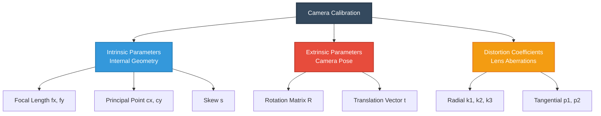

### Projection Model

The complete camera projection model:

$s \begin{bmatrix} u \\ v \\ 1 \end{bmatrix} = \mathbf{K} [\mathbf{R} | \mathbf{t}] \begin{bmatrix} X \\ Y \\ Z \\ 1 \end{bmatrix}$

Where:

**Intrinsic matrix** $\mathbf{K}$:

$\mathbf{K} = \begin{bmatrix} f_x & s & c_x \\ 0 & f_y & c_y \\ 0 & 0 & 1 \end{bmatrix}$

Parameters:
- $f_x, f_y$ = focal lengths in pixels (horizontal and vertical)
- $c_x, c_y$ = principal point coordinates (image center)
- $s$ = skew coefficient (typically 0 for modern cameras)

**Extrinsic parameters** $[\mathbf{R} | \mathbf{t}]$:

$[\mathbf{R} | \mathbf{t}] = \begin{bmatrix} r_{11} & r_{12} & r_{13} & t_x \\ r_{21} & r_{22} & r_{23} & t_y \\ r_{31} & r_{32} & r_{33} & t_z \end{bmatrix}$

Parameters:
- $\mathbf{R}$ = 3×3 rotation matrix (9 elements, 3 DOF)
- $\mathbf{t}$ = 3×1 translation vector

### Distortion Model

Real lenses introduce nonlinear distortions corrected by:

**Radial distortion:**

$\begin{aligned}
x_{\text{distorted}} &= x_{\text{ideal}}(1 + k_1r^2 + k_2r^4 + k_3r^6) \\
y_{\text{distorted}} &= y_{\text{ideal}}(1 + k_1r^2 + k_2r^4 + k_3r^6)
\end{aligned}$

**Tangential distortion:**

$\begin{aligned}
x_{\text{distorted}} &= x_{\text{ideal}} + [2p_1xy + p_2(r^2 + 2x^2)] \\
y_{\text{distorted}} &= y_{\text{ideal}} + [p_1(r^2 + 2y^2) + 2p_2xy]
\end{aligned}$

Where $r^2 = x^2 + y^2$ (normalized coordinates).

### Calibration Procedure

#### 1. Data Acquisition

Capture multiple images (10-30) of calibration target (checkerboard) at various:
- Orientations (tilted, rotated)
- Distances (near and far)
- Positions (covering full field of view)

#### 2. Corner Detection

Detect checkerboard corners with sub-pixel accuracy:

$\mathbf{C} = \{(u_i, v_i)\}_{i=1}^N$

Sub-pixel refinement minimizes:

$\arg\min_{(u,v)} \sum_{\text{window}} \nabla I^2$

#### 3. Homography Estimation

For each image, compute homography relating 3D target to 2D image:

$\begin{bmatrix} u \\ v \\ 1 \end{bmatrix} = \mathbf{H} \begin{bmatrix} X \\ Y \\ 1 \end{bmatrix}$

Where $\mathbf{H}$ is a 3×3 homography matrix (8 DOF).

#### 4. Parameter Optimization

Minimize reprojection error:

$\arg\min_{\mathbf{K}, \{\mathbf{R}_i, \mathbf{t}_i\}, \text{dist}} \sum_{i=1}^M \sum_{j=1}^N \left\| \mathbf{p}_{ij} - \hat{\mathbf{p}}(\mathbf{K}, \mathbf{R}_i, \mathbf{t}_i, \text{dist}, \mathbf{P}_j) \right\|^2$

Where:
- $M$ = number of images
- $N$ = number of points per image
- $\mathbf{p}_{ij}$ = observed 2D point
- $\hat{\mathbf{p}}$ = projected 3D point

Solved using:
- Levenberg-Marquardt algorithm
- Bundle adjustment
- Non-linear optimization

### Calibration Quality Metrics

**Reprojection error (RMS):**

$\text{RMS} = \sqrt{\frac{1}{MN}\sum_{i=1}^M \sum_{j=1}^N \left\| \mathbf{p}_{ij} - \hat{\mathbf{p}}_{ij} \right\|^2}$

Target: < 0.5 pixels for good calibration, < 0.3 for excellent.

**Mean error per image:**

Identifies problematic images for removal.

### Stereo Calibration

For stereo systems, additionally calibrate:

**Relative pose:**

$\mathbf{T} = \begin{bmatrix} \mathbf{R} & \mathbf{t} \\ \mathbf{0} & 1 \end{bmatrix}$

**Essential matrix:**

$\mathbf{E} = [\mathbf{t}]_\times \mathbf{R}$

**Fundamental matrix:**

$\mathbf{F} = \mathbf{K}_2^{-T} \mathbf{E} \mathbf{K}_1^{-1}$

**Epipolar constraint:**

$\mathbf{p}_2^T \mathbf{F} \mathbf{p}_1 = 0$

---

## 11. Image Signal Processing Pipeline

Modern cameras employ sophisticated processing to convert raw sensor data into viewable images.

### ISP Architecture


### Processing Stages

#### 1. Black Level Correction

Remove sensor dark current offset:

$I_{\text{corrected}} = I_{\text{raw}} - I_{\text{black}}$

#### 2. Defect Pixel Correction

Replace faulty pixels using interpolation:

$I(x,y) = \frac{1}{N}\sum_{\text{neighbors}} I(x_i, y_i)$

#### 3. Lens Shading Correction

Compensate for vignetting (brightness falloff):

$I_{\text{corrected}}(x,y) = I(x,y) \cdot G(x,y)$

Where $G(x,y)$ is a gain map, typically modeled as:

$G(r) = 1 + a_1r^2 + a_2r^4 + a_3r^6$

#### 4. Noise Reduction

**Temporal filtering (video):**

$I_t(x,y) = \alpha I_{t-1}(x,y) + (1-\alpha)I_t(x,y)$

**Spatial filtering:**

Bilateral filter preserves edges:

$I_{\text{filtered}}(x,y) = \frac{\sum_{(i,j) \in \Omega} w(i,j) \cdot I(i,j)}{\sum_{(i,j) \in \Omega} w(i,j)}$

$w(i,j) = \exp\left(-\frac{(i-x)^2 + (j-y)^2}{2\sigma_s^2}\right) \exp\left(-\frac{(I(i,j) - I(x,y))^2}{2\sigma_r^2}\right)$

#### 5. Demosaicing

Reconstruct full RGB from Bayer pattern (discussed in Section 5).

#### 6. White Balance

Correct color temperature:

$\begin{bmatrix} R' \\ G' \\ B' \end{bmatrix} = \begin{bmatrix} k_R & 0 & 0 \\ 0 & 1 & 0 \\ 0 & 0 & k_B \end{bmatrix} \begin{bmatrix} R \\ G \\ B \end{bmatrix}$

**Gray world assumption:**

$k_R = \frac{\langle G \rangle}{\langle R \rangle}, \quad k_B = \frac{\langle G \rangle}{\langle B \rangle}$

#### 7. Color Space Transform

Convert to output color space (sRGB, Adobe RGB):

$\begin{bmatrix} R_{\text{out}} \\ G_{\text{out}} \\ B_{\text{out}} \end{bmatrix} = \mathbf{M} \begin{bmatrix} R \\ G \\ B \end{bmatrix}$

Where $\mathbf{M}$ is a 3×3 color correction matrix.

#### 8. Gamma Correction

Apply nonlinear tone curve:

$V_{\text{out}} = V_{\text{in}}^{1/\gamma}$

For sRGB ($\gamma \approx 2.2$):

$V_{\text{out}} = \begin{cases}
12.92 V_{\text{in}} & V_{\text{in}} \leq 0.0031308 \\
1.055 V_{\text{in}}^{1/2.4} - 0.055 & V_{\text{in}} > 0.0031308
\end{cases}$

#### 9. Sharpening

Enhance edges using unsharp masking:

$I_{\text{sharp}} = I + \alpha(I - I_{\text{blurred}})$

Or high-pass filter:

$I_{\text{sharp}} = I + \alpha \cdot \text{HPF}(I)$

#### 10. Compression

JPEG encoding with quality factor $Q$:
- DCT transform
- Quantization
- Entropy coding (Huffman)

**Compression ratio:**

$CR = \frac{\text{Raw size}}{\text{Compressed size}}$

### RAW vs. Processed

| Format | Processing | Bit Depth | Flexibility | Size | Use Case |
|--------|-----------|-----------|-------------|------|----------|
| **RAW** | Minimal | 12-16 bit | Maximum | Large (20-60 MB) | Professional, editing |
| **JPEG** | Full ISP | 8 bit | Limited | Small (2-8 MB) | Consumer, web |
| **HEIF/HEVC** | Full ISP | 10 bit | Moderate | Medium (1-5 MB) | Modern devices |
| **TIFF** | Variable | 8-16 bit | High | Very large (50-200 MB) | Archival, print |

---

## 12. Best Practices and Guidelines

### Camera Selection Criteria

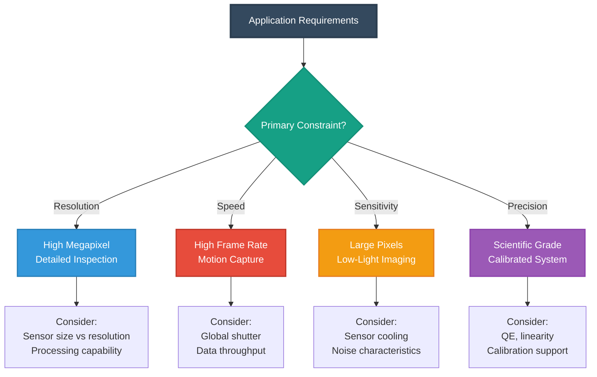

### Selection Guidelines by Application

#### Computer Vision / Robotics

**Requirements:**
- Global shutter (avoid rolling artifacts)
- Moderate resolution (1-5 MP sufficient)
- High frame rate (60-120 fps)
- Low latency
- Robust interfaces (GigE, USB3)

**Recommended specifications:**
- Sensor: 1/2" to 2/3" CMOS
- Resolution: 1280×1024 to 2448×2048
- Pixel size: 3-5 μm
- Shutter: Global
- Frame rate: 60-200 fps

#### Photogrammetry / 3D Reconstruction

**Requirements:**
- High resolution (detail capture)
- Low distortion lens
- Large sensor (depth of field control)
- RAW format support
- Precise calibration

**Recommended specifications:**
- Sensor: APS-C or full-frame
- Resolution: 16-45 MP
- Pixel size: 4-6 μm
- Format: RAW (12-14 bit)
- Lens: High-quality, low distortion

#### Scientific Imaging

**Requirements:**
- High quantum efficiency
- Low noise (< 3 e⁻ read noise)
- Large dynamic range (14+ stops)
- Linear response
- Precise timing

**Recommended specifications:**
- Sensor: Back-illuminated sCMOS or cooled CCD
- Resolution: Application-dependent
- Bit depth: 16-bit
- Cooling: -20°C to -60°C
- QE: > 80% at target wavelength

#### Industrial Inspection

**Requirements:**
- Consistent, repeatable performance
- Global shutter
- Triggering capability
- Durable construction
- Long product lifecycle

**Recommended specifications:**
- Sensor: CCD or global shutter CMOS
- Resolution: Matched to feature size
- Interface: GigE Vision, USB3 Vision
- Triggering: Hardware trigger support
- Housing: Industrial-grade

### Imaging Best Practices

#### 1. Format Selection

| Application | Recommended Format | Rationale |
|-------------|-------------------|-----------|
| **Photogrammetry** | RAW (DNG, CR2, NEF) | Maximum geometric fidelity, no compression artifacts |
| **Machine vision** | Uncompressed (TIFF, BMP) | Pixel-level accuracy required |
| **Scientific analysis** | RAW or 16-bit TIFF | Preserve full sensor dynamic range |
| **Web/display** | JPEG, WebP | Efficient compression, universal support |
| **Archival** | Lossless (TIFF, PNG) | Long-term preservation without quality loss |
| **Video processing** | ProRes, RAW video | High quality for post-processing |

#### 2. Exposure Optimization

**Avoid overexposure (clipping):**
- Monitor histogram for highlight warnings
- Use exposure compensation (-0.3 to -0.7 EV)
- Consider HDR bracketing for high-contrast scenes

**Expose to the right (ETTR):**
- Maximize signal without clipping
- Better SNR in post-processing
- Particularly important for 8-bit output

**ISO selection:**

$\text{SNR} \propto \frac{\sqrt{N_{\text{photons}}}}{\text{Gain}}$

Use lowest ISO that achieves proper exposure:
- ISO 100-400: Optimal for most conditions
- ISO 800-1600: Acceptable trade-off
- ISO 3200+: Only when necessary

#### 3. Aperture Selection

**Optimal aperture** (for most lenses): f/8 to f/11
- Best sharpness (avoids aberrations and diffraction)
- Reasonable depth of field
- Good balance of performance

**Diffraction limit:**

$d_{\text{Airy}} = 2.44 \lambda N$

For green light (λ = 550 nm) at f/16:

$d_{\text{Airy}} = 2.44 \times 0.55 \times 16 = 21.5 \text{ μm}$

Matches or exceeds typical pixel sizes, limiting resolution.

#### 4. Focus Techniques

**Critical focus:**
- Use live view with magnification
- Focus peaking assistance
- Autofocus fine-tuning

**Depth of field calculation:**

For required DOF, choose aperture:

$N = \frac{f^2 \cdot \text{DOF}}{2Cd_o^2}$

**Hyperfocal distance** (maximize DOF):

$H = \frac{f^2}{NC} + f$

Focus at $H$ to get everything from $H/2$ to infinity in focus.

#### 5. Camera Calibration Workflow

**Step-by-step procedure:**

1. **Prepare calibration target**
   - High-quality checkerboard (7×9 or larger)
   - Flat, rigid mounting
   - Good lighting (uniform, no glare)

2. **Capture calibration images**
   - 15-30 images minimum
   - Vary orientation (tilts, rotations)
   - Vary distance (near, far)
   - Cover full field of view

3. **Process calibration**
   - Use robust software (OpenCV, MATLAB, Agisoft)
   - Check reprojection error (< 0.5 pixels)
   - Verify parameter stability

4. **Validate calibration**
   - Test with independent data
   - Verify undistortion quality
   - Check 3D reconstruction accuracy

5. **Document and store**
   - Save calibration parameters
   - Record camera serial number
   - Note calibration date and conditions
   - Recalibrate periodically (6-12 months)

#### 6. Noise Reduction Strategies

**Prevention:**
- Use lowest practical ISO
- Longer exposure (if motion allows)
- Adequate lighting
- Sensor cooling (scientific applications)

**Post-processing:**
- Dark frame subtraction
- Flat-field correction
- Noise reduction algorithms (bilateral filter, NLM)
- Frame averaging for static scenes

**Frame averaging improvement:**

$\text{SNR}_{\text{avg}} = \sqrt{N} \times \text{SNR}_{\text{single}}$

Averaging 16 frames → 4× SNR improvement (12 dB).

#### 7. Motion Handling

**Global shutter cameras:**
- Essential for moving objects
- No distortion artifacts
- Synchronization for multi-camera

**Rolling shutter mitigation:**
- Fastest shutter speed practical
- Electronic stabilization
- Motion prediction algorithms

**Motion blur limit:**

Maximum exposure time for acceptable blur:

$t_{\text{max}} = \frac{d_{\text{pixel}} \cdot d_{\text{object}}}{f \cdot v}$

Where:
- $d_{\text{pixel}}$ = pixel size
- $d_{\text{object}}$ = distance to object
- $f$ = focal length
- $v$ = object velocity

### Quality Assurance Checklist

**Pre-capture:**
-  Camera calibrated and validated
-  Lens clean and free of defects
-  Correct white balance setting
-  RAW format enabled (if required)
-  Focus mode appropriate (AF/MF)
-  Exposure settings verified
-  ISO at minimum practical level

**During capture:**
-  Monitor histogram (no clipping)
-  Check focus confirmation
-  Verify image sharpness (zoom in)
-  Consistent lighting conditions
-  Minimal camera shake (tripod if needed)
-  Appropriate shutter speed for motion

**Post-capture:**
-  Verify file integrity
-  Check metadata embedded
-  Backup immediately
-  Quality review on calibrated display
- Document capture conditions
-  Archive systematically

### Maintenance and Care

**Regular maintenance:**
- **Sensor cleaning** - Professional cleaning annually
- **Calibration verification** - Test monthly for critical applications
- **Firmware updates** - Check manufacturer updates
- **Storage conditions** - Cool, dry environment
- **Transport protection** - Padded cases, desiccant

**Troubleshooting common issues:**

| Issue | Likely Cause | Solution |
|-------|--------------|----------|
| **Dark images** | Underexposure | Increase ISO, slower shutter, wider aperture |
| **Blurry images** | Motion, focus | Faster shutter, tripod, check focus |
| **Noisy images** | High ISO, long exposure | Lower ISO, reduce exposure time, cooling |
| **Color casts** | Wrong white balance | Set correct WB, shoot RAW |
| **Distortion** | Lens characteristics | Apply lens correction profile |
| **Vignetting** | Wide aperture, wide lens | Stop down, enable lens corrections |
| **Hot pixels** | Sensor defects | Pixel mapping, replacement if severe |

---

## 13. References

### Foundational Texts

1. **Szeliski, R.** (2022). *Computer Vision: Algorithms and Applications* (2nd ed.). Springer.
   - Comprehensive coverage of camera models and calibration
   - Free online: http://szeliski.org/Book/

2. **Burger, W., & Burge, M. J.** (2016). *Digital Image Processing: An Algorithmic Introduction Using Java* (2nd ed.). Springer.
   - Detailed treatment of image sensors and processing
   - ISBN: 978-1447166832

3. **Holst, G. C., & Lomheim, T. S.** (2011). *CMOS/CCD Sensors and Camera Systems* (2nd ed.). SPIE Press.
   - Authoritative reference on sensor technology and design
   - ISBN: 978-0819483386

4. **Nakamura, J.** (2017). *Image Sensors and Signal Processing for Digital Still Cameras*. CRC Press.
   - Comprehensive coverage of sensor architecture and ISP
   - ISBN: 978-0849335457

### Camera Calibration

5. **Hartley, R., & Zisserman, A.** (2004). *Multiple View Geometry in Computer Vision* (2nd ed.). Cambridge University Press.
   - Mathematical foundations of camera geometry
   - ISBN: 978-0521540513

6. **Zhang, Z.** (2000). "A Flexible New Technique for Camera Calibration." *IEEE Transactions on Pattern Analysis and Machine Intelligence*, 22(11), 1330-1334.
   - Foundational paper on practical calibration methods

7. **Bouguet, J.-Y.** Camera Calibration Toolbox for MATLAB.
   - http://www.vision.caltech.edu/bouguetj/calib_doc/

### Technical Standards

8. **EMVA Standard 1288** - Standard for Measurement and Presentation of Specifications for Image Sensors and Cameras
   - https://www.emva.org/standards-technology/emva-1288/

9. **GenICam Standard** - Generic Interface for Cameras
   - https://www.emva.org/standards-technology/genicam/

10. **GigE Vision Standard** - Interface Standard for Industrial Cameras
    - https://www.visiononline.org/vision-standards-details.cfm?id=120

### Industry Resources

11. **OpenCV Documentation - Camera Calibration and 3D Reconstruction**
    - https://docs.opencv.org/master/d9/d0c/group__calib3d.html

12. **Basler Camera Technology Guide**
    - Practical guide to machine vision cameras
    - https://www.baslerweb.com/

13. **Edmund Optics Imaging Resource Guide**
    - Comprehensive guide to imaging optics and cameras
    - https://www.edmundoptics.com/knowledge-center/

### Scientific Papers

14. **Fossum, E. R.** (1997). "CMOS Image Sensors: Electronic Camera-on-a-Chip." *IEEE Transactions on Electron Devices*, 44(10), 1689-1698.
   - Foundational work on CMOS active pixel sensors

15. **Boyle, W. S., & Smith, G. E.** (1970). "Charge Coupled Semiconductor Devices." *Bell System Technical Journal*, 49(4), 587-593.
   - Original CCD invention (Nobel Prize 2009)

### Online Learning

16. **First Principles of Computer Vision** - YouTube Channel
    - https://www.youtube.com/channel/UCf0WB91t8Ky6AuYcQV0CcLw
    - Excellent video lectures on imaging fundamentals

17. **Stanford CS231A: Computer Vision**
    - http://web.stanford.edu/class/cs231a/
    - Course materials on cameras and geometry

---

## Appendix: Quick Reference

### Key Formulas

**Thin lens equation:**
$\frac{1}{f} = \frac{1}{d_o} + \frac{1}{d_i}$

**Field of view:**
$\text{FOV} = 2 \arctan\left(\frac{w_{\text{sensor}}}{2f}\right)$

**Dynamic range:**
$\text{DR (dB)} = 20 \log_{10}\left(\frac{Q_{\text{full-well}}}{\sigma_{\text{read}}}\right)$

**Signal-to-noise ratio:**
$\text{SNR} = \frac{N_{\text{signal}}}{\sqrt{N_{\text{signal}} + N_{\text{dark}} + \sigma_{\text{read}}^2}}$

**Quantum efficiency:**
$\text{QE}(\lambda) = \frac{N_{\text{electrons}}}{N_{\text{photons}}}$

**Depth of field:**
$\text{DOF} \approx \frac{2NCd_o^2}{f^2}$

**Camera projection:**
$s\mathbf{p} = \mathbf{K}[\mathbf{R}|\mathbf{t}]\mathbf{P}$

### Sensor Comparison Summary

| Feature | CCD | FSI CMOS | BSI CMOS | sCMOS |
|---------|-----|----------|----------|-------|
| **QE** | 40-60% | 40-60% | 80-95% | 80-95% |
| **Read Noise** | 2-5 e⁻ | 5-15 e⁻ | 3-8 e⁻ | 1-3 e⁻ |
| **Speed** | 10-60 fps | 100-1000 fps | 100-1000 fps | 100-400 fps |
| **Power** | High | Low | Low | Medium |
| **Cost** | High | Low | Medium | High |
| **Applications** | Scientific | Consumer | Modern phones | Scientific |

### Pixel Size Guidelines

| Application | Recommended Pixel Size | Rationale |
|-------------|----------------------|-----------|
| **Smartphones** | 0.8-2.0 μm | Compact size, high resolution |
| **Consumer cameras** | 2-5 μm | Balance of resolution and performance |
| **Professional photo** | 4-9 μm | Image quality, low noise, DR |
| **Scientific imaging** | 6-24 μm | Maximum well capacity, sensitivity |
| **Machine vision** | 3-5 μm | Balance of resolution and speed |

### ISO and Noise Relationships

| ISO | Relative Gain | Read Noise Impact | Use Case |
|-----|---------------|-------------------|----------|
| 100 | 1× | Minimal | Bright light, optimal quality |
| 400 | 4× | Low | General photography |
| 1600 | 16× | Moderate | Low light, acceptable quality |
| 6400 | 64× | High | Very low light, noise visible |
| 25600 | 256× | Very high | Extreme low light, emergency |

### Frame Rate Requirements

| Application | Minimum FPS | Recommended FPS | Rationale |
|-------------|-------------|-----------------|-----------|
| **Static scenes** | 1-10 | 10-30 | Time-lapse, documentation |
| **General video** | 24-30 | 30-60 | Standard motion capture |
| **Sports/action** | 60 | 120-240 | Smooth slow motion |
| **High-speed analysis** | 240 | 1000-10,000 | Scientific, impact studies |
| **Machine vision** | 30-60 | 60-200 | Real-time processing |

### Calibration Target Recommendations

| Target Type | Size | Features | Application |
|-------------|------|----------|-------------|
| **Checkerboard** | 7×9 to 12×12 | Square corners | General calibration |
| **Circle grid** | 7×9 or larger | Circular features | Precise center detection |
| **ArUco markers** | 4×4 to 7×7 | Coded patterns | Pose estimation |
| **Charuco board** | Hybrid | Checkerboard + ArUco | Robust partial views |

---

## Glossary

**Active Pixel Sensor (APS)** - CMOS architecture where each pixel contains amplification circuitry

**Bayer Pattern** - Most common color filter array with RGGB repeating pattern

**Blooming** - Charge overflow from saturated pixels affecting neighbors (CCD issue)

**Circle of Confusion (CoC)** - Maximum blur spot diameter considered acceptably sharp

**Dark Current** - Thermally generated electrons independent of light exposure

**Demosaicing** - Interpolation algorithm reconstructing full RGB from CFA data

**Fill Factor** - Ratio of photosensitive area to total pixel area

**Full-Well Capacity** - Maximum electrons a pixel can store before saturation

**Global Shutter** - All pixels exposed simultaneously

**Quantum Efficiency (QE)** - Probability of photon-to-electron conversion

**Read Noise** - Electronic noise from readout circuitry

**Rolling Shutter** - Sequential row-by-row exposure causing motion artifacts

**Signal-to-Noise Ratio (SNR)** - Ratio of useful signal to noise

---

## Practice Problems

### Problem 1: Dynamic Range Calculation

**Question:** A camera sensor has a full-well capacity of 40,000 e⁻ and read noise of 4 e⁻. Calculate the dynamic range in both dB and stops.

**Solution:**

$\text{DR (dB)} = 20 \log_{10}\left(\frac{40000}{4}\right) = 20 \log_{10}(10000) = 80 \text{ dB}$

$\text{DR (stops)} = \log_2(10000) = 13.3 \text{ stops}$

### Problem 2: Field of View

**Question:** Calculate the horizontal FOV for a 35mm lens on an APS-C sensor (23.6mm width).

**Solution:**

$\text{FOV}_h = 2 \arctan\left(\frac{23.6}{2 \times 35}\right) = 2 \arctan(0.337) = 37.4°$

### Problem 3: Depth of Field

**Question:** A 50mm lens at f/8 focused on a subject 5m away. Calculate the DOF assuming circle of confusion C = 0.03mm.

**Solution:**

$\text{DOF} \approx \frac{2 \times 8 \times 0.03 \times 5000^2}{50^2} = \frac{12,000,000}{2500} = 4,800 \text{ mm} = 4.8 \text{ m}$

---

**Document Version:** 1.0  
**Last Updated:** November 2025  
**License:** Educational use permitted with attribution

---

*This comprehensive guide provides essential knowledge for understanding image sensors and camera systems, supporting applications in computer vision, machine vision, photogrammetry, computational photography, and scientific imaging.* 4000-row sensor at 60 fps:
