# Pixels and Resolution: Fundamentals of Digital Image Representation

**A Comprehensive Guide to Spatial, Spectral, and Radiometric Resolution**  
*Digital Image Processing | Computer Vision | Computational Photography*

---

## Table of Contents

1. [Introduction](#1-introduction)
2. [What Is a Pixel?](#2-what-is-a-pixel)
3. [Spatial Resolution](#3-spatial-resolution)
4. [Types of Resolution](#4-types-of-resolution)
5. [Pixel Density: PPI and DPI](#5-pixel-density-ppi-and-dpi)
6. [Aspect Ratio](#6-aspect-ratio)
7. [Field of View and Resolution](#7-field-of-view-and-resolution)
8. [Resolution vs. Image Quality](#8-resolution-vs-image-quality)
9. [Digital vs. Optical Zoom](#9-digital-vs-optical-zoom)
10. [Sampling Theory and Nyquist Criterion](#10-sampling-theory-and-nyquist-criterion)
11. [Practical Applications and Examples](#11-practical-applications-and-examples)
12. [Best Practices and Guidelines](#12-best-practices-and-guidelines)
13. [References](#13-references)

---

## 1. Introduction

**Pixels** and **resolution** are fundamental concepts that determine how digital images represent visual information. Understanding these concepts is essential for anyone working in digital imaging, computer vision, graphics, photography, or scientific visualization.

### Why This Matters

Pixels and resolution affect:
- **Image quality** - Detail, sharpness, and clarity
- **File size** - Storage and transmission requirements
- **Processing performance** - Computational complexity
- **Display quality** - Screen representation and print output
- **Application suitability** - Matching resolution to task requirements

### Learning Objectives

By the end of this guide, you will understand:
- The mathematical representation of pixels and their properties
- Different types of resolution and their relationships
- How pixel density affects display and print quality
- The interplay between resolution and image quality
- Sampling theory and its implications for resolution
- Practical guidelines for resolution selection

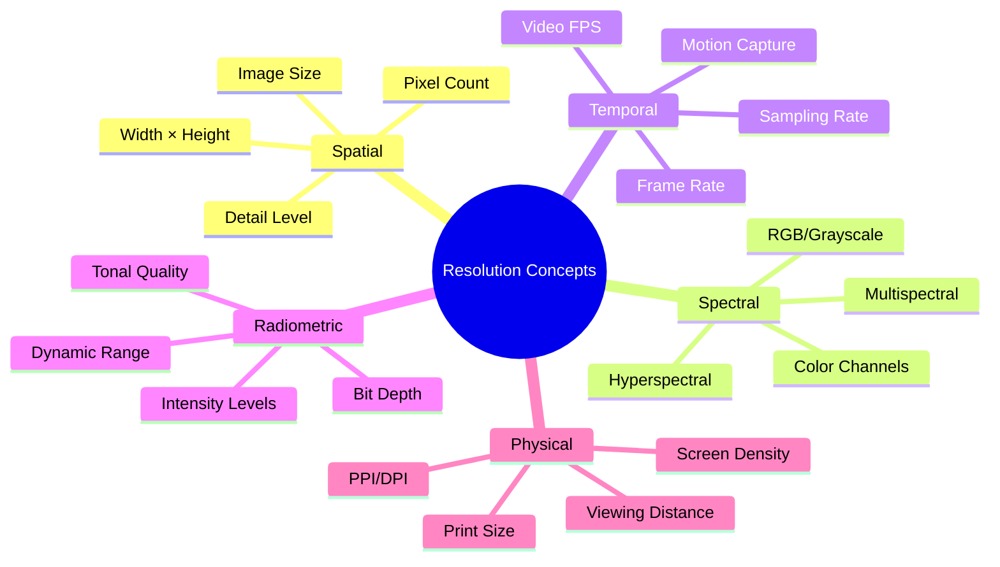

---

## 2. What Is a Pixel?

A **pixel** (picture element) is the smallest addressable element in a digital image. It is the fundamental building block that represents a single point of color or intensity in a discretized spatial grid.

### Pixel as a Mathematical Entity

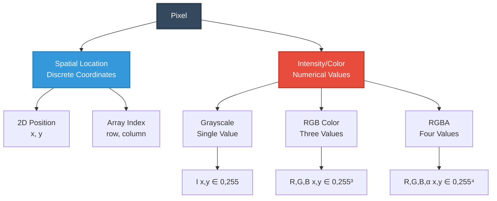

### Pixel Characteristics

A pixel is defined by three fundamental properties:

#### 1. Spatial Position

**Discrete coordinates** in the image grid:

$$(x, y) \in \mathbb{Z}^2$$

Where:
- $x \in [0, W-1]$ = horizontal position (column)
- $y \in [0, H-1]$ = vertical position (row)
- $W$ = image width in pixels
- $H$ = image height in pixels

**Coordinate system:**

```
(0,0) ────────────────────→ x (columns)
  │
  │
  │
  ↓
  y (rows)
```

Origin is typically at the **top-left corner** in image processing, unlike Cartesian coordinates.

#### 2. Intensity or Color Value

**Grayscale pixel** (single channel):

$$I(x, y) = \text{intensity at location } (x, y)$$

$$I: \mathbb{Z}^2 \to [0, L-1]$$

Where $L = 2^b$ for $b$-bit depth. For 8-bit:

$$I(x, y) \in [0, 255]$$

**Color pixel** (RGB):

$$f(x, y) = \begin{bmatrix} R(x,y) \\ G(x,y) \\ B(x,y) \end{bmatrix}$$

$$f: \mathbb{Z}^2 \to [0, 255]^3$$

**Color pixel with transparency** (RGBA):

$$f(x, y) = \begin{bmatrix} R(x,y) \\ G(x,y) \\ B(x,y) \\ \alpha(x,y) \end{bmatrix}$$

Where $\alpha$ is the transparency channel (0 = transparent, 255 = opaque).

#### 3. Physical Size (Pixel Pitch)

The physical dimension of a pixel on a sensor or display:

$$p = \frac{d_{\text{sensor}}}{N_{\text{pixels}}}$$

Where:
- $p$ = pixel pitch (μm or mm)
- $d_{\text{sensor}}$ = sensor dimension
- $N_{\text{pixels}}$ = number of pixels along that dimension

### Pixel Value Interpretation

| Grayscale Value | Interpretation | Appearance |
|----------------|----------------|------------|
| 0 | Minimum intensity | Pure black |
| 64 | Dark gray | 25% brightness |
| 128 | Mid gray | 50% brightness |
| 192 | Light gray | 75% brightness |
| 255 | Maximum intensity | Pure white |

### Pixel Neighborhood

Pixels are analyzed in relation to their neighbors:

**4-connected neighborhood** (Von Neumann):

$$N_4(x,y) = \{(x-1,y), (x+1,y), (x,y-1), (x,y+1)\}$$

**8-connected neighborhood** (Moore):

$$N_8(x,y) = N_4(x,y) \cup \{(x-1,y-1), (x-1,y+1), (x+1,y-1), (x+1,y+1)\}$$

---

## 3. Spatial Resolution

**Spatial resolution** defines the number of pixels in an image, determining the level of spatial detail that can be represented.

### Resolution Specification

Spatial resolution is expressed as:

$$R = W \times H$$

Where:
- $W$ = width (horizontal pixel count)
- $H$ = height (vertical pixel count)

### Total Pixel Count

$$N_{\text{total}} = W \times H$$

**In megapixels (MP):**

$$\text{MP} = \frac{W \times H}{10^6}$$

### Common Resolutions

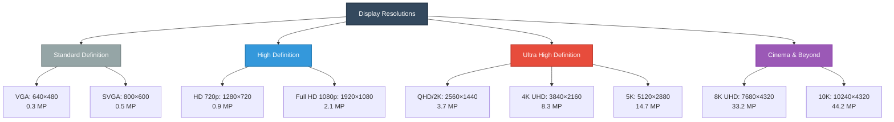

### Resolution Table

| Name | Resolution | Aspect Ratio | Megapixels | Total Pixels | Use Case |
|------|-----------|--------------|------------|--------------|----------|
| **VGA** | 640 × 480 | 4:3 | 0.3 MP | 307,200 | Legacy systems |
| **HD 720p** | 1280 × 720 | 16:9 | 0.9 MP | 921,600 | HD video |
| **Full HD 1080p** | 1920 × 1080 | 16:9 | 2.1 MP | 2,073,600 | Standard HD |
| **QHD/2K** | 2560 × 1440 | 16:9 | 3.7 MP | 3,686,400 | Gaming monitors |
| **4K UHD** | 3840 × 2160 | 16:9 | 8.3 MP | 8,294,400 | High-end displays |
| **DCI 4K** | 4096 × 2160 | 1.9:1 | 8.8 MP | 8,847,360 | Digital cinema |
| **5K** | 5120 × 2880 | 16:9 | 14.7 MP | 14,745,600 | Professional monitors |
| **8K UHD** | 7680 × 4320 | 16:9 | 33.2 MP | 33,177,600 | Next-gen displays |

### Camera Sensor Resolutions

| Category | Resolution Range | Example | Application |
|----------|-----------------|---------|-------------|
| **Low** | 0.3-5 MP | 2592×1944 | Security cameras, webcams |
| **Medium** | 5-20 MP | 5472×3648 | Smartphones, consumer cameras |
| **High** | 20-45 MP | 8256×5504 | Professional photography |
| **Ultra-high** | 50-150 MP | 14192×10640 | Medium format, scientific |

### Resolution and Detail

The **Rayleigh criterion** for resolving two points:

$$\delta = 1.22 \lambda \frac{f}{D}$$

Where:
- $\delta$ = minimum resolvable distance
- $\lambda$ = wavelength
- $f$ = focal length
- $D$ = aperture diameter

For optimal resolution, pixel pitch should match:

$$p \leq \delta$$

---

## 4. Types of Resolution

Digital images have multiple dimensions of resolution, each affecting different aspects of image quality and information content.

### Resolution Taxonomy

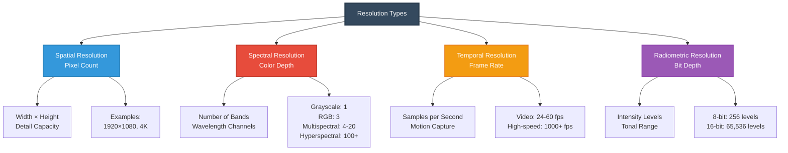

### 1. Spatial Resolution

The number of pixels in horizontal and vertical dimensions.

**Mathematical representation:**

$$I \in \mathbb{R}^{H \times W \times C}$$

Where:
- $H$ = height (rows)
- $W$ = width (columns)
- $C$ = number of channels

**Impact on file size:**

$$\text{Size} = W \times H \times C \times \frac{b}{8} \text{ bytes}$$

**Example:** 4K RGB image (8-bit):

$$3840 \times 2160 \times 3 \times 1 = 24,883,200 \text{ bytes} \approx 23.7 \text{ MB}$$

### 2. Spectral Resolution

The number of wavelength bands captured.

**Grayscale (1 channel):**

$$I: \mathbb{Z}^2 \to [0, 255]$$

**RGB (3 channels):**

$$I: \mathbb{Z}^2 \to [0, 255]^3$$

**Multispectral (4-20 bands):**

$$I: \mathbb{Z}^2 \times \{1, 2, \ldots, N_b\} \to [0, 2^{16}-1]$$

Applications: Remote sensing, agriculture, geology

**Hyperspectral (100-1000+ bands):**

$$I: \mathbb{Z}^2 \times [400\text{nm}, 2500\text{nm}] \to \mathbb{R}$$

Applications: Material identification, chemical analysis

| Type | Bands | Wavelength Range | Spectral Resolution | Application |
|------|-------|------------------|-------------------|-------------|
| **Panchromatic** | 1 | 400-700 nm | N/A | General imaging |
| **RGB** | 3 | R:620-750, G:495-570, B:450-495 nm | ~100 nm | Consumer imaging |
| **Multispectral** | 4-20 | 400-2500 nm | 50-200 nm | Agriculture, geology |
| **Hyperspectral** | 100-1000+ | 400-2500 nm | 1-10 nm | Material analysis |

### 3. Temporal Resolution

The rate at which images are captured over time.

**Frame rate:**

$$f_{\text{fps}} = \frac{N_{\text{frames}}}{t}$$

Where:
- $N_{\text{frames}}$ = number of frames
- $t$ = time duration (seconds)

**Temporal sampling interval:**

$$\Delta t = \frac{1}{f_{\text{fps}}}$$

**Common frame rates:**

| Frame Rate | $\Delta t$ | Application |
|-----------|------------|-------------|
| 24 fps | 41.7 ms | Cinema standard |
| 30 fps | 33.3 ms | Standard video (NTSC) |
| 60 fps | 16.7 ms | Smooth video, gaming |
| 120 fps | 8.3 ms | High-speed, slow motion |
| 240 fps | 4.2 ms | Sports analysis |
| 1000+ fps | < 1 ms | Scientific high-speed |

**Nyquist criterion for motion:**

To capture motion without aliasing:

$$f_{\text{fps}} \geq 2f_{\text{motion}}$$

Where $f_{\text{motion}}$ is the highest frequency of motion.

### 4. Radiometric Resolution

The number of discrete intensity levels that can be represented.

**Quantization levels:**

$$L = 2^b$$

Where $b$ = bit depth per channel.

**Intensity value range:**

$$I \in [0, 2^b - 1]$$

**Common bit depths:**

| Bit Depth | Levels | Range | Dynamic Range (dB) | Use Case |
|-----------|--------|-------|-------------------|----------|
| **1-bit** | 2 | 0-1 | 6 dB | Binary images |
| **8-bit** | 256 | 0-255 | 48 dB | Consumer imaging |
| **10-bit** | 1,024 | 0-1023 | 60 dB | Professional video |
| **12-bit** | 4,096 | 0-4095 | 72 dB | RAW photography |
| **14-bit** | 16,384 | 0-16383 | 84 dB | High-end cameras |
| **16-bit** | 65,536 | 0-65535 | 96 dB | Scientific imaging |

**Dynamic range in dB:**

$$\text{DR (dB)} = 20 \log_{10}(2^b) = 6.02b \text{ dB}$$

**Example:** 14-bit image:

$$\text{DR} = 6.02 \times 14 = 84.3 \text{ dB}$$

### Resolution Trade-offs

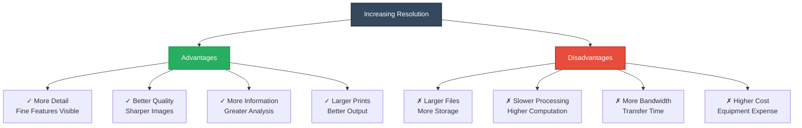

---

## 5. Pixel Density: PPI and DPI

**Pixel density** measures how many pixels occupy a given physical distance, determining the sharpness and clarity of displayed or printed images.

### PPI: Pixels Per Inch

Used for **displays** (screens, monitors).

**Calculation formula:**

$$\text{PPI} = \frac{\sqrt{W_p^2 + H_p^2}}{D_{\text{in}}}$$

Where:
- $W_p$ = width in pixels
- $H_p$ = height in pixels
- $D_{\text{in}}$ = diagonal size in inches

**Diagonal pixel count:**

$$D_p = \sqrt{W_p^2 + H_p^2}$$

**Example 1:** iPhone 14 Pro (6.1" diagonal, 2556×1179)

$$\text{PPI} = \frac{\sqrt{2556^2 + 1179^2}}{6.1} = \frac{2814}{6.1} \approx 461 \text{ PPI}$$

**Example 2:** 27" 4K monitor (3840×2160)

$$\text{PPI} = \frac{\sqrt{3840^2 + 2160^2}}{27} = \frac{4406}{27} \approx 163 \text{ PPI}$$

### DPI: Dots Per Inch

Used for **printing** (printers, presses).

**Print size calculation:**

$$W_{\text{inches}} = \frac{W_{\text{pixels}}}{\text{DPI}}, \quad H_{\text{inches}} = \frac{H_{\text{pixels}}}{\text{DPI}}$$

**Required pixels for print size:**

$$W_{\text{pixels}} = W_{\text{inches}} \times \text{DPI}$$
$$H_{\text{pixels}} = H_{\text{inches}} \times \text{DPI}$$

### PPI/DPI Standards

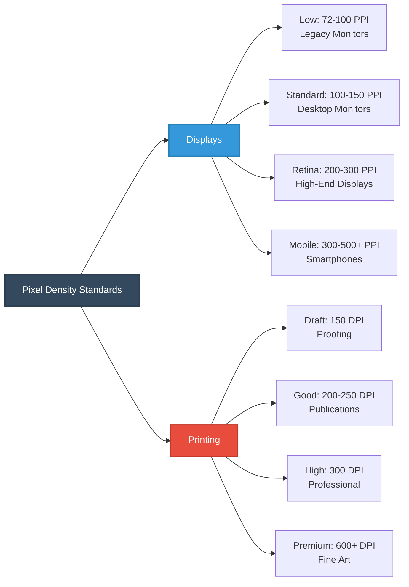

| Application | Recommended PPI/DPI | Rationale |
|-------------|-------------------|-----------|
| **Web images** | 72-96 PPI | Screen display standard |
| **Desktop monitors** | 100-150 PPI | Comfortable viewing |
| **Retina displays** | 200-300 PPI | Pixels invisible to eye |
| **Smartphones** | 300-500+ PPI | Close viewing distance |
| **Draft printing** | 150 DPI | Cost-effective proofs |
| **Magazine printing** | 250-300 DPI | Professional quality |
| **Photo printing** | 300 DPI | Standard for quality prints |
| **Fine art printing** | 600-1200 DPI | Museum quality |

### Viewing Distance and PPI

The **angular resolution** of the human eye is approximately:

$$\theta_{\min} \approx 1 \text{ arcminute} = \frac{1}{60}° \approx 0.0003 \text{ radians}$$

**Minimum resolvable distance** at viewing distance $d$:

$$\delta = d \cdot \tan(\theta_{\min}) \approx d \cdot 0.0003$$

**Required PPI** for "Retina" (pixels invisible):

$$\text{PPI}_{\text{retina}} = \frac{1}{\delta} = \frac{1}{d \cdot 0.0003} \times 25.4 \text{ mm/inch}$$

**Example:** At 12 inches (305 mm) viewing distance:

$$\delta = 305 \times 0.0003 = 0.0915 \text{ mm} = 91.5 \text{ μm}$$

$$\text{PPI}_{\text{retina}} = \frac{25.4}{0.0915} \approx 277 \text{ PPI}$$

**Viewing distance table:**

| Device | Typical Distance | Required PPI for "Retina" |
|--------|-----------------|--------------------------|
| **Smartphone** | 10-12 inches | 300-350 PPI |
| **Tablet** | 12-15 inches | 250-300 PPI |
| **Laptop** | 20-24 inches | 150-180 PPI |
| **Desktop monitor** | 24-30 inches | 100-150 PPI |
| **TV** | 6-10 feet | 30-50 PPI |
| **Cinema** | 20-50 feet | 10-20 PPI |

### Print Size Examples

**Example 1:** 24 MP image (6000×4000) printed at 300 DPI

$$W = \frac{6000}{300} = 20 \text{ inches}$$
$$H = \frac{4000}{300} = 13.3 \text{ inches}$$

Print size: **20" × 13.3"** (excellent quality)

**Example 2:** Same image at 150 DPI

$$W = \frac{6000}{150} = 40 \text{ inches}$$
$$H = \frac{4000}{150} = 26.7 \text{ inches}$$

Print size: **40" × 26.7"** (acceptable for distant viewing)

---

## 6. Aspect Ratio

**Aspect ratio** is the proportional relationship between image width and height, expressed as a ratio or decimal.

### Definition

$$\text{Aspect Ratio} = \frac{W}{H} = W:H$$

### Common Aspect Ratios

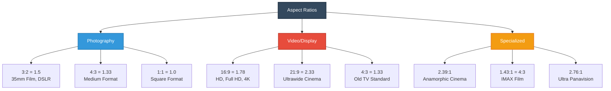

### Aspect Ratio Table

| Ratio | Decimal | Description | Common Use |
|-------|---------|-------------|------------|
| **1:1** | 1.0 | Square | Instagram, profile photos |
| **4:3** | 1.33 | Standard | Old TV, iPad, micro 4/3 |
| **3:2** | 1.5 | Classic | 35mm film, Full-frame DSLR |
| **16:10** | 1.6 | Computer | Laptop displays, tablets |
| **16:9** | 1.78 | Widescreen | HDTV, monitors, YouTube |
| **1.85:1** | 1.85 | Cinema | US theatrical standard |
| **21:9** | 2.33 | Ultrawide | Cinema displays, gaming |
| **2.39:1** | 2.39 | Anamorphic | Scope cinema format |

### Calculating Dimensions

**Given aspect ratio and one dimension:**

If width is known:
$$H = \frac{W}{\text{AR}}$$

If height is known:
$$W = H \times \text{AR}$$

**Example:** 16:9 image with width = 1920 pixels

$$H = \frac{1920}{16/9} = \frac{1920 \times 9}{16} = 1080 \text{ pixels}$$

### Aspect Ratio Conversion

**Cropping to new aspect ratio:**

Two strategies:
1. **Crop width** (keep height)
2. **Crop height** (keep width)

**Crop width (keep H):**

$$W_{\text{new}} = H \times \text{AR}_{\text{new}}$$

**Crop height (keep W):**

$$H_{\text{new}} = \frac{W}{\text{AR}_{\text{new}}}$$

**Example:** Convert 3:2 image (3000×2000) to 16:9

Option 1 - Keep height (2000):
$$W_{\text{new}} = 2000 \times \frac{16}{9} = 3556 \text{ pixels}$$
(Not possible - exceeds original width, must use Option 2)

Option 2 - Keep width (3000):
$$H_{\text{new}} = \frac{3000}{16/9} = 1688 \text{ pixels}$$

Result: **3000×1688** (cropped 312 pixels from top/bottom)

### Maintaining Aspect Ratio

When resizing, preserve aspect ratio:

$$\frac{W_{\text{new}}}{H_{\text{new}}} = \frac{W_{\text{old}}}{H_{\text{old}}}$$

**Scale factor:**

$$s = \min\left(\frac{W_{\text{target}}}{W}, \frac{H_{\text{target}}}{H}\right)$$

$$W_{\text{new}} = W \times s, \quad H_{\text{new}} = H \times s$$

---

## 7. Field of View and Resolution

**Field of view (FOV)** and resolution interact to determine the spatial coverage and detail captured by an imaging system.

### FOV Geometry

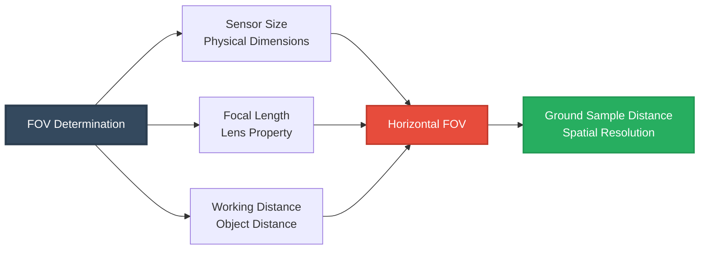

### FOV Formulas

**Horizontal FOV:**

$\text{FOV}_h = 2 \arctan\left(\frac{w_{\text{sensor}}}{2f}\right)$

**Vertical FOV:**

$\text{FOV}_v = 2 \arctan\left(\frac{h_{\text{sensor}}}{2f}\right)$

**Diagonal FOV:**

$\text{FOV}_d = 2 \arctan\left(\frac{\sqrt{w_{\text{sensor}}^2 + h_{\text{sensor}}^2}}{2f}\right)$

Where:
- $w_{\text{sensor}}$ = sensor width
- $h_{\text{sensor}}$ = sensor height
- $f$ = focal length

**Example:** 50mm lens on full-frame sensor (36×24mm)

$\text{FOV}_h = 2 \arctan\left(\frac{36}{2 \times 50}\right) = 2 \arctan(0.36) = 39.6°$

$\text{FOV}_v = 2 \arctan\left(\frac{24}{2 \times 50}\right) = 2 \arctan(0.24) = 27.0°$

### Ground Sample Distance (GSD)

For aerial/satellite imaging, **GSD** is the ground distance represented by one pixel:

$\text{GSD} = \frac{H \cdot p}{f}$

Where:
- $H$ = altitude (distance from camera to ground)
- $p$ = pixel pitch (sensor pixel size)
- $f$ = focal length

**Alternatively, using FOV:**

$\text{GSD} = \frac{W_{\text{ground}}}{W_{\text{pixels}}} = \frac{H \cdot 2\tan(\text{FOV}_h/2)}{W_{\text{pixels}}}$

**Example:** Drone at 100m altitude, 4mm pixel pitch, 50mm lens

$\text{GSD} = \frac{100,000 \text{ mm} \times 0.004 \text{ mm}}{50 \text{ mm}} = 8 \text{ mm/pixel}$

Each pixel represents 8mm on the ground.

### Angular Resolution

The angular size subtended by one pixel:

$\theta_{\text{pixel}} = \frac{p}{f} \text{ radians} = \frac{p}{f} \times \frac{180}{\pi} \text{ degrees}$

**In arcminutes:**

$\theta_{\text{pixel}} = \frac{p}{f} \times \frac{180 \times 60}{\pi} \text{ arcmin}$

**Example:** 5μm pixel, 50mm focal length

$\theta_{\text{pixel}} = \frac{0.005}{50} \times \frac{180 \times 60}{\pi} = 0.34 \text{ arcmin}$

---

## 8. Resolution vs. Image Quality

Higher resolution does not automatically guarantee better image quality. Multiple factors interact to determine overall image quality.

### Quality Factor Interactions

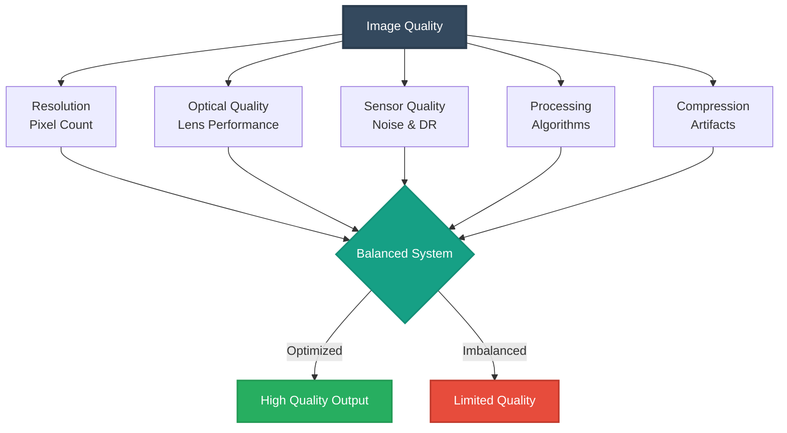

### Factors Affecting Quality

#### 1. Lens Quality

**Modulation Transfer Function (MTF):**

$\text{MTF}(f) = \frac{M_{\text{output}}(f)}{M_{\text{input}}(f)}$

Where $f$ = spatial frequency (cycles/mm).

A high-resolution sensor requires a high-quality lens:

$\text{MTF}_{\text{system}} = \text{MTF}_{\text{lens}} \times \text{MTF}_{\text{sensor}}$

**Nyquist frequency for sensor:**

$f_{\text{Nyquist}} = \frac{1}{2p}$

Where $p$ = pixel pitch.

Lens MTF should exceed 50% at Nyquist frequency.

#### 2. Pixel Size Trade-offs

**Larger pixels:**
- Higher full-well capacity
- Better SNR
- Superior low-light performance
- Lower resolution (for same sensor size)

**Smaller pixels:**
- Higher resolution
- Lower full-well capacity
- Higher noise
- Diffraction-limited at smaller apertures

**SNR relationship:**

$\text{SNR} \propto \sqrt{A_{\text{pixel}}} \propto p$

Where $A_{\text{pixel}} = p^2$ is pixel area.

**Example:** Comparing 2μm vs. 4μm pixels

$\frac{\text{SNR}_{4\mu m}}{\text{SNR}_{2\mu m}} = \frac{4}{2} = 2$

The 4μm pixels have 2× better SNR (6 dB improvement).

#### 3. Diffraction Limit

At small apertures, diffraction limits resolution:

$d_{\text{Airy}} = 2.44 \lambda N$

Where:
- $\lambda$ = wavelength (550 nm for green)
- $N$ = f-number

**Diffraction-limited pixel size:**

$p_{\text{min}} = 2.44 \lambda N$

**Example:** At f/8 with green light:

$p_{\text{min}} = 2.44 \times 0.55 \times 8 = 10.7 \text{ μm}$

Pixels smaller than 10.7μm won't gain resolution at f/8.

**Optimal aperture for pixel size:**

$N_{\text{optimal}} = \frac{p}{2.44\lambda}$

For 5μm pixels:

$N_{\text{optimal}} = \frac{5}{2.44 \times 0.55} = 3.7 \approx f/4$

#### 4. Sensor Noise

**Total noise:**

$\sigma_{\text{total}} = \sqrt{\sigma_{\text{shot}}^2 + \sigma_{\text{dark}}^2 + \sigma_{\text{read}}^2}$

Higher resolution with smaller pixels increases read noise contribution.

#### 5. Compression Artifacts

**JPEG quality factor** $Q \in [0, 100]$:

$\text{Quality} \propto Q$
$\text{Compression ratio} \propto \frac{1}{Q}$

Aggressive compression can negate resolution advantages.

**PSNR (Peak Signal-to-Noise Ratio):**

$\text{PSNR} = 10 \log_{10}\left(\frac{\text{MAX}_I^2}{\text{MSE}}\right)$

Where MSE = Mean Squared Error.

Good quality: PSNR > 30 dB  
Excellent quality: PSNR > 40 dB

### Effective Resolution

The **effective resolution** accounts for entire system:

$R_{\text{effective}} = R_{\text{sensor}} \times \text{MTF}_{\text{lens}} \times Q_{\text{processing}}$

**Example:** 

- 24 MP sensor
- Lens MTF = 0.6 at Nyquist
- Processing loss = 0.9

$R_{\text{effective}} = 24 \times 0.6 \times 0.9 = 13 \text{ MP effective}$

---

## 9. Digital vs. Optical Zoom

Two fundamentally different approaches to magnification with drastically different quality implications.

### Comparison Framework

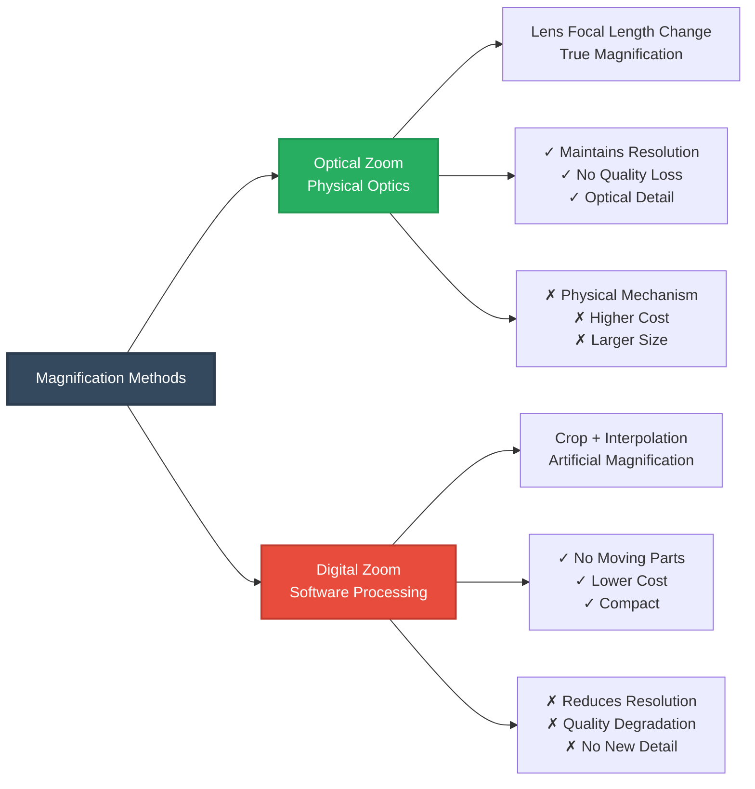

### Optical Zoom

**Mechanism:** Changes focal length through lens element movement.

**Zoom ratio:**

$Z = \frac{f_{\max}}{f_{\min}}$

**Example:** 24-120mm lens

$Z = \frac{120}{24} = 5\times \text{ optical zoom}$

**Key properties:**
- Captures full sensor resolution at all zoom levels
- True optical magnification
- Maintains image quality
- No interpolation artifacts

**Field of view change:**

$\frac{\text{FOV}_{\min}}{\text{FOV}_{\max}} = \frac{f_{\max}}{f_{\min}}$

### Digital Zoom

**Mechanism:** Crops center region and interpolates to original size.

**Effective crop factor:**

$C = Z_{\text{digital}}$

**Actual resolution after digital zoom:**

$R_{\text{actual}} = \frac{R_{\text{original}}}{Z_{\text{digital}}^2}$

**Example:** 12 MP camera with 4× digital zoom

$R_{\text{actual}} = \frac{12}{4^2} = \frac{12}{16} = 0.75 \text{ MP}$

Only 0.75 MP of actual detail, interpolated to appear as 12 MP.

**Cropped area:**

$W_{\text{crop}} = \frac{W}{Z}, \quad H_{\text{crop}} = \frac{H}{Z}$

**Upscaling factor:**

$S = Z$

### Quality Comparison

| Aspect | Optical Zoom | Digital Zoom |
|--------|--------------|--------------|
| **Resolution** | Maintained | Reduced by $Z^2$ |
| **Detail** | True optical detail | Interpolated (artificial) |
| **Quality** | Excellent | Degrades with zoom |
| **Artifacts** | Minimal | Pixelation, blur |
| **Cost** | High (optics) | Free (software) |
| **Size/Weight** | Larger, heavier | No impact |
| **Mechanism** | Physical lens | Software processing |
| **Scientific use** | Recommended | Avoid |

### Hybrid Zoom

Modern smartphones use **computational photography**:

1. **Optical zoom** to maximum hardware capability (e.g., 3×)
2. **Digital zoom** beyond that point
3. **AI enhancement** to reduce artifacts

**Combined zoom:**

$Z_{\text{total}} = Z_{\text{optical}} \times Z_{\text{digital}}$

**Example:** Phone with 3× optical, 10× total

$Z_{\text{digital}} = \frac{10}{3} = 3.33\times$

Quality degrades beyond 3× but less than pure digital zoom.

---

## 10. Sampling Theory and Nyquist Criterion

**Sampling theory** establishes the minimum resolution required to accurately represent spatial information without aliasing artifacts.

### Nyquist-Shannon Sampling Theorem

To reconstruct a signal without aliasing, the sampling rate must be at least twice the highest frequency component:

$f_s \geq 2f_{\text{max}}$

Where:
- $f_s$ = sampling frequency (samples per unit distance)
- $f_{\text{max}}$ = maximum spatial frequency (cycles per unit distance)

**For images:**

$\Delta x \leq \frac{1}{2f_{\text{max}}}$

Where $\Delta x$ = pixel spacing.

### Nyquist Frequency

The **Nyquist frequency** is half the sampling rate:

$f_{\text{Nyquist}} = \frac{f_s}{2} = \frac{1}{2\Delta x}$

**For a sensor with pixel pitch $p$:**

$f_{\text{Nyquist}} = \frac{1}{2p} \text{ cycles/mm}$

**Example:** 5μm pixels

$f_{\text{Nyquist}} = \frac{1}{2 \times 0.005} = 100 \text{ cycles/mm}$

### Sampling Grid

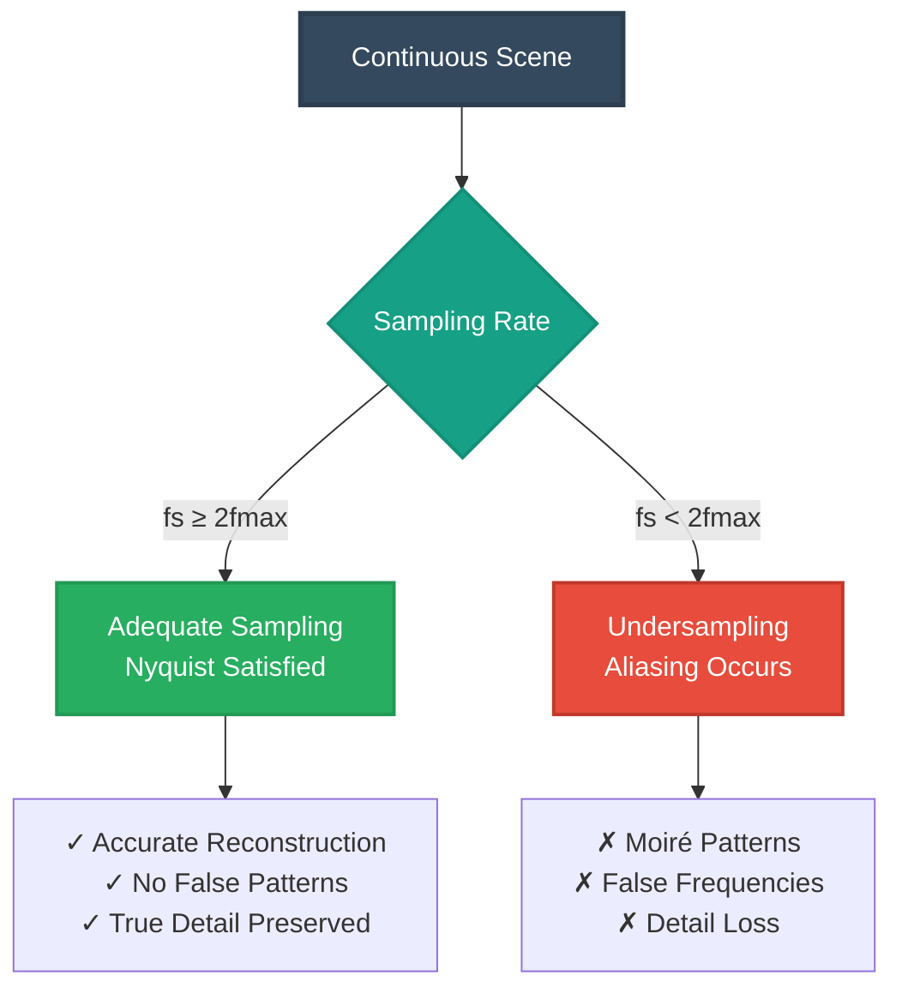

### Aliasing

When $f_s < 2f_{\text{max}}$, high frequencies appear as false low frequencies:

$f_{\text{alias}} = |f_{\text{true}} - nf_s|$

Where $n$ is an integer chosen so $f_{\text{alias}} < f_s/2$.

**Common aliasing artifacts:**

1. **Moiré patterns** - Interference between scene patterns and pixel grid
2. **Wagon-wheel effect** - Spokes appear to rotate backward
3. **Stairstepping** - Jagged diagonal lines

### Anti-Aliasing

**Optical low-pass filter (OLPF):**

Blurs image slightly before sampling:

$\text{MTF}_{\text{OLPF}}(f) = \text{sinc}(\pi f/f_c)$

Where $f_c$ is cutoff frequency (typically near Nyquist).

**Trade-off:**
- ✓ Eliminates aliasing
- ✗ Slightly reduces sharpness

Many modern cameras omit OLPF for maximum sharpness, relying on:
- High resolution (oversampling)
- Non-regular sensor patterns (X-Trans)
- Digital post-processing

### Oversampling

Sampling above Nyquist rate provides benefits:

$\text{Oversampling ratio} = \frac{f_s}{2f_{\text{max}}}$

**Benefits:**
- Margin against aliasing
- Better reconstruction
- Simplified anti-alias filtering
- Improved SNR through averaging

**Effective bit depth improvement:**

$\Delta b = \frac{1}{2}\log_2(N)$

Where $N$ = oversampling factor.

---

## 11. Practical Applications and Examples

### Example 1: Print Size Calculation

**Given:** 24 MP image (6000×4000 pixels), desired print at 300 DPI

**Calculation:**

$W_{\text{print}} = \frac{6000}{300} = 20 \text{ inches}$

$H_{\text{print}} = \frac{4000}{300} = 13.3 \text{ inches}$

**Result:** Maximum print size = **20" × 13.3"** at professional quality.

For larger prints at acceptable quality (200 DPI):

$W = \frac{6000}{200} = 30", \quad H = \frac{4000}{200} = 20"$

### Example 2: Required Resolution for Target Print

**Given:** Desired 16"×20" print at 300 DPI

**Calculation:**

$W_{\text{pixels}} = 16 \times 300 = 4800 \text{ pixels}$

$H_{\text{pixels}} = 20 \times 300 = 6000 \text{ pixels}$

$\text{Total} = 4800 \times 6000 = 28.8 \text{ MP}$

**Result:** Need at least **29 MP** camera.

### Example 3: Smartphone Screen PPI

**Given:** iPhone 14 Pro - 6.1" diagonal, 2556×1179 pixels

**Calculation:**

$D_{\text{pixels}} = \sqrt{2556^2 + 1179^2} = \sqrt{6,533,136 + 1,390,041} = 2814 \text{ pixels}$

$\text{PPI} = \frac{2814}{6.1} = 461 \text{ PPI}$

**Result:** 461 PPI - well above "Retina" threshold (~300 PPI).

### Example 4: Drone GSD Calculation

**Given:** 
- Altitude: 150m
- Camera: 20 MP (5472×3648)
- Sensor: 13.2×8.8mm (micro 4/3)
- Focal length: 15mm

**Step 1:** Calculate pixel pitch

$p = \frac{13.2}{5472} = 0.00241 \text{ mm} = 2.41 \text{ μm}$

**Step 2:** Calculate GSD

$\text{GSD} = \frac{H \cdot p}{f} = \frac{150,000 \times 0.00241}{15} = 24.1 \text{ mm/pixel}$

**Step 3:** Calculate ground coverage

$W_{\text{ground}} = \text{GSD} \times W_{\text{pixels}} = 24.1 \times 5472 = 131,875 \text{ mm} = 132 \text{ m}$

$H_{\text{ground}} = 24.1 \times 3648 = 87,917 \text{ mm} = 88 \text{ m}$

**Result:** Each image covers **132m × 88m** with 2.4cm ground resolution.

### Example 5: Aspect Ratio Conversion

**Given:** 4:3 image (4000×3000) needs to be 16:9

**Option 1:** Maintain width (4000)

$H_{\text{new}} = \frac{4000}{16/9} = 2250 \text{ pixels}$

Crop: 750 pixels from height (375 top, 375 bottom)

**Option 2:** Maintain height (3000)

$W_{\text{new}} = 3000 \times \frac{16}{9} = 5333 \text{ pixels}$

Not possible (exceeds original width)

**Result:** Use Option 1 → **4000×2250** (16:9 aspect ratio)

### Example 6: Storage Requirements

**Given:** 4K video (3840×2160) at 60 fps, 24-bit color, 10 minutes

**Uncompressed size per frame:**

$S_{\text{frame}} = 3840 \times 2160 \times 3 = 24,883,200 \text{ bytes} = 23.7 \text{ MB}$

**Total frames:**

$N = 60 \times 60 \times 10 = 36,000 \text{ frames}$

**Total uncompressed:**

$S_{\text{total}} = 23.7 \times 36,000 = 853,200 \text{ MB} = 833 \text{ GB}$

**With H.265 compression (100:1):**

$S_{\text{compressed}} = \frac{833}{100} = 8.3 \text{ GB}$

---

## 12. Best Practices and Guidelines

### Resolution Selection Guidelines

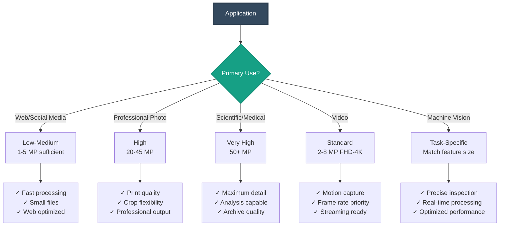

### Application-Specific Recommendations

| Application | Recommended Resolution | Rationale |
|-------------|----------------------|-----------|
| **Social media** | 1080×1080 to 1920×1080 | Web display, fast loading |
| **Web images** | 1920×1080 (Full HD) | Balance quality/file size |
| **Product photography** | 3000×3000 minimum | Zoom capability, detail |
| **Portrait photography** | 4000×6000 (24 MP) | Print flexibility, cropping |
| **Landscape photography** | 6000×8000 (45 MP+) | Large prints, fine detail |
| **Scientific imaging** | Application-dependent | Match to analysis requirements |
| **Document scanning** | 300-600 DPI | OCR, archival quality |
| **Medical imaging** | 2-10 MP specialized | Diagnostic requirements |
| **Video streaming** | 1920×1080 to 3840×2160 | Bandwidth vs. quality |
| **Machine vision** | 1-5 MP typical | Real-time processing speed |

### Quality Optimization Strategies

#### 1. Resolution vs. File Size

**Balance considerations:**

- Higher resolution → better quality, larger files
- Consider delivery medium (web, print, archive)
- Use appropriate compression

**File size estimation:**

$\text{Size (MB)} = \frac{W \times H \times C \times b}{8 \times 10^6 \times CR}$

Where:
- $C$ = channels (3 for RGB)
- $b$ = bits per channel
- $CR$ = compression ratio

#### 2. Avoiding Upscaling

**Never upscale if possible:**

- Adds no real detail
- Introduces interpolation artifacts
- Increases file size unnecessarily

If upscaling is unavoidable:
- Use high-quality algorithms (Lanczos, bicubic)
- Limit to 150-200% maximum
- Consider AI-based super-resolution for critical applications

#### 3. Maintaining Aspect Ratio

**Always maintain aspect ratio when resizing:**

```python
# Correct approach
scale = min(target_width / width, target_height / height)
new_width = int(width * scale)
new_height = int(height * scale)
```

**Avoid:**
- Arbitrary stretching (distortion)
- Non-proportional scaling
- Letter boxing unless necessary

#### 4. Bit Depth Selection

| Application | Recommended Bit Depth | Reason |
|-------------|---------------------|---------|
| **Web display** | 8-bit per channel | Sufficient for display |
| **Photo editing** | 16-bit per channel | Editing headroom |
| **Scientific** | 12-16 bit | Preserve dynamic range |
| **HDR** | 10-16 bit | Extended luminance range |
| **Print** | 8-bit (16-bit master) | Balance quality/size |

#### 5. Compression Guidelines

**Lossless (recommended for masters):**
- PNG for images with transparency
- TIFF for multi-layered images
- DNG/RAW for photographic sources

**Lossy (for delivery):**
- JPEG quality 85-95 for photos
- WebP for modern web applications
- HEIF/HEVC for efficient storage

**Avoid:**
- Repeated JPEG saves (quality degrades)
- Excessive compression (artifacts)
- Lossy formats for archival

### Quality Assurance Checklist

**Resolution verification:**
- ✅ Matches intended output size
- ✅ Adequate for viewing distance
- ✅ Sufficient DPI for print (if applicable)
- ✅ No unnecessary upscaling
- ✅ Aspect ratio maintained

**Technical quality:**
- ✅ Proper bit depth for application
- ✅ Appropriate compression level
- ✅ No visible artifacts (blocking, banding)
- ✅ Adequate sampling (Nyquist satisfied)
- ✅ Consistent pixel dimensions

**File management:**
- ✅ Systematic naming convention
- ✅ Metadata embedded (resolution, DPI)
- ✅ Master files preserved (highest quality)
- ✅ Delivery versions optimized
- ✅ Backup strategy implemented

---

## 13. References

### Foundational Texts

1. **Gonzalez, R. C., & Woods, R. E.** (2018). *Digital Image Processing* (4th ed.). Pearson.
   - Comprehensive coverage of resolution and sampling theory
   - ISBN: 978-0133356724

2. **Szeliski, R.** (2022). *Computer Vision: Algorithms and Applications* (2nd ed.). Springer.
   - Modern treatment of image representation
   - Free online: http://szeliski.org/Book/

3. **Burger, W., & Burge, M. J.** (2016). *Digital Image Processing: An Algorithmic Introduction* (2nd ed.). Springer.
   - Practical algorithms for resolution handling
   - ISBN: 978-1447166832

### Sampling Theory

4. **Shannon, C. E.** (1949). "Communication in the Presence of Noise." *Proceedings of the IRE*, 37(1), 10-21.
   - Foundational paper on sampling theorem

5. **Petersen, D. P., & Middleton, D.** (1962). "Sampling and Reconstruction of Wave-Number-Limited Functions in N-Dimensional Euclidean Spaces." *Information and Control*, 5(4), 279-323.
   - Extension to multi-dimensional sampling

### Practical Resources

6. **OpenCV Documentation - Geometric Image Transformations**
   - https://docs.opencv.org/master/da/d54/group__imgproc__transform.html

7. **Adobe Resolution Guide**
   - Standards for image resolution in various applications
   - https://helpx.adobe.com/photoshop/using/image-size-resolution.html

8. **DPI Calculator Tools**
   - https://www.pixelcalculator.com/
   - https://www.omnicalculator.com/other/pixels-per-inch

### Standards

9. **ISO 12233:2017** - Photography — Electronic still picture imaging — Resolution and spatial frequency responses

10. **ITU-R BT.601** - Studio encoding parameters of digital television for standard 4:3 and wide-screen 16:9 aspect ratios

---

## Appendix: Quick Reference

### Essential Formulas

**Total pixels:**
$N = W \times H$

**Megapixels:**
$\text{MP} = \frac{W \times H}{10^6}$

**PPI (Pixels Per Inch):**
$\text{PPI} = \frac{\sqrt{W^2 + H^2}}{D_{\text{inches}}}$

**Print size:**
$W_{\text{inches}} = \frac{W_{\text{pixels}}}{\text{DPI}}, \quad H_{\text{inches}} = \frac{H_{\text{pixels}}}{\text{DPI}}$

**Aspect ratio:**
$\text{AR} = \frac{W}{H}$

**Field of view:**
$\text{FOV} = 2\arctan\left(\frac{d_{\text{sensor}}}{2f}\right)$

**Ground sample distance:**
$\text{GSD} = \frac{H \cdot p}{f}$

**Nyquist frequency:**
$f_{\text{Nyquist}} = \frac{1}{2p}$

### Conversion Tables

#### Common Resolutions

| Name | Pixels | Aspect | MP |
|------|--------|--------|-----|
| HD | 1280×720 | 16:9 | 0.9 |
| Full HD | 1920×1080 | 16:9 | 2.1 |
| QHD | 2560×1440 | 16:9 | 3.7 |
| 4K UHD | 3840×2160 | 16:9 | 8.3 |
| 8K UHD | 7680×4320 | 16:9 | 33.2 |

#### Print DPI Guidelines

| Quality | DPI | Use Case |
|---------|-----|----------|
| Draft | 150 | Proofs, reference |
| Good | 200-250 | Publications |
| Professional | 300 | Photos, art prints |
| Premium | 600+ | Fine art, archival |

#### Viewing Distance & Required PPI

| Distance | Required PPI |
|----------|--------------|
| 10" | 300-350 |
| 15" | 250-300 |
| 24" | 150-180 |
| 10 feet | 30-50 |

---

**Document Version:** 1.0  
**Last Updated:** November 2025  
**License:** Educational use permitted with attribution

---

*This comprehensive guide provides essential knowledge for understanding pixels and resolution in digital imaging, supporting applications in photography, computer vision, graphics, and scientific visualization.*