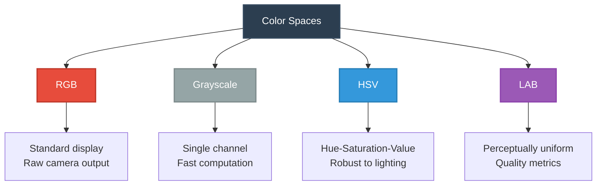
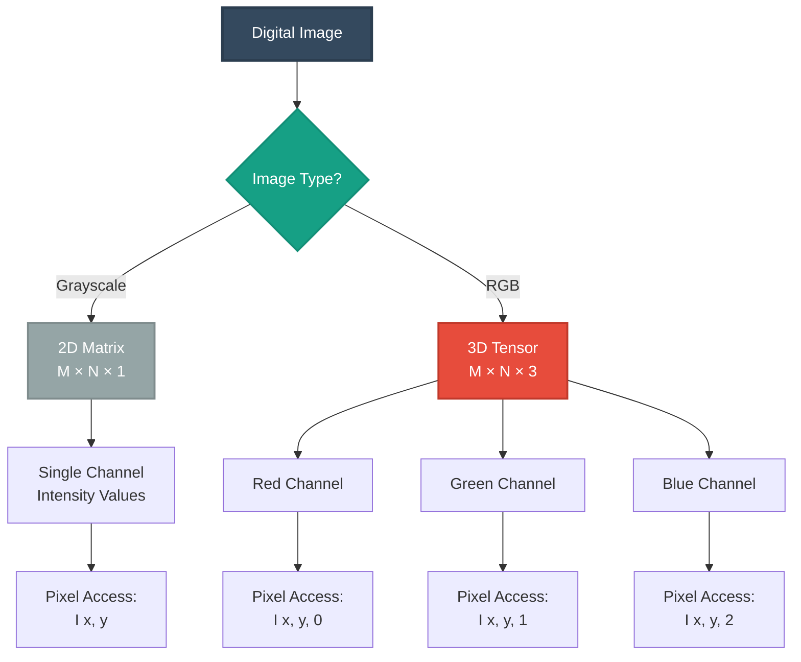
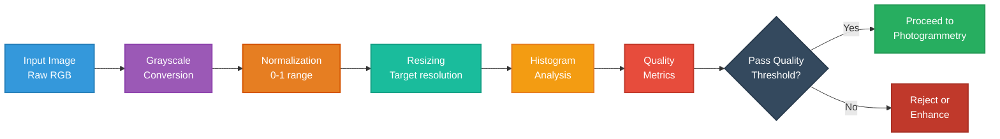

# Foundations of Digital Images
  
**Topic:** Digital Image Fundamentals  
**Date:** November 2025

---

## Table of Contents

1. [Introduction](#introduction)
2. [Pixels and Color Channels](#pixels-and-color-channels)
3. [Image Representation as Matrix](#image-representation-as-matrix)
4. [Image Resolution and Aspect Ratio](#image-resolution-and-aspect-ratio)
5. [Basic Image Operations](#basic-image-operations)
6. [Practical Implementation](#practical-implementation)
7. [Summary](#summary)
8. [References](#references)

---

## Introduction

Digital images form the core input to photogrammetric pipelines. A deep understanding of their structure, representation, and basic transformations is essential for image similarity analysis, sharpness evaluation, and preprocessing techniques used to optimize 3D reconstruction workflows.

### Learning Objectives

- Understand what pixels are and how images are stored mathematically
- Learn how grayscale and RGB images differ
- Understand resolution, aspect ratio, and resizing
- Gain familiarity with common preprocessing operations (grayscale, normalization, histogram)
- Build computational intuition for later stages (hashing, SSIM, sharpness metrics)

---

## Pixels and Color Channels

### What is a Pixel?

A **pixel** (picture element) is the smallest controllable element of an image. It contains numerical values that represent **brightness** (grayscale) or **color** (RGB).

### Grayscale Images

A grayscale pixel stores one intensity value:

$$I(x, y) \in [0, 255] \quad \text{(8-bit)}$$

$$I(x, y) \in [0, 1] \quad \text{(normalized)}$$

Where:
- $0$ represents black
- $255$ represents white (8-bit)
- $1$ represents white (normalized)

**Mathematical representation as intensity function:**

$$I: \mathbb{R}^2 \to \mathbb{R}$$
$$(x, y) \mapsto \text{intensity}$$

### RGB Images

Each pixel contains **three** intensity values representing Red, Green, and Blue:

$$I(x, y) = [R(x, y), G(x, y), B(x, y)]$$

**Mathematical mapping:**

$$I: \mathbb{R}^2 \to \mathbb{R}^3$$

### Color Space Comparison



| Space | Description | Use Case |
|-------|-------------|----------|
| **RGB** | Standard display space | Raw camera output, general processing |
| **Grayscale** | Single-channel representation | Fast computation, edge detection |
| **HSV** | Hue–Saturation–Value | Robust to shadows & lighting changes |
| **LAB** | Perceptually uniform | Quality metrics, SSIM calculations |

---

## Image Representation as Matrix

### Grayscale Image Structure

A grayscale image is represented as a **2D matrix**:

$$I = [I(x, y)]_{M \times N}$$

Where $M$ is the number of rows (height) and $N$ is the number of columns (width).

**Example matrix:**

$$I = \begin{bmatrix}
120 & 130 & 125 & 140 \\
115 & 128 & 135 & 142 \\
110 & 125 & 138 & 145
\end{bmatrix}$$

### RGB Image Structure

An RGB image is a **3D tensor**:

$$I \in \mathbb{R}^{M \times N \times 3}$$

**Channel separation:**

$$R = I[:, :, 0]$$
$$G = I[:, :, 1]$$
$$B = I[:, :, 2]$$

### Image Structure Visualization



### Coordinate System

The standard image coordinate system has its origin at the **top-left corner**:

```
(0,0) ────────────────────→ x (columns, width)
  │
  │
  │
  ↓
  y (rows, height)
```

---

## Image Resolution and Aspect Ratio

### Resolution

**Definition:** The number of pixels in an image, expressed as Width × Height.

$$\text{Total pixels} = M \times N$$

**Common resolutions:**

| Resolution | Dimensions | Megapixels |
|------------|------------|------------|
| HD | 1920 × 1080 | ≈ 2.1 MP |
| Full HD | 1920 × 1080 | ≈ 2.1 MP |
| 4K UHD | 3840 × 2160 | ≈ 8.3 MP |
| Full-frame DSLR | 6000 × 4000 | ≈ 24 MP |

### Aspect Ratio

The aspect ratio defines the proportional relationship between width and height:

$$\text{Aspect Ratio} = \frac{\text{Width}}{\text{Height}}$$

**Common aspect ratios:**

- **16:9** = 1.778 (widescreen, modern displays)
- **4:3** = 1.333 (traditional photography)
- **3:2** = 1.5 (DSLR cameras)
- **1:1** = 1.0 (square format, social media)

### Image Resizing

When resizing an image, scaling factors are calculated as:

$$\text{scale}_x = \frac{\text{old\_width}}{\text{new\_width}}$$

$$\text{scale}_y = \frac{\text{old\_height}}{\text{new\_height}}$$

**Interpolation methods:**

| Method | Characteristics | Use Case |
|--------|----------------|----------|
| **Nearest Neighbor** | Fast, blocky artifacts | Quick previews, pixel art |
| **Bilinear** | Weighted average of 4 neighbors | General purpose |
| **Bicubic** | Smoothest, uses 16 neighbors | High-quality downsampling |
| **Lanczos** | Sharp, minimal aliasing | Professional applications |

---

## Basic Image Operations

### 1. Grayscale Conversion

Using **luminance weights** based on photometric perception:

$$I_{\text{gray}} = 0.299R + 0.587G + 0.114B$$

The green channel receives the highest weight because the human eye is most sensitive to green wavelengths.

### 2. Normalization

**Min-max normalization** (scales to [0, 1]):

$$I_{\text{norm}} = \frac{I - I_{\min}}{I_{\max} - I_{\min}}$$

**Z-score normalization** (standardizes to mean=0, std=1):

$$I_{\text{std}} = \frac{I - \mu}{\sigma}$$

Where $\mu$ is the mean and $\sigma$ is the standard deviation.

### 3. Histogram Analysis

The histogram $H$ counts pixels at each intensity level $k$:

$$H(k) = \sum_{x,y} \mathbb{1}[I(x,y) = k]$$

Where $\mathbb{1}[\cdot]$ is the indicator function.

**Applications:**
- Exposure detection (under/overexposure)
- Contrast evaluation
- Quality filtering for photogrammetry

### 4. Arithmetic Operations

| Operation | Formula | Application |
|-----------|---------|-------------|
| **Addition** | $I = I_1 + I_2$ | Image blending, HDR |
| **Subtraction** | $I = \|I_1 - I_2\|$ | Change detection, difference maps |
| **Brightness adjustment** | $I' = \alpha \cdot I + \beta$ | Exposure correction |
| **Contrast adjustment** | $I' = \alpha \cdot (I - \mu) + \mu$ | Dynamic range enhancement |

---

## Preprocessing Pipeline



---

## Practical Implementation

```python
import numpy as np
import cv2
from matplotlib import pyplot as plt

# Load an image (OpenCV loads in BGR format)
img_bgr = cv2.imread("image.jpg")
img_rgb = cv2.cvtColor(img_bgr, cv2.COLOR_BGR2RGB)

# Extract metadata
h, w, c = img_rgb.shape
print(f"Resolution: {w}×{h}")
print(f"Channels: {c}")
print(f"Total pixels: {h * w:,}")
print(f"Aspect ratio: {w/h:.3f}")

# Extract individual color channels
R = img_rgb[:, :, 0]
G = img_rgb[:, :, 1]
B = img_rgb[:, :, 2]

# Convert to grayscale using OpenCV (uses proper luminance weights)
gray = cv2.cvtColor(img_rgb, cv2.COLOR_RGB2GRAY)

# Normalize to [0, 1] range
normalized = gray.astype(np.float32) / 255.0

# Resize with bicubic interpolation
resized = cv2.resize(img_rgb, (800, 600), interpolation=cv2.INTER_CUBIC)

# Calculate histogram
hist = cv2.calcHist([gray], [0], None, [256], [0, 256])

# Calculate basic statistics
mean_intensity = np.mean(gray)
std_intensity = np.std(gray)
print(f"Mean intensity: {mean_intensity:.2f}")
print(f"Std deviation: {std_intensity:.2f}")

# Visualization
fig, axes = plt.subplots(2, 3, figsize=(15, 10))

axes[0, 0].imshow(img_rgb)
axes[0, 0].set_title("Original RGB Image")
axes[0, 0].axis("off")

axes[0, 1].imshow(gray, cmap="gray")
axes[0, 1].set_title("Grayscale Conversion")
axes[0, 1].axis("off")

axes[0, 2].imshow(R, cmap="Reds")
axes[0, 2].set_title("Red Channel")
axes[0, 2].axis("off")

axes[1, 0].imshow(G, cmap="Greens")
axes[1, 0].set_title("Green Channel")
axes[1, 0].axis("off")

axes[1, 1].imshow(B, cmap="Blues")
axes[1, 1].set_title("Blue Channel")
axes[1, 1].axis("off")

axes[1, 2].plot(hist, color='black', linewidth=1.5)
axes[1, 2].set_title("Intensity Histogram")
axes[1, 2].set_xlabel("Pixel Intensity")
axes[1, 2].set_ylabel("Frequency")
axes[1, 2].grid(True, alpha=0.3)
axes[1, 2].set_xlim([0, 256])

plt.tight_layout()
plt.show()
```

---

## Summary

### Key Concepts Learned

- **Images as matrices:** Grayscale images are 2D matrices, RGB images are 3D tensors
- **Color channels:** Grayscale uses 1 channel, RGB uses 3 channels (Red, Green, Blue)
- **Resolution:** Defined as Width × Height, determines image detail
- **Aspect ratio:** Proportional relationship between width and height
- **Basic operations:** Grayscale conversion, normalization, resizing, histogram analysis
- **Preprocessing:** Essential for preparing images for photogrammetric analysis

### Why This Matters for Photogrammetry

Photogrammetry reconstruction quality depends critically on:

- **Image clarity** – Sharpness and focus quality
- **Consistent brightness** – Uniform exposure across image set
- **Sufficient detail** – Adequate resolution for feature matching
- **Stable color** – Consistent color temperature and white balance

Understanding image representation enables more robust:

- **Blur detection** – Identifying out-of-focus or motion-blurred images
- **Similarity metrics** – Computing SSIM, perceptual hashing
- **Exposure correction** – Normalizing lighting conditions
- **Frame selection** – Choosing optimal images for reconstruction

---

## References

1. Gonzalez, R. C., & Woods, R. E. (2018). *Digital Image Processing* (4th ed.). Pearson.
2. Szeliski, R. (2022). *Computer Vision: Algorithms and Applications* (2nd ed.). Springer.
3. OpenCV Documentation. Retrieved from https://docs.opencv.org/
4. NumPy Documentation. Retrieved from https://numpy.org/doc/
5. Hartley, R., & Zisserman, A. (2004). *Multiple View Geometry in Computer Vision*. Cambridge University Press.

---

*Document prepared for photogrammetric reconstruction optimization course, November 2025*